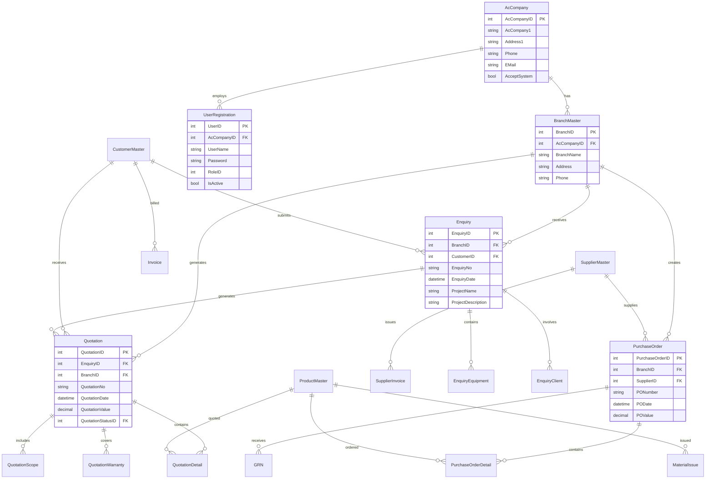
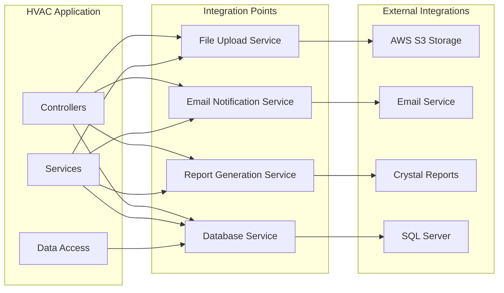
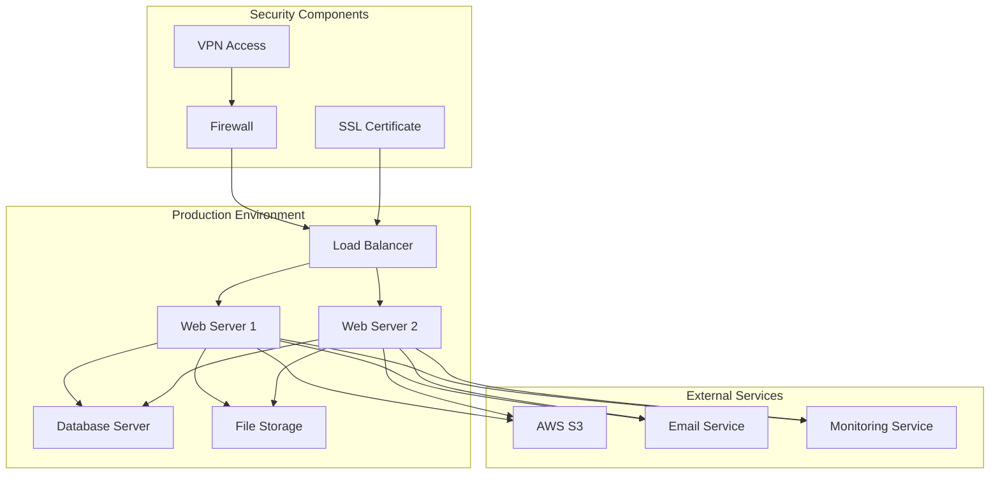
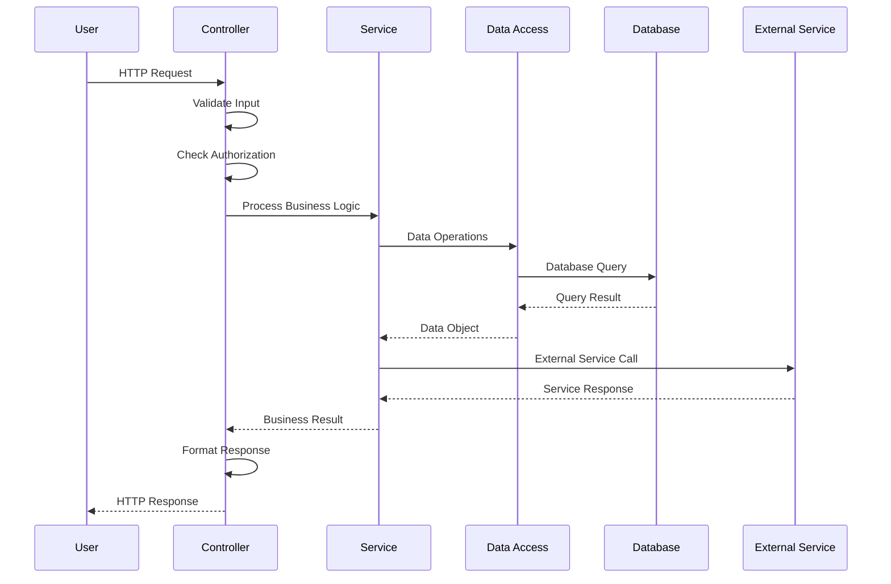
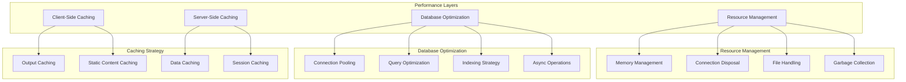

# HVAC Management System - Architecture Diagram

## Table of Contents
1. [System Architecture Overview](#system-architecture-overview)
2. [Database Architecture](#database-architecture)
3. [Security Architecture](#security-architecture)
4. [Integration Architecture](#integration-architecture)
5. [Deployment Architecture](#deployment-architecture)

## System Architecture Overview

```mermaid
graph TB
    subgraph "Client Layer"
        A[Web Browser]
        B[Mobile Browser]
    end
    
    subgraph "Presentation Layer"
        C[ASP.NET MVC Controllers]
        D[Views (Razor)]
        E[Static Content]
    end
    
    subgraph "Business Logic Layer"
        F[Service Classes]
        G[Business Rules]
        H[Validation Logic]
    end
    
    subgraph "Data Access Layer"
        I[Entity Framework]
        J[Custom DAO Classes]
        K[Repository Pattern]
    end
    
    subgraph "Data Layer"
        L[SQL Server Database]
        M[File System]
    end
    
    subgraph "External Services"
        N[AWS S3 Storage]
        O[Email Service]
        P[Crystal Reports]
    end
    
    A --> C
    B --> C
    C --> D
    C --> E
    C --> F
    F --> G
    F --> H
    F --> I
    I --> J
    J --> K
    K --> L
    C --> M
    C --> N
    C --> O
    C --> P
```

## Database Architecture



## Security Architecture

```mermaid
graph TB
    subgraph "Security Layers"
        A[Authentication Layer]
        B[Authorization Layer]
        C[Data Protection Layer]
        D[Network Security Layer]
    end
    
    subgraph "Authentication Components"
        E[Session Management]
        F[User Validation]
        G[Password Hashing]
    end
    
    subgraph "Authorization Components"
        H[Role-Based Access Control]
        I[Permission Matrix]
        J[Resource Protection]
    end
    
    subgraph "Data Protection Components"
        K[Input Validation]
        L[Output Encoding]
        M[SQL Injection Prevention]
        N[XSS Prevention]
        O[CSRF Protection]
    end
    
    subgraph "Network Security Components"
        P[HTTPS Encryption]
        Q[Request Validation]
        R[File Upload Security]
    end
    
    A --> E
    A --> F
    A --> G
    
    B --> H
    B --> I
    B --> J
    
    C --> K
    C --> L
    C --> M
    C --> N
    C --> O
    
    D --> P
    D --> Q
    D --> R
```



## Integration Architecture



## Deployment Architecture



## Component Interaction Flow



## Performance Architecture



---

*These architecture diagrams provide a comprehensive view of the HVAC Management System's technical structure and component relationships.*
