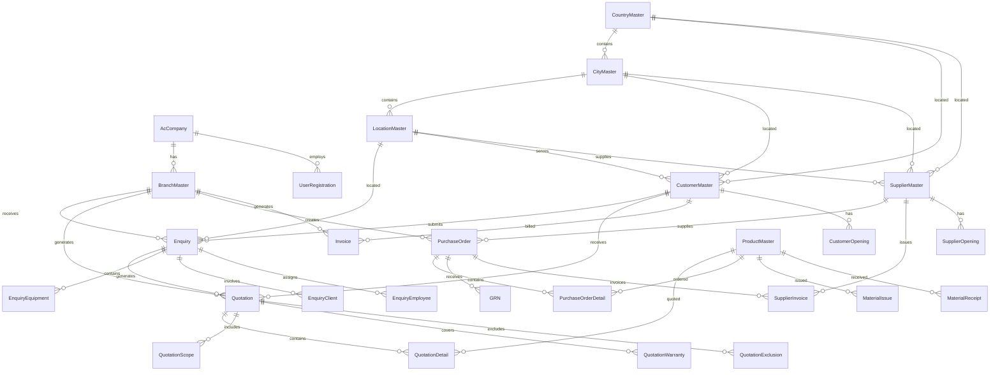

# HVAC Management System - Database Schema

## Table of Contents
1. [Database Overview](#database-overview)
2. [Entity Relationship Diagram](#entity-relationship-diagram)
3. [Core Tables](#core-tables)
4. [Master Data Tables](#master-data-tables)
5. [Transaction Tables](#transaction-tables)
6. [Lookup Tables](#lookup-tables)
7. [Indexes and Constraints](#indexes-and-constraints)
8. [Stored Procedures](#stored-procedures)
9. [Views](#views)
10. [Triggers](#triggers)
11. [Data Relationships](#data-relationships)
12. [Performance Considerations](#performance-considerations)

## Database Overview

The HVAC Management System database is designed using a normalized relational model with clear separation between master data, transaction data, and lookup tables. The schema supports the complete business workflow from enquiry to project completion.

### Database Characteristics
- **Database Name**: HVAC_DB
- **Schema**: dbo
- **Collation**: SQL_Latin1_General_CP1_CI_AS
- **Compatibility Level**: 140 (SQL Server 2019)
- **Recovery Model**: Simple
- **Total Tables**: 45+
- **Total Stored Procedures**: 30+
- **Total Views**: 15+

## Entity Relationship Diagram



## Core Tables

### 1. AcCompany (Company Master)

```sql
CREATE TABLE [dbo].[AcCompany] (
    [AcCompanyID] INT IDENTITY(1,1) NOT NULL,
    [AcCompany1] NVARCHAR(100) NOT NULL,
    [Address1] NVARCHAR(200) NULL,
    [Address2] NVARCHAR(200) NULL,
    [Address3] NVARCHAR(200) NULL,
    [Phone] NVARCHAR(20) NULL,
    [EMail] NVARCHAR(100) NULL,
    [KeyPerson] NVARCHAR(100) NULL,
    [AcceptSystem] BIT NULL DEFAULT(0),
    [CountryName] NVARCHAR(100) NULL,
    [CityName] NVARCHAR(100) NULL,
    [LocationName] NVARCHAR(100) NULL,
    [CurrencyID] INT NULL,
    [CreatedDate] DATETIME NULL DEFAULT(GETDATE()),
    [ModifiedDate] DATETIME NULL DEFAULT(GETDATE()),
    CONSTRAINT [PK_AcCompany] PRIMARY KEY CLUSTERED ([AcCompanyID] ASC)
);
```

**Purpose**: Stores company information and system settings
**Key Fields**: Company name, contact details, system acceptance status
**Relationships**: One-to-many with BranchMaster, UserRegistration

### 2. BranchMaster (Branch Management)

```sql
CREATE TABLE [dbo].[BranchMaster] (
    [BranchID] INT IDENTITY(1,1) NOT NULL,
    [AcCompanyID] INT NOT NULL,
    [BranchName] NVARCHAR(100) NOT NULL,
    [Address] NVARCHAR(200) NULL,
    [Phone] NVARCHAR(20) NULL,
    [Email] NVARCHAR(100) NULL,
    [IsActive] BIT NULL DEFAULT(1),
    [CreatedDate] DATETIME NULL DEFAULT(GETDATE()),
    [ModifiedDate] DATETIME NULL DEFAULT(GETDATE()),
    CONSTRAINT [PK_BranchMaster] PRIMARY KEY CLUSTERED ([BranchID] ASC),
    CONSTRAINT [FK_BranchMaster_AcCompany] FOREIGN KEY ([AcCompanyID]) REFERENCES [dbo].[AcCompany] ([AcCompanyID])
);
```

**Purpose**: Manages multiple business locations
**Key Fields**: Branch name, address, contact information
**Relationships**: Many-to-one with AcCompany, One-to-many with transactions

### 3. UserRegistration (User Management)

```sql
CREATE TABLE [dbo].[UserRegistration] (
    [UserID] INT IDENTITY(1,1) NOT NULL,
    [AcCompanyID] INT NOT NULL,
    [UserName] NVARCHAR(50) NOT NULL,
    [Password] NVARCHAR(255) NOT NULL,
    [FirstName] NVARCHAR(50) NULL,
    [LastName] NVARCHAR(50) NULL,
    [Email] NVARCHAR(100) NULL,
    [Phone] NVARCHAR(20) NULL,
    [RoleID] INT NOT NULL,
    [IsActive] BIT NULL DEFAULT(1),
    [LastLogin] DATETIME NULL,
    [CreatedDate] DATETIME NULL DEFAULT(GETDATE()),
    [ModifiedDate] DATETIME NULL DEFAULT(GETDATE()),
    CONSTRAINT [PK_UserRegistration] PRIMARY KEY CLUSTERED ([UserID] ASC),
    CONSTRAINT [FK_UserRegistration_AcCompany] FOREIGN KEY ([AcCompanyID]) REFERENCES [dbo].[AcCompany] ([AcCompanyID]),
    CONSTRAINT [UQ_UserRegistration_UserName] UNIQUE ([UserName])
);
```

**Purpose**: User authentication and authorization
**Key Fields**: Username, password (hashed), role assignment
**Relationships**: Many-to-one with AcCompany, One-to-many with audit logs

## Master Data Tables

### 1. CustomerMaster (Customer Management)

```sql
CREATE TABLE [dbo].[CustomerMaster] (
    [CustomerID] INT IDENTITY(1,1) NOT NULL,
    [CustomerName] NVARCHAR(100) NOT NULL,
    [ContactPerson] NVARCHAR(100) NULL,
    [Address] NVARCHAR(200) NULL,
    [City] NVARCHAR(50) NULL,
    [State] NVARCHAR(50) NULL,
    [Country] NVARCHAR(50) NULL,
    [Phone] NVARCHAR(20) NULL,
    [Email] NVARCHAR(100) NULL,
    [GSTNumber] NVARCHAR(20) NULL,
    [IsActive] BIT NULL DEFAULT(1),
    [CreatedDate] DATETIME NULL DEFAULT(GETDATE()),
    [ModifiedDate] DATETIME NULL DEFAULT(GETDATE()),
    CONSTRAINT [PK_CustomerMaster] PRIMARY KEY CLUSTERED ([CustomerID] ASC)
);
```

### 2. SupplierMaster (Supplier Management)

```sql
CREATE TABLE [dbo].[SupplierMaster] (
    [SupplierID] INT IDENTITY(1,1) NOT NULL,
    [SupplierName] NVARCHAR(100) NOT NULL,
    [ContactPerson] NVARCHAR(100) NULL,
    [Address] NVARCHAR(200) NULL,
    [City] NVARCHAR(50) NULL,
    [State] NVARCHAR(50) NULL,
    [Country] NVARCHAR(50) NULL,
    [Phone] NVARCHAR(20) NULL,
    [Email] NVARCHAR(100) NULL,
    [GSTNumber] NVARCHAR(20) NULL,
    [SupplierTypeID] INT NULL,
    [IsActive] BIT NULL DEFAULT(1),
    [CreatedDate] DATETIME NULL DEFAULT(GETDATE()),
    [ModifiedDate] DATETIME NULL DEFAULT(GETDATE()),
    CONSTRAINT [PK_SupplierMaster] PRIMARY KEY CLUSTERED ([SupplierID] ASC)
);
```

### 3. ProductMaster (Product Catalog)

```sql
CREATE TABLE [dbo].[ProductMaster] (
    [ProductID] INT IDENTITY(1,1) NOT NULL,
    [ProductName] NVARCHAR(100) NOT NULL,
    [ProductCode] NVARCHAR(50) NULL,
    [Description] NVARCHAR(MAX) NULL,
    [ProductTypeID] INT NULL,
    [ProductFamilyID] INT NULL,
    [UnitID] INT NULL,
    [HSNCode] NVARCHAR(20) NULL,
    [IsActive] BIT NULL DEFAULT(1),
    [CreatedDate] DATETIME NULL DEFAULT(GETDATE()),
    [ModifiedDate] DATETIME NULL DEFAULT(GETDATE()),
    CONSTRAINT [PK_ProductMaster] PRIMARY KEY CLUSTERED ([ProductID] ASC)
);
```

## Transaction Tables

### 1. Enquiry (Enquiry Management)

```sql
CREATE TABLE [dbo].[Enquiry] (
    [EnquiryID] INT IDENTITY(1,1) NOT NULL,
    [BranchID] INT NOT NULL,
    [CustomerID] INT NOT NULL,
    [EnquiryNo] NVARCHAR(50) NOT NULL,
    [EnquiryDate] DATETIME NOT NULL,
    [ProjectName] NVARCHAR(200) NOT NULL,
    [ProjectDescription] NVARCHAR(MAX) NULL,
    [ProjectNumber] NVARCHAR(50) NULL,
    [CityID] INT NULL,
    [CountryID] INT NULL,
    [DueDate] DATETIME NULL,
    [PriorityID] INT NULL,
    [BuildingTypeID] INT NULL,
    [EnquiryTypeID] INT NULL,
    [StatusID] INT NULL,
    [VerticalsID] INT NULL,
    [JobHandOverID] INT NULL,
    [CreatedBy] INT NULL,
    [CreatedDate] DATETIME NULL DEFAULT(GETDATE()),
    [ModifiedBy] INT NULL,
    [ModifiedDate] DATETIME NULL DEFAULT(GETDATE()),
    CONSTRAINT [PK_Enquiry] PRIMARY KEY CLUSTERED ([EnquiryID] ASC),
    CONSTRAINT [FK_Enquiry_BranchMaster] FOREIGN KEY ([BranchID]) REFERENCES [dbo].[BranchMaster] ([BranchID]),
    CONSTRAINT [FK_Enquiry_CustomerMaster] FOREIGN KEY ([CustomerID]) REFERENCES [dbo].[CustomerMaster] ([CustomerID])
);
```

### 2. Quotation (Quotation Management)

```sql
CREATE TABLE [dbo].[Quotation] (
    [QuotationID] INT IDENTITY(1,1) NOT NULL,
    [EnquiryID] INT NOT NULL,
    [BranchID] INT NOT NULL,
    [QuotationNo] NVARCHAR(50) NOT NULL,
    [QuotationDate] DATETIME NOT NULL,
    [QuotationValue] DECIMAL(18,2) NULL,
    [DiscountAmount] DECIMAL(18,2) NULL,
    [DiscountPercent] DECIMAL(5,2) NULL,
    [VATPercent] DECIMAL(5,2) NULL,
    [VATAmount] DECIMAL(18,2) NULL,
    [NetAmount] DECIMAL(18,2) NULL,
    [QuotationStatusID] INT NULL,
    [Validity] INT NULL,
    [DeliveryTerms] NVARCHAR(MAX) NULL,
    [PaymentTerms] NVARCHAR(MAX) NULL,
    [TermsandConditions] NVARCHAR(MAX) NULL,
    [SubjectText] NVARCHAR(MAX) NULL,
    [ClientPOID] INT NULL,
    [Margin] DECIMAL(18,2) NULL,
    [MarginPercent] DECIMAL(5,2) NULL,
    [CreatedBy] INT NULL,
    [CreatedDate] DATETIME NULL DEFAULT(GETDATE()),
    [ModifiedBy] INT NULL,
    [ModifiedDate] DATETIME NULL DEFAULT(GETDATE()),
    CONSTRAINT [PK_Quotation] PRIMARY KEY CLUSTERED ([QuotationID] ASC),
    CONSTRAINT [FK_Quotation_Enquiry] FOREIGN KEY ([EnquiryID]) REFERENCES [dbo].[Enquiry] ([EnquiryID]),
    CONSTRAINT [FK_Quotation_BranchMaster] FOREIGN KEY ([BranchID]) REFERENCES [dbo].[BranchMaster] ([BranchID])
);
```

### 3. PurchaseOrder (Purchase Order Management)

```sql
CREATE TABLE [dbo].[PurchaseOrder] (
    [PurchaseOrderID] INT IDENTITY(1,1) NOT NULL,
    [BranchID] INT NOT NULL,
    [SupplierID] INT NOT NULL,
    [PONumber] NVARCHAR(50) NOT NULL,
    [PODate] DATETIME NOT NULL,
    [ExpectedDelivery] DATETIME NULL,
    [POValue] DECIMAL(18,2) NULL,
    [StatusID] INT NULL,
    [Remarks] NVARCHAR(MAX) NULL,
    [CreatedBy] INT NULL,
    [CreatedDate] DATETIME NULL DEFAULT(GETDATE()),
    [ModifiedBy] INT NULL,
    [ModifiedDate] DATETIME NULL DEFAULT(GETDATE()),
    CONSTRAINT [PK_PurchaseOrder] PRIMARY KEY CLUSTERED ([PurchaseOrderID] ASC),
    CONSTRAINT [FK_PurchaseOrder_BranchMaster] FOREIGN KEY ([BranchID]) REFERENCES [dbo].[BranchMaster] ([BranchID]),
    CONSTRAINT [FK_PurchaseOrder_SupplierMaster] FOREIGN KEY ([SupplierID]) REFERENCES [dbo].[SupplierMaster] ([SupplierID])
);
```

## Lookup Tables

### 1. Status Tables

```sql
-- Enquiry Status
CREATE TABLE [dbo].[EnquiryStatus] (
    [StatusID] INT IDENTITY(1,1) NOT NULL,
    [StatusName] NVARCHAR(50) NOT NULL,
    [IsActive] BIT NULL DEFAULT(1),
    CONSTRAINT [PK_EnquiryStatus] PRIMARY KEY CLUSTERED ([StatusID] ASC)
);

-- Quotation Status
CREATE TABLE [dbo].[QuotationStatus] (
    [QuotationStatusID] INT IDENTITY(1,1) NOT NULL,
    [Status] NVARCHAR(50) NOT NULL,
    [IsActive] BIT NULL DEFAULT(1),
    CONSTRAINT [PK_QuotationStatus] PRIMARY KEY CLUSTERED ([QuotationStatusID] ASC)
);

-- Priority Master
CREATE TABLE [dbo].[PriorityMaster] (
    [PriorityID] INT IDENTITY(1,1) NOT NULL,
    [PriorityName] NVARCHAR(50) NOT NULL,
    [IsActive] BIT NULL DEFAULT(1),
    CONSTRAINT [PK_PriorityMaster] PRIMARY KEY CLUSTERED ([PriorityID] ASC)
);
```

### 2. Geographic Tables

```sql
-- Country Master
CREATE TABLE [dbo].[CountryMaster] (
    [CountryID] INT IDENTITY(1,1) NOT NULL,
    [CountryName] NVARCHAR(100) NOT NULL,
    [CountryCode] NVARCHAR(3) NULL,
    [IsActive] BIT NULL DEFAULT(1),
    CONSTRAINT [PK_CountryMaster] PRIMARY KEY CLUSTERED ([CountryID] ASC)
);

-- City Master
CREATE TABLE [dbo].[CityMaster] (
    [CityID] INT IDENTITY(1,1) NOT NULL,
    [CountryID] INT NOT NULL,
    [City] NVARCHAR(100) NOT NULL,
    [IsActive] BIT NULL DEFAULT(1),
    CONSTRAINT [PK_CityMaster] PRIMARY KEY CLUSTERED ([CityID] ASC),
    CONSTRAINT [FK_CityMaster_CountryMaster] FOREIGN KEY ([CountryID]) REFERENCES [dbo].[CountryMaster] ([CountryID])
);

-- Location Master
CREATE TABLE [dbo].[LocationMaster] (
    [LocationID] INT IDENTITY(1,1) NOT NULL,
    [CityID] INT NOT NULL,
    [Location] NVARCHAR(100) NOT NULL,
    [IsActive] BIT NULL DEFAULT(1),
    CONSTRAINT [PK_LocationMaster] PRIMARY KEY CLUSTERED ([LocationID] ASC),
    CONSTRAINT [FK_LocationMaster_CityMaster] FOREIGN KEY ([CityID]) REFERENCES [dbo].[CityMaster] ([CityID])
);
```

## Indexes and Constraints

### Primary Indexes

```sql
-- Clustered indexes on primary keys
CREATE UNIQUE CLUSTERED INDEX [PK_AcCompany] ON [dbo].[AcCompany] ([AcCompanyID]);
CREATE UNIQUE CLUSTERED INDEX [PK_BranchMaster] ON [dbo].[BranchMaster] ([BranchID]);
CREATE UNIQUE CLUSTERED INDEX [PK_UserRegistration] ON [dbo].[UserRegistration] ([UserID]);
CREATE UNIQUE CLUSTERED INDEX [PK_Enquiry] ON [dbo].[Enquiry] ([EnquiryID]);
CREATE UNIQUE CLUSTERED INDEX [PK_Quotation] ON [dbo].[Quotation] ([QuotationID]);
```

### Performance Indexes

```sql
-- Non-clustered indexes for performance
CREATE NONCLUSTERED INDEX [IX_Enquiry_EnquiryNo] ON [dbo].[Enquiry] ([EnquiryNo]);
CREATE NONCLUSTERED INDEX [IX_Enquiry_CustomerID] ON [dbo].[Enquiry] ([CustomerID]);
CREATE NONCLUSTERED INDEX [IX_Enquiry_EnquiryDate] ON [dbo].[Enquiry] ([EnquiryDate]);
CREATE NONCLUSTERED INDEX [IX_Enquiry_StatusID] ON [dbo].[Enquiry] ([StatusID]);

CREATE NONCLUSTERED INDEX [IX_Quotation_QuotationNo] ON [dbo].[Quotation] ([QuotationNo]);
CREATE NONCLUSTERED INDEX [IX_Quotation_QuotationDate] ON [dbo].[Quotation] ([QuotationDate]);
CREATE NONCLUSTERED INDEX [IX_Quotation_EnquiryID] ON [dbo].[Quotation] ([EnquiryID]);

CREATE NONCLUSTERED INDEX [IX_PurchaseOrder_PONumber] ON [dbo].[PurchaseOrder] ([PONumber]);
CREATE NONCLUSTERED INDEX [IX_PurchaseOrder_SupplierID] ON [dbo].[PurchaseOrder] ([SupplierID]);
CREATE NONCLUSTERED INDEX [IX_PurchaseOrder_PODate] ON [dbo].[PurchaseOrder] ([PODate]);

CREATE NONCLUSTERED INDEX [IX_CustomerMaster_CustomerName] ON [dbo].[CustomerMaster] ([CustomerName]);
CREATE NONCLUSTERED INDEX [IX_SupplierMaster_SupplierName] ON [dbo].[SupplierMaster] ([SupplierName]);
CREATE NONCLUSTERED INDEX [IX_UserRegistration_UserName] ON [dbo].[UserRegistration] ([UserName]);
```

### Foreign Key Constraints

```sql
-- Foreign key constraints
ALTER TABLE [dbo].[BranchMaster] ADD CONSTRAINT [FK_BranchMaster_AcCompany] 
    FOREIGN KEY ([AcCompanyID]) REFERENCES [dbo].[AcCompany] ([AcCompanyID]);

ALTER TABLE [dbo].[UserRegistration] ADD CONSTRAINT [FK_UserRegistration_AcCompany] 
    FOREIGN KEY ([AcCompanyID]) REFERENCES [dbo].[AcCompany] ([AcCompanyID]);

ALTER TABLE [dbo].[Enquiry] ADD CONSTRAINT [FK_Enquiry_BranchMaster] 
    FOREIGN KEY ([BranchID]) REFERENCES [dbo].[BranchMaster] ([BranchID]);

ALTER TABLE [dbo].[Enquiry] ADD CONSTRAINT [FK_Enquiry_CustomerMaster] 
    FOREIGN KEY ([CustomerID]) REFERENCES [dbo].[CustomerMaster] ([CustomerID]);

ALTER TABLE [dbo].[Quotation] ADD CONSTRAINT [FK_Quotation_Enquiry] 
    FOREIGN KEY ([EnquiryID]) REFERENCES [dbo].[Enquiry] ([EnquiryID]);

ALTER TABLE [dbo].[Quotation] ADD CONSTRAINT [FK_Quotation_BranchMaster] 
    FOREIGN KEY ([BranchID]) REFERENCES [dbo].[BranchMaster] ([BranchID]);
```

## Stored Procedures

### 1. Enquiry Procedures

```sql
-- Get Enquiry List
CREATE PROCEDURE [dbo].[SP_GetEnquiryList]
    @FromDate DATETIME,
    @ToDate DATETIME,
    @EnquiryNo NVARCHAR(50) = NULL,
    @CustomerID INT = NULL,
    @StatusID INT = NULL,
    @BranchID INT = NULL,
    @YearID INT = NULL,
    @EmployeeID INT = NULL,
    @RoleID INT = NULL
AS
BEGIN
    SET NOCOUNT ON;
    
    SELECT 
        e.EnquiryID,
        e.EnquiryNo,
        e.EnquiryDate,
        e.ProjectName,
        e.ProjectDescription,
        e.ProjectNumber,
        c.CustomerName,
        s.StatusName,
        p.PriorityName,
        bt.BuildingTypeName,
        et.EnquiryTypeName,
        v.VerticalName,
        l.Location,
        ci.City,
        co.CountryName
    FROM Enquiry e
    INNER JOIN CustomerMaster c ON e.CustomerID = c.CustomerID
    LEFT JOIN EnquiryStatus s ON e.StatusID = s.StatusID
    LEFT JOIN PriorityMaster p ON e.PriorityID = p.PriorityID
    LEFT JOIN BuildingTypeMaster bt ON e.BuildingTypeID = bt.BuildingTypeID
    LEFT JOIN EnquiryTypeMaster et ON e.EnquiryTypeID = et.EnquiryTypeID
    LEFT JOIN VerticalMaster v ON e.VerticalsID = v.VerticalID
    LEFT JOIN LocationMaster l ON e.CityID = l.LocationID
    LEFT JOIN CityMaster ci ON l.CityID = ci.CityID
    LEFT JOIN CountryMaster co ON ci.CountryID = co.CountryID
    WHERE e.EnquiryDate BETWEEN @FromDate AND @ToDate
    AND (@EnquiryNo IS NULL OR e.EnquiryNo LIKE '%' + @EnquiryNo + '%')
    AND (@CustomerID IS NULL OR e.CustomerID = @CustomerID)
    AND (@StatusID IS NULL OR e.StatusID = @StatusID)
    AND (@BranchID IS NULL OR e.BranchID = @BranchID)
    ORDER BY e.EnquiryDate DESC;
END
```

### 2. Quotation Procedures

```sql
-- Get Quotation List
CREATE PROCEDURE [dbo].[SP_GetQuotationList]
    @FromDate DATETIME,
    @ToDate DATETIME,
    @QuotationNo NVARCHAR(50) = NULL,
    @EnquiryNo NVARCHAR(50) = NULL,
    @CustomerID INT = NULL,
    @StatusID INT = NULL,
    @BranchID INT = NULL,
    @YearID INT = NULL,
    @EmployeeID INT = NULL,
    @RoleID INT = NULL
AS
BEGIN
    SET NOCOUNT ON;
    
    SELECT 
        q.QuotationID,
        q.QuotationNo,
        q.QuotationDate,
        e.EnquiryNo,
        c.CustomerName,
        q.QuotationValue,
        q.NetAmount,
        qs.Status,
        q.Validity,
        q.DeliveryTerms,
        q.PaymentTerms
    FROM Quotation q
    INNER JOIN Enquiry e ON q.EnquiryID = e.EnquiryID
    INNER JOIN CustomerMaster c ON e.CustomerID = c.CustomerID
    LEFT JOIN QuotationStatus qs ON q.QuotationStatusID = qs.QuotationStatusID
    WHERE q.QuotationDate BETWEEN @FromDate AND @ToDate
    AND (@QuotationNo IS NULL OR q.QuotationNo LIKE '%' + @QuotationNo + '%')
    AND (@EnquiryNo IS NULL OR e.EnquiryNo LIKE '%' + @EnquiryNo + '%')
    AND (@CustomerID IS NULL OR e.CustomerID = @CustomerID)
    AND (@StatusID IS NULL OR q.QuotationStatusID = @StatusID)
    AND (@BranchID IS NULL OR q.BranchID = @BranchID)
    ORDER BY q.QuotationDate DESC;
END
```

### 3. Dashboard Procedures

```sql
-- Get Dashboard Summary
CREATE PROCEDURE [dbo].[SP_GetDashboardSummary]
    @BranchID INT,
    @YearID INT,
    @EmployeeID INT,
    @RoleID INT
AS
BEGIN
    SET NOCOUNT ON;
    
    SELECT 
        (SELECT COUNT(*) FROM Enquiry WHERE BranchID = @BranchID AND YEAR(EnquiryDate) = @YearID) AS TotalEnquiries,
        (SELECT COUNT(*) FROM Quotation WHERE BranchID = @BranchID AND YEAR(QuotationDate) = @YearID) AS TotalQuotations,
        (SELECT COUNT(*) FROM PurchaseOrder WHERE BranchID = @BranchID AND YEAR(PODate) = @YearID) AS TotalPurchaseOrders,
        (SELECT ISNULL(SUM(NetAmount), 0) FROM Quotation WHERE BranchID = @BranchID AND YEAR(QuotationDate) = @YearID) AS TotalRevenue,
        (SELECT COUNT(*) FROM Enquiry WHERE BranchID = @BranchID AND StatusID = 1 AND YEAR(EnquiryDate) = @YearID) AS NewEnquiries,
        (SELECT COUNT(*) FROM Quotation WHERE BranchID = @BranchID AND QuotationStatusID = 2 AND YEAR(QuotationDate) = @YearID) AS PendingQuotations;
END
```

## Views

### 1. Enquiry Summary View

```sql
CREATE VIEW [dbo].[vw_EnquirySummary]
AS
SELECT 
    e.EnquiryID,
    e.EnquiryNo,
    e.EnquiryDate,
    e.ProjectName,
    c.CustomerName,
    s.StatusName,
    p.PriorityName,
    bt.BuildingTypeName,
    et.EnquiryTypeName,
    l.Location,
    ci.City,
    co.CountryName,
    u.FirstName + ' ' + u.LastName AS CreatedByUser
FROM Enquiry e
INNER JOIN CustomerMaster c ON e.CustomerID = c.CustomerID
LEFT JOIN EnquiryStatus s ON e.StatusID = s.StatusID
LEFT JOIN PriorityMaster p ON e.PriorityID = p.PriorityID
LEFT JOIN BuildingTypeMaster bt ON e.BuildingTypeID = bt.BuildingTypeID
LEFT JOIN EnquiryTypeMaster et ON e.EnquiryTypeID = et.EnquiryTypeID
LEFT JOIN LocationMaster l ON e.CityID = l.LocationID
LEFT JOIN CityMaster ci ON l.CityID = ci.CityID
LEFT JOIN CountryMaster co ON ci.CountryID = co.CountryID
LEFT JOIN UserRegistration u ON e.CreatedBy = u.UserID;
```

### 2. Quotation Summary View

```sql
CREATE VIEW [dbo].[vw_QuotationSummary]
AS
SELECT 
    q.QuotationID,
    q.QuotationNo,
    q.QuotationDate,
    e.EnquiryNo,
    c.CustomerName,
    q.QuotationValue,
    q.NetAmount,
    qs.Status,
    q.Validity,
    u.FirstName + ' ' + u.LastName AS CreatedByUser
FROM Quotation q
INNER JOIN Enquiry e ON q.EnquiryID = e.EnquiryID
INNER JOIN CustomerMaster c ON e.CustomerID = c.CustomerID
LEFT JOIN QuotationStatus qs ON q.QuotationStatusID = qs.QuotationStatusID
LEFT JOIN UserRegistration u ON q.CreatedBy = u.UserID;
```

## Triggers

### 1. Audit Log Trigger

```sql
CREATE TRIGGER [dbo].[tr_Enquiry_Audit]
ON [dbo].[Enquiry]
AFTER INSERT, UPDATE, DELETE
AS
BEGIN
    SET NOCOUNT ON;
    
    -- Insert audit log for INSERT operations
    IF EXISTS (SELECT * FROM inserted) AND NOT EXISTS (SELECT * FROM deleted)
    BEGIN
        INSERT INTO AuditLog (TableName, RecordID, Operation, OldValues, NewValues, UserID, Timestamp)
        SELECT 
            'Enquiry',
            i.EnquiryID,
            'INSERT',
            NULL,
            (SELECT * FROM inserted FOR JSON AUTO),
            i.CreatedBy,
            GETDATE()
        FROM inserted i;
    END
    
    -- Insert audit log for UPDATE operations
    IF EXISTS (SELECT * FROM inserted) AND EXISTS (SELECT * FROM deleted)
    BEGIN
        INSERT INTO AuditLog (TableName, RecordID, Operation, OldValues, NewValues, UserID, Timestamp)
        SELECT 
            'Enquiry',
            i.EnquiryID,
            'UPDATE',
            (SELECT * FROM deleted FOR JSON AUTO),
            (SELECT * FROM inserted FOR JSON AUTO),
            i.ModifiedBy,
            GETDATE()
        FROM inserted i;
    END
    
    -- Insert audit log for DELETE operations
    IF EXISTS (SELECT * FROM deleted) AND NOT EXISTS (SELECT * FROM inserted)
    BEGIN
        INSERT INTO AuditLog (TableName, RecordID, Operation, OldValues, NewValues, UserID, Timestamp)
        SELECT 
            'Enquiry',
            d.EnquiryID,
            'DELETE',
            (SELECT * FROM deleted FOR JSON AUTO),
            NULL,
            d.ModifiedBy,
            GETDATE()
        FROM deleted d;
    END
END
```

## Data Relationships

### Primary Relationships

| Parent Table | Child Table | Relationship Type | Foreign Key |
|--------------|-------------|-------------------|-------------|
| AcCompany | BranchMaster | One-to-Many | AcCompanyID |
| AcCompany | UserRegistration | One-to-Many | AcCompanyID |
| BranchMaster | Enquiry | One-to-Many | BranchID |
| BranchMaster | Quotation | One-to-Many | BranchID |
| BranchMaster | PurchaseOrder | One-to-Many | BranchID |
| CustomerMaster | Enquiry | One-to-Many | CustomerID |
| SupplierMaster | PurchaseOrder | One-to-Many | SupplierID |
| Enquiry | Quotation | One-to-Many | EnquiryID |
| CountryMaster | CityMaster | One-to-Many | CountryID |
| CityMaster | LocationMaster | One-to-Many | CityID |

### Business Workflow Relationships

```
Enquiry → Quotation → PurchaseOrder → GRN → Invoice
   ↓         ↓           ↓         ↓      ↓
Customer   Customer   Supplier   Supplier  Customer
   ↓         ↓           ↓         ↓      ↓
Project   Project    Material   Material  Payment
```

## Performance Considerations

### 1. Indexing Strategy

```sql
-- Composite indexes for common queries
CREATE NONCLUSTERED INDEX [IX_Enquiry_Date_Status] 
ON [dbo].[Enquiry] ([EnquiryDate], [StatusID]);

CREATE NONCLUSTERED INDEX [IX_Quotation_Date_Status] 
ON [dbo].[Quotation] ([QuotationDate], [QuotationStatusID]);

CREATE NONCLUSTERED INDEX [IX_PurchaseOrder_Date_Status] 
ON [dbo].[PurchaseOrder] ([PODate], [StatusID]);
```

### 2. Partitioning Strategy

```sql
-- Partition function for date-based partitioning
CREATE PARTITION FUNCTION [pf_EnquiryDate] (DATETIME)
AS RANGE RIGHT FOR VALUES ('2024-01-01', '2025-01-01', '2026-01-01');

-- Partition scheme
CREATE PARTITION SCHEME [ps_EnquiryDate]
AS PARTITION [pf_EnquiryDate]
TO ([PRIMARY], [PRIMARY], [PRIMARY], [PRIMARY]);
```

### 3. Statistics Maintenance

```sql
-- Update statistics procedure
CREATE PROCEDURE [dbo].[SP_UpdateStatistics]
AS
BEGIN
    EXEC sp_updatestats;
    
    -- Update specific table statistics
    UPDATE STATISTICS [dbo].[Enquiry] WITH FULLSCAN;
    UPDATE STATISTICS [dbo].[Quotation] WITH FULLSCAN;
    UPDATE STATISTICS [dbo].[PurchaseOrder] WITH FULLSCAN;
END
```

---

*This database schema documentation provides comprehensive information about the HVAC Management System's database structure, relationships, and performance considerations.*
