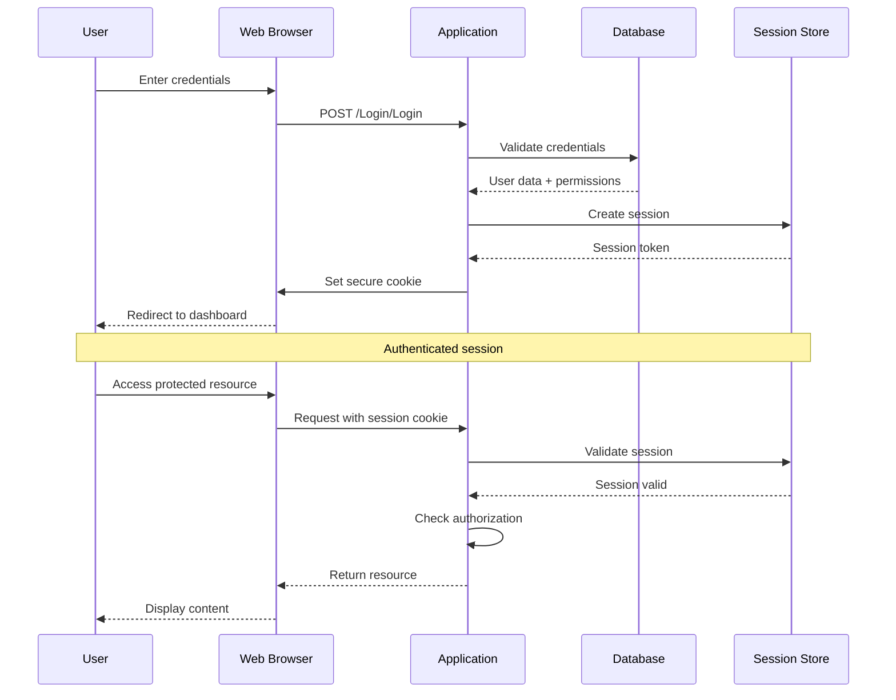

# HVAC Management System - Authentication & Authorization

## Table of Contents
1. [Authentication Overview](#authentication-overview)
2. [User Authentication](#user-authentication)
3. [Password Management](#password-management)
4. [Session Management](#session-management)
5. [Multi-Factor Authentication](#multi-factor-authentication)
6. [Authorization Framework](#authorization-framework)
7. [Role-Based Access Control](#role-based-access-control)
8. [Resource-Based Authorization](#resource-based-authorization)
9. [API Authentication](#api-authentication)
10. [Security Policies](#security-policies)
11. [Access Control Lists](#access-control-lists)
12. [Audit and Compliance](#audit-and-compliance)

## Authentication Overview

The HVAC Management System implements a comprehensive authentication and authorization framework to ensure secure access to system resources and data.

### Authentication Flow



### Authentication Components

| Component | Purpose | Implementation |
|-----------|---------|----------------|
| **Login Controller** | Handle authentication requests | ASP.NET MVC Controller |
| **User Service** | Validate credentials and manage users | Business Logic Layer |
| **Password Hasher** | Secure password storage and verification | BCrypt/PBKDF2 |
| **Session Manager** | Manage user sessions | ASP.NET Session State |
| **Authentication Filter** | Protect controller actions | Custom Action Filter |

## User Authentication

### 1. Login Process

#### Login Controller Implementation
```csharp
[AllowAnonymous]
public class LoginController : Controller
{
    private readonly HVACEntities _db;
    private readonly PasswordHasher _passwordHasher;
    private readonly SessionManager _sessionManager;
    
    public LoginController()
    {
        _db = new HVACEntities();
        _passwordHasher = new PasswordHasher();
        _sessionManager = new SessionManager();
    }
    
    [HttpGet]
    public ActionResult Index()
    {
        if (User.Identity.IsAuthenticated)
        {
            return RedirectToAction("Index", "Dashboard");
        }
        
        return View();
    }
    
    [HttpPost]
    [ValidateAntiForgeryToken]
    public ActionResult Login(LoginViewModel model)
    {
        if (!ModelState.IsValid)
        {
            return View("Index", model);
        }
        
        try
        {
            // Validate credentials
            var user = ValidateCredentials(model.UserName, model.Password);
            if (user == null)
            {
                ModelState.AddModelError("", "Invalid username or password.");
                LogFailedLogin(model.UserName, Request.UserHostAddress);
                return View("Index", model);
            }
            
            // Check if account is locked
            if (IsAccountLocked(user.UserID))
            {
                ModelState.AddModelError("", "Account is locked. Please contact administrator.");
                return View("Index", model);
            }
            
            // Create secure session
            _sessionManager.CreateSecureSession(user.UserID);
            
            // Update last login
            UpdateLastLogin(user.UserID);
            
            // Log successful login
            LogSuccessfulLogin(user.UserID, Request.UserHostAddress);
            
            // Redirect to dashboard
            return RedirectToAction("Index", "Dashboard");
        }
        catch (Exception ex)
        {
            LoggingHelper.LogError("Error during login", "LoginController", "Login", ex);
            ModelState.AddModelError("", "An error occurred during login. Please try again.");
            return View("Index", model);
        }
    }
    
    private UserRegistration ValidateCredentials(string username, string password)
    {
        var user = _db.UserRegistrations
            .FirstOrDefault(u => u.UserName == username && u.IsActive);
        
        if (user == null)
            return null;
        
        if (!_passwordHasher.VerifyPassword(password, user.Password))
        {
            IncrementFailedLoginAttempts(user.UserID);
            return null;
        }
        
        // Reset failed login attempts on successful login
        ResetFailedLoginAttempts(user.UserID);
        return user;
    }
}
```

#### Login View Model
```csharp
public class LoginViewModel
{
    [Required(ErrorMessage = "Username is required")]
    [StringLength(50, ErrorMessage = "Username cannot exceed 50 characters")]
    public string UserName { get; set; }
    
    [Required(ErrorMessage = "Password is required")]
    [StringLength(128, ErrorMessage = "Password cannot exceed 128 characters")]
    [DataType(DataType.Password)]
    public string Password { get; set; }
    
    [Display(Name = "Remember Me")]
    public bool RememberMe { get; set; }
    
    public string ReturnUrl { get; set; }
}
```

### 2. User Registration

#### Registration Process
```csharp
[HttpPost]
[ValidateAntiForgeryToken]
public ActionResult Register(UserRegistrationVM model)
{
    if (!ModelState.IsValid)
    {
        PopulateRegistrationDropdowns(model);
        return View(model);
    }
    
    try
    {
        // Validate unique username
        if (IsUsernameExists(model.UserName))
        {
            ModelState.AddModelError("UserName", "Username already exists.");
            PopulateRegistrationDropdowns(model);
            return View(model);
        }
        
        // Validate unique email
        if (IsEmailExists(model.Email))
        {
            ModelState.AddModelError("Email", "Email already exists.");
            PopulateRegistrationDropdowns(model);
            return View(model);
        }
        
        // Create new user
        var user = new UserRegistration
        {
            AcCompanyID = model.AcCompanyID,
            UserName = model.UserName,
            Password = _passwordHasher.HashPassword(model.Password),
            FirstName = model.FirstName,
            LastName = model.LastName,
            Email = model.Email,
            Phone = model.Phone,
            RoleID = model.RoleID,
            IsActive = true,
            CreatedDate = DateTime.Now
        };
        
        _db.UserRegistrations.Add(user);
        _db.SaveChanges();
        
        // Send welcome email
        SendWelcomeEmail(user);
        
        TempData["SuccessMsg"] = "User registered successfully.";
        return RedirectToAction("Index");
    }
    catch (Exception ex)
    {
        LoggingHelper.LogError("Error during user registration", "UserRegistrationController", "Register", ex);
        ModelState.AddModelError("", "An error occurred during registration. Please try again.");
        PopulateRegistrationDropdowns(model);
        return View(model);
    }
}
```

## Password Management

### 1. Password Policy

#### Password Requirements
```csharp
public class PasswordPolicy
{
    public const int MinLength = 8;
    public const int MaxLength = 128;
    public const bool RequireUppercase = true;
    public const bool RequireLowercase = true;
    public const bool RequireNumbers = true;
    public const bool RequireSpecialChars = true;
    public const int MaxAgeDays = 90;
    public const int HistoryCount = 5;
    public const int MinUniqueChars = 4;
    
    public static ValidationResult ValidatePassword(string password, string username = null)
    {
        var result = new ValidationResult();
        
        // Length validation
        if (password.Length < MinLength)
        {
            result.AddError("Password", $"Password must be at least {MinLength} characters long.");
        }
        
        if (password.Length > MaxLength)
        {
            result.AddError("Password", $"Password cannot exceed {MaxLength} characters.");
        }
        
        // Character requirements
        if (RequireUppercase && !password.Any(char.IsUpper))
        {
            result.AddError("Password", "Password must contain at least one uppercase letter.");
        }
        
        if (RequireLowercase && !password.Any(char.IsLower))
        {
            result.AddError("Password", "Password must contain at least one lowercase letter.");
        }
        
        if (RequireNumbers && !password.Any(char.IsDigit))
        {
            result.AddError("Password", "Password must contain at least one number.");
        }
        
        if (RequireSpecialChars && !password.Any(c => "!@#$%^&*()_+-=[]{}|;:,.<>?".Contains(c)))
        {
            result.AddError("Password", "Password must contain at least one special character.");
        }
        
        // Username similarity check
        if (!string.IsNullOrEmpty(username) && password.ToLower().Contains(username.ToLower()))
        {
            result.AddError("Password", "Password cannot contain the username.");
        }
        
        // Common password check
        if (IsCommonPassword(password))
        {
            result.AddError("Password", "Password is too common. Please choose a stronger password.");
        }
        
        return result;
    }
    
    private static bool IsCommonPassword(string password)
    {
        var commonPasswords = new[]
        {
            "password", "123456", "123456789", "qwerty", "abc123",
            "password123", "admin", "letmein", "welcome", "monkey"
        };
        
        return commonPasswords.Contains(password.ToLower());
    }
}
```

### 2. Password Hashing

#### Secure Password Hashing
```csharp
public class PasswordHasher
{
    private const int WorkFactor = 12;
    
    public string HashPassword(string password)
    {
        if (string.IsNullOrEmpty(password))
            throw new ArgumentException("Password cannot be null or empty.");
        
        // Use BCrypt for password hashing
        return BCrypt.Net.BCrypt.HashPassword(password, WorkFactor);
    }
    
    public bool VerifyPassword(string password, string hash)
    {
        if (string.IsNullOrEmpty(password) || string.IsNullOrEmpty(hash))
            return false;
        
        try
        {
            return BCrypt.Net.BCrypt.Verify(password, hash);
        }
        catch (Exception ex)
        {
            LoggingHelper.LogError("Error verifying password", "PasswordHasher", "VerifyPassword", ex);
            return false;
        }
    }
    
    public bool NeedsRehash(string hash)
    {
        try
        {
            var currentWorkFactor = BCrypt.Net.BCrypt.GetWorkFactor(hash);
            return currentWorkFactor < WorkFactor;
        }
        catch
        {
            return true; // Rehash if we can't determine work factor
        }
    }
}
```

### 3. Password Reset

#### Password Reset Process
```csharp
public class PasswordResetService
{
    private readonly HVACEntities _db;
    private readonly EmailService _emailService;
    private readonly PasswordHasher _passwordHasher;
    
    public PasswordResetService()
    {
        _db = new HVACEntities();
        _emailService = new EmailService();
        _passwordHasher = new PasswordHasher();
    }
    
    public bool InitiatePasswordReset(string email)
    {
        try
        {
            var user = _db.UserRegistrations
                .FirstOrDefault(u => u.Email == email && u.IsActive);
            
            if (user == null)
                return false; // Don't reveal if email exists
            
            // Generate reset token
            var resetToken = GenerateResetToken();
            var expiryTime = DateTime.Now.AddHours(24);
            
            // Store reset token
            StorePasswordResetToken(user.UserID, resetToken, expiryTime);
            
            // Send reset email
            SendPasswordResetEmail(user.Email, resetToken);
            
            return true;
        }
        catch (Exception ex)
        {
            LoggingHelper.LogError("Error initiating password reset", "PasswordResetService", "InitiatePasswordReset", ex);
            return false;
        }
    }
    
    public bool ResetPassword(string token, string newPassword)
    {
        try
        {
            var resetRequest = GetPasswordResetRequest(token);
            if (resetRequest == null || resetRequest.ExpiryTime < DateTime.Now)
            {
                return false; // Invalid or expired token
            }
            
            var user = _db.UserRegistrations.Find(resetRequest.UserID);
            if (user == null)
                return false;
            
            // Validate new password
            var validation = PasswordPolicy.ValidatePassword(newPassword, user.UserName);
            if (!validation.IsValid)
            {
                return false;
            }
            
            // Update password
            user.Password = _passwordHasher.HashPassword(newPassword);
            user.ModifiedDate = DateTime.Now;
            
            // Invalidate all sessions
            InvalidateUserSessions(user.UserID);
            
            // Remove reset token
            RemovePasswordResetToken(token);
            
            _db.SaveChanges();
            
            // Log password reset
            LogPasswordReset(user.UserID);
            
            return true;
        }
        catch (Exception ex)
        {
            LoggingHelper.LogError("Error resetting password", "PasswordResetService", "ResetPassword", ex);
            return false;
        }
    }
}
```

## Session Management

### 1. Secure Session Creation

#### Session Manager Implementation
```csharp
public class SessionManager
{
    private const int SessionTimeoutMinutes = 30;
    private const string SessionCookieName = "HVAC_Session";
    
    public void CreateSecureSession(int userId)
    {
        try
        {
            // Generate secure session ID
            var sessionId = GenerateSecureSessionId();
            
            // Get user information
            var user = GetUser(userId);
            if (user == null)
                throw new ArgumentException("User not found.");
            
            // Create session data
            var sessionData = new SessionData
            {
                SessionId = sessionId,
                UserId = userId,
                UserName = user.UserName,
                RoleId = user.RoleID,
                CompanyId = user.AcCompanyID,
                CreatedAt = DateTime.Now,
                ExpiresAt = DateTime.Now.AddMinutes(SessionTimeoutMinutes),
                IPAddress = GetClientIPAddress(),
                UserAgent = GetUserAgent()
            };
            
            // Store session in database
            StoreSession(sessionData);
            
            // Set secure cookie
            SetSecureCookie(sessionId);
            
            // Log session creation
            LogSessionEvent("SESSION_CREATED", userId, sessionId);
        }
        catch (Exception ex)
        {
            LoggingHelper.LogError("Error creating secure session", "SessionManager", "CreateSecureSession", ex);
            throw;
        }
    }
    
    private string GenerateSecureSessionId()
    {
        // Generate cryptographically secure random session ID
        using (var rng = new RNGCryptoServiceProvider())
        {
            var bytes = new byte[32];
            rng.GetBytes(bytes);
            return Convert.ToBase64String(bytes);
        }
    }
    
    private void SetSecureCookie(string sessionId)
    {
        var cookie = new HttpCookie(SessionCookieName, sessionId)
        {
            HttpOnly = true,           // Prevent XSS
            Secure = true,             // HTTPS only
            SameSite = SameSiteMode.Strict, // CSRF protection
            Expires = DateTime.Now.AddMinutes(SessionTimeoutMinutes)
        };
        
        HttpContext.Current.Response.Cookies.Add(cookie);
    }
}
```

### 2. Session Validation

#### Session Validation Filter
```csharp
public class SessionExpireFilterAttribute : ActionFilterAttribute
{
    public override void OnActionExecuting(ActionExecutingContext filterContext)
    {
        var session = HttpContext.Current.Session;
        var request = HttpContext.Current.Request;
        
        // Skip validation for login and public actions
        if (IsPublicAction(filterContext))
        {
            base.OnActionExecuting(filterContext);
            return;
        }
        
        try
        {
            // Check if user is authenticated
            if (session["UserID"] == null)
            {
                RedirectToLogin(filterContext);
                return;
            }
            
            // Validate session
            var sessionId = GetSessionIdFromCookie();
            if (string.IsNullOrEmpty(sessionId))
            {
                RedirectToLogin(filterContext);
                return;
            }
            
            var sessionData = ValidateSession(sessionId);
            if (sessionData == null)
            {
                RedirectToLogin(filterContext);
                return;
            }
            
            // Check session timeout
            if (IsSessionExpired(sessionData))
            {
                LogoutUser(sessionData.UserId);
                RedirectToLogin(filterContext);
                return;
            }
            
            // Check IP address (optional)
            if (HasIPChanged(sessionData))
            {
                LogoutUser(sessionData.UserId);
                RedirectToLogin(filterContext);
                return;
            }
            
            // Extend session if needed
            ExtendSession(sessionData);
            
            // Set user context
            SetUserContext(sessionData);
            
            base.OnActionExecuting(filterContext);
        }
        catch (Exception ex)
        {
            LoggingHelper.LogError("Error validating session", "SessionExpireFilter", "OnActionExecuting", ex);
            RedirectToLogin(filterContext);
        }
    }
    
    private bool IsPublicAction(ActionExecutingContext filterContext)
    {
        var controllerName = filterContext.ActionDescriptor.ControllerDescriptor.ControllerName;
        var actionName = filterContext.ActionDescriptor.ActionName;
        
        var publicActions = new[]
        {
            "Login", "Register", "ForgotPassword", "ResetPassword", "Error"
        };
        
        return publicActions.Contains(controllerName);
    }
}
```

### 3. Session Timeout Management

#### Automatic Session Extension
```csharp
public class SessionTimeoutManager
{
    private const int SessionExtensionMinutes = 5;
    
    public void ExtendSession(SessionData sessionData)
    {
        var timeUntilExpiry = sessionData.ExpiresAt - DateTime.Now;
        
        // Extend session if it's close to expiry
        if (timeUntilExpiry.TotalMinutes < SessionExtensionMinutes)
        {
            sessionData.ExpiresAt = DateTime.Now.AddMinutes(30);
            UpdateSession(sessionData);
            
            // Update cookie expiry
            UpdateSessionCookie(sessionData.SessionId);
            
            LogSessionEvent("SESSION_EXTENDED", sessionData.UserId, sessionData.SessionId);
        }
    }
    
    public void LogoutUser(int userId)
    {
        try
        {
            // Invalidate all sessions for user
            InvalidateUserSessions(userId);
            
            // Clear session data
            ClearSessionData();
            
            // Log logout
            LogSessionEvent("SESSION_LOGOUT", userId, null);
        }
        catch (Exception ex)
        {
            LoggingHelper.LogError("Error during logout", "SessionTimeoutManager", "LogoutUser", ex);
        }
    }
}
```

## Multi-Factor Authentication

### 1. TOTP Implementation

#### TOTP Service
```csharp
public class TOTPService
{
    private const int SecretKeyLength = 20;
    private const int TimeStepSeconds = 30;
    private const int CodeLength = 6;
    
    public string GenerateSecretKey()
    {
        var key = new byte[SecretKeyLength];
        using (var rng = new RNGCryptoServiceProvider())
        {
            rng.GetBytes(key);
        }
        return Base32Encoding.ToString(key);
    }
    
    public string GenerateQRCodeUrl(string secretKey, string username, string issuer = "HVAC System")
    {
        var url = $"otpauth://totp/{issuer}:{username}?secret={secretKey}&issuer={issuer}";
        return url;
    }
    
    public bool ValidateCode(string secretKey, string code)
    {
        var expectedCode = GenerateCode(secretKey, DateTimeOffset.UtcNow);
        return string.Equals(code, expectedCode, StringComparison.OrdinalIgnoreCase);
    }
    
    private string GenerateCode(string secretKey, DateTimeOffset timestamp)
    {
        var key = Base32Encoding.ToBytes(secretKey);
        var timeStep = (timestamp.ToUnixTimeSeconds() / TimeStepSeconds);
        var timeStepBytes = BitConverter.GetBytes(timeStep);
        
        if (BitConverter.IsLittleEndian)
        {
            Array.Reverse(timeStepBytes);
        }
        
        var hmac = new HMACSHA1(key);
        var hash = hmac.ComputeHash(timeStepBytes);
        
        var offset = hash[hash.Length - 1] & 0x0F;
        var code = ((hash[offset] & 0x7F) << 24) |
                   ((hash[offset + 1] & 0xFF) << 16) |
                   ((hash[offset + 2] & 0xFF) << 8) |
                   (hash[offset + 3] & 0xFF);
        
        code = code % (int)Math.Pow(10, CodeLength);
        return code.ToString().PadLeft(CodeLength, '0');
    }
}
```

### 2. MFA Setup Process

#### MFA Setup Controller
```csharp
[Authorize]
public class MFAController : Controller
{
    private readonly TOTPService _totpService;
    private readonly HVACEntities _db;
    
    public MFAController()
    {
        _totpService = new TOTPService();
        _db = new HVACEntities();
    }
    
    [HttpGet]
    public ActionResult Setup()
    {
        var userId = GetCurrentUserId();
        var user = _db.UserRegistrations.Find(userId);
        
        if (user.MFASecretKey != null)
        {
            return RedirectToAction("Index", "Dashboard");
        }
        
        var secretKey = _totpService.GenerateSecretKey();
        var qrCodeUrl = _totpService.GenerateQRCodeUrl(secretKey, user.UserName);
        
        var model = new MFASetupViewModel
        {
            SecretKey = secretKey,
            QRCodeUrl = qrCodeUrl,
            ManualEntryKey = secretKey
        };
        
        return View(model);
    }
    
    [HttpPost]
    [ValidateAntiForgeryToken]
    public ActionResult VerifySetup(MFASetupViewModel model)
    {
        if (!ModelState.IsValid)
        {
            return View("Setup", model);
        }
        
        try
        {
            // Validate TOTP code
            if (!_totpService.ValidateCode(model.SecretKey, model.VerificationCode))
            {
                ModelState.AddModelError("VerificationCode", "Invalid verification code.");
                return View("Setup", model);
            }
            
            // Save MFA secret key
            var userId = GetCurrentUserId();
            var user = _db.UserRegistrations.Find(userId);
            user.MFASecretKey = model.SecretKey;
            user.MFAEnabled = true;
            user.ModifiedDate = DateTime.Now;
            
            _db.SaveChanges();
            
            TempData["SuccessMsg"] = "Multi-factor authentication enabled successfully.";
            return RedirectToAction("Index", "Dashboard");
        }
        catch (Exception ex)
        {
            LoggingHelper.LogError("Error setting up MFA", "MFAController", "VerifySetup", ex);
            ModelState.AddModelError("", "An error occurred while setting up MFA. Please try again.");
            return View("Setup", model);
        }
    }
}
```

## Authorization Framework

### 1. Role-Based Access Control

#### Role Definition
```csharp
public class Role
{
    public int RoleID { get; set; }
    public string RoleName { get; set; }
    public string Description { get; set; }
    public bool IsActive { get; set; }
    public List<Permission> Permissions { get; set; }
    public DateTime CreatedDate { get; set; }
    public DateTime ModifiedDate { get; set; }
}

public class Permission
{
    public int PermissionID { get; set; }
    public string PermissionName { get; set; }
    public string Resource { get; set; }
    public string Action { get; set; }
    public string Description { get; set; }
    public bool IsActive { get; set; }
}
```

#### Default Roles and Permissions
```csharp
public class DefaultRoles
{
    public static readonly Role Administrator = new Role
    {
        RoleID = 1,
        RoleName = "Administrator",
        Description = "Full system access",
        Permissions = new List<Permission>
        {
            new Permission { Resource = "User", Action = "Create" },
            new Permission { Resource = "User", Action = "Read" },
            new Permission { Resource = "User", Action = "Update" },
            new Permission { Resource = "User", Action = "Delete" },
            new Permission { Resource = "Enquiry", Action = "Create" },
            new Permission { Resource = "Enquiry", Action = "Read" },
            new Permission { Resource = "Enquiry", Action = "Update" },
            new Permission { Resource = "Enquiry", Action = "Delete" },
            new Permission { Resource = "Quotation", Action = "Create" },
            new Permission { Resource = "Quotation", Action = "Read" },
            new Permission { Resource = "Quotation", Action = "Update" },
            new Permission { Resource = "Quotation", Action = "Delete" },
            new Permission { Resource = "Reports", Action = "Read" },
            new Permission { Resource = "System", Action = "Configure" }
        }
    };
    
    public static readonly Role Manager = new Role
    {
        RoleID = 2,
        RoleName = "Manager",
        Description = "Management level access",
        Permissions = new List<Permission>
        {
            new Permission { Resource = "Enquiry", Action = "Create" },
            new Permission { Resource = "Enquiry", Action = "Read" },
            new Permission { Resource = "Enquiry", Action = "Update" },
            new Permission { Resource = "Quotation", Action = "Create" },
            new Permission { Resource = "Quotation", Action = "Read" },
            new Permission { Resource = "Quotation", Action = "Update" },
            new Permission { Resource = "Reports", Action = "Read" }
        }
    };
    
    public static readonly Role SalesExecutive = new Role
    {
        RoleID = 3,
        RoleName = "Sales Executive",
        Description = "Sales and enquiry management",
        Permissions = new List<Permission>
        {
            new Permission { Resource = "Enquiry", Action = "Create" },
            new Permission { Resource = "Enquiry", Action = "Read" },
            new Permission { Resource = "Enquiry", Action = "Update" },
            new Permission { Resource = "Quotation", Action = "Create" },
            new Permission { Resource = "Quotation", Action = "Read" },
            new Permission { Resource = "Quotation", Action = "Update" }
        }
    };
}
```

### 2. Authorization Attributes

#### Custom Authorization Attributes
```csharp
[AttributeUsage(AttributeTargets.Method | AttributeTargets.Class)]
public class AuthorizeRoleAttribute : AuthorizeAttribute
{
    private readonly string[] _roles;
    
    public AuthorizeRoleAttribute(params string[] roles)
    {
        _roles = roles;
    }
    
    public override void OnAuthorization(AuthorizationContext filterContext)
    {
        base.OnAuthorization(filterContext);
        
        if (filterContext.Result is HttpUnauthorizedResult)
        {
            var user = GetCurrentUser();
            if (user == null)
            {
                filterContext.Result = new RedirectToRouteResult(
                    new RouteValueDictionary(new { controller = "Login", action = "Index" }));
            }
            else
            {
                filterContext.Result = new RedirectToRouteResult(
                    new RouteValueDictionary(new { controller = "Error", action = "Unauthorized" }));
            }
        }
    }
}

[AttributeUsage(AttributeTargets.Method | AttributeTargets.Class)]
public class AuthorizePermissionAttribute : AuthorizeAttribute
{
    private readonly string _resource;
    private readonly string _action;
    
    public AuthorizePermissionAttribute(string resource, string action)
    {
        _resource = resource;
        _action = action;
    }
    
    public override void OnAuthorization(AuthorizationContext filterContext)
    {
        base.OnAuthorization(filterContext);
        
        var user = GetCurrentUser();
        if (user == null)
        {
            filterContext.Result = new RedirectToRouteResult(
                new RouteValueDictionary(new { controller = "Login", action = "Index" }));
            return;
        }
        
        if (!HasPermission(user, _resource, _action))
        {
            filterContext.Result = new RedirectToRouteResult(
                new RouteValueDictionary(new { controller = "Error", action = "Unauthorized" }));
        }
    }
}
```

### 3. Permission Checking

#### Permission Service
```csharp
public class PermissionService
{
    private readonly HVACEntities _db;
    
    public PermissionService()
    {
        _db = new HVACEntities();
    }
    
    public bool HasPermission(int userId, string resource, string action)
    {
        try
        {
            var user = _db.UserRegistrations
                .Include(u => u.Role)
                .Include(u => u.Role.Permissions)
                .FirstOrDefault(u => u.UserID == userId);
            
            if (user?.Role?.Permissions == null)
                return false;
            
            return user.Role.Permissions.Any(p => 
                p.Resource.Equals(resource, StringComparison.OrdinalIgnoreCase) &&
                p.Action.Equals(action, StringComparison.OrdinalIgnoreCase) &&
                p.IsActive);
        }
        catch (Exception ex)
        {
            LoggingHelper.LogError("Error checking permission", "PermissionService", "HasPermission", ex);
            return false;
        }
    }
    
    public List<Permission> GetUserPermissions(int userId)
    {
        try
        {
            var user = _db.UserRegistrations
                .Include(u => u.Role)
                .Include(u => u.Role.Permissions)
                .FirstOrDefault(u => u.UserID == userId);
            
            return user?.Role?.Permissions?.Where(p => p.IsActive).ToList() ?? new List<Permission>();
        }
        catch (Exception ex)
        {
            LoggingHelper.LogError("Error getting user permissions", "PermissionService", "GetUserPermissions", ex);
            return new List<Permission>();
        }
    }
}
```

## Resource-Based Authorization

### 1. Resource Ownership

#### Resource Authorization Service
```csharp
public class ResourceAuthorizationService
{
    private readonly HVACEntities _db;
    
    public ResourceAuthorizationService()
    {
        _db = new HVACEntities();
    }
    
    public bool CanAccessEnquiry(int userId, int enquiryId)
    {
        try
        {
            var user = _db.UserRegistrations.Find(userId);
            var enquiry = _db.Enquiries.Find(enquiryId);
            
            if (user == null || enquiry == null)
                return false;
            
            // Administrator can access all enquiries
            if (user.RoleID == 1)
                return true;
            
            // User can access enquiries from their branch
            if (user.BranchID == enquiry.BranchID)
                return true;
            
            // User can access enquiries they created
            if (enquiry.CreatedBy == userId)
                return true;
            
            return false;
        }
        catch (Exception ex)
        {
            LoggingHelper.LogError("Error checking enquiry access", "ResourceAuthorizationService", "CanAccessEnquiry", ex);
            return false;
        }
    }
    
    public bool CanModifyEnquiry(int userId, int enquiryId)
    {
        try
        {
            var user = _db.UserRegistrations.Find(userId);
            var enquiry = _db.Enquiries.Find(enquiryId);
            
            if (user == null || enquiry == null)
                return false;
            
            // Administrator can modify all enquiries
            if (user.RoleID == 1)
                return true;
            
            // Manager can modify enquiries from their branch
            if (user.RoleID == 2 && user.BranchID == enquiry.BranchID)
                return true;
            
            // User can modify enquiries they created
            if (enquiry.CreatedBy == userId)
                return true;
            
            return false;
        }
        catch (Exception ex)
        {
            LoggingHelper.LogError("Error checking enquiry modification", "ResourceAuthorizationService", "CanModifyEnquiry", ex);
            return false;
        }
    }
}
```

### 2. Data Filtering

#### Data Access Control
```csharp
public class DataAccessControl
{
    private readonly HVACEntities _db;
    
    public DataAccessControl()
    {
        _db = new HVACEntities();
    }
    
    public IQueryable<Enquiry> GetAccessibleEnquiries(int userId)
    {
        try
        {
            var user = _db.UserRegistrations.Find(userId);
            if (user == null)
                return Enumerable.Empty<Enquiry>().AsQueryable();
            
            var query = _db.Enquiries.AsQueryable();
            
            // Administrator can see all enquiries
            if (user.RoleID == 1)
                return query;
            
            // Other users can only see enquiries from their branch
            return query.Where(e => e.BranchID == user.BranchID);
        }
        catch (Exception ex)
        {
            LoggingHelper.LogError("Error getting accessible enquiries", "DataAccessControl", "GetAccessibleEnquiries", ex);
            return Enumerable.Empty<Enquiry>().AsQueryable();
        }
    }
    
    public IQueryable<CustomerMaster> GetAccessibleCustomers(int userId)
    {
        try
        {
            var user = _db.UserRegistrations.Find(userId);
            if (user == null)
                return Enumerable.Empty<CustomerMaster>().AsQueryable();
            
            // All users can see all customers (business requirement)
            return _db.CustomerMasters.Where(c => c.IsActive);
        }
        catch (Exception ex)
        {
            LoggingHelper.LogError("Error getting accessible customers", "DataAccessControl", "GetAccessibleCustomers", ex);
            return Enumerable.Empty<CustomerMaster>().AsQueryable();
        }
    }
}
```

## API Authentication

### 1. API Key Authentication

#### API Key Service
```csharp
public class APIKeyService
{
    private readonly HVACEntities _db;
    
    public APIKeyService()
    {
        _db = new HVACEntities();
    }
    
    public string GenerateAPIKey(int userId)
    {
        var apiKey = GenerateSecureKey();
        var hashedKey = HashAPIKey(apiKey);
        
        var keyRecord = new APIKey
        {
            UserID = userId,
            HashedKey = hashedKey,
            CreatedDate = DateTime.Now,
            ExpiryDate = DateTime.Now.AddYears(1),
            IsActive = true
        };
        
        _db.APIKeys.Add(keyRecord);
        _db.SaveChanges();
        
        return apiKey;
    }
    
    public bool ValidateAPIKey(string apiKey)
    {
        try
        {
            var hashedKey = HashAPIKey(apiKey);
            var keyRecord = _db.APIKeys
                .FirstOrDefault(k => k.HashedKey == hashedKey && k.IsActive && k.ExpiryDate > DateTime.Now);
            
            return keyRecord != null;
        }
        catch (Exception ex)
        {
            LoggingHelper.LogError("Error validating API key", "APIKeyService", "ValidateAPIKey", ex);
            return false;
        }
    }
    
    private string GenerateSecureKey()
    {
        using (var rng = new RNGCryptoServiceProvider())
        {
            var bytes = new byte[32];
            rng.GetBytes(bytes);
            return Convert.ToBase64String(bytes);
        }
    }
    
    private string HashAPIKey(string apiKey)
    {
        using (var sha256 = SHA256.Create())
        {
            var hash = sha256.ComputeHash(Encoding.UTF8.GetBytes(apiKey));
            return Convert.ToBase64String(hash);
        }
    }
}
```

### 2. JWT Token Authentication

#### JWT Service
```csharp
public class JWTService
{
    private readonly string _secretKey;
    private readonly string _issuer;
    private readonly string _audience;
    
    public JWTService()
    {
        _secretKey = ConfigurationManager.AppSettings["JWTSecretKey"];
        _issuer = ConfigurationManager.AppSettings["JWTIssuer"];
        _audience = ConfigurationManager.AppSettings["JWTAudience"];
    }
    
    public string GenerateToken(int userId, string username, int roleId)
    {
        var tokenHandler = new JwtSecurityTokenHandler();
        var key = Encoding.ASCII.GetBytes(_secretKey);
        
        var tokenDescriptor = new SecurityTokenDescriptor
        {
            Subject = new ClaimsIdentity(new[]
            {
                new Claim(ClaimTypes.NameIdentifier, userId.ToString()),
                new Claim(ClaimTypes.Name, username),
                new Claim(ClaimTypes.Role, roleId.ToString()),
                new Claim("iat", DateTimeOffset.UtcNow.ToUnixTimeSeconds().ToString(), ClaimValueTypes.Integer64)
            }),
            Expires = DateTime.UtcNow.AddHours(1),
            Issuer = _issuer,
            Audience = _audience,
            SigningCredentials = new SigningCredentials(new SymmetricSecurityKey(key), SecurityAlgorithms.HmacSha256Signature)
        };
        
        var token = tokenHandler.CreateToken(tokenDescriptor);
        return tokenHandler.WriteToken(token);
    }
    
    public ClaimsPrincipal ValidateToken(string token)
    {
        try
        {
            var tokenHandler = new JwtSecurityTokenHandler();
            var key = Encoding.ASCII.GetBytes(_secretKey);
            
            var validationParameters = new TokenValidationParameters
            {
                ValidateIssuerSigningKey = true,
                IssuerSigningKey = new SymmetricSecurityKey(key),
                ValidateIssuer = true,
                ValidIssuer = _issuer,
                ValidateAudience = true,
                ValidAudience = _audience,
                ValidateLifetime = true,
                ClockSkew = TimeSpan.Zero
            };
            
            var principal = tokenHandler.ValidateToken(token, validationParameters, out SecurityToken validatedToken);
            return principal;
        }
        catch (Exception ex)
        {
            LoggingHelper.LogError("Error validating JWT token", "JWTService", "ValidateToken", ex);
            return null;
        }
    }
}
```

## Security Policies

### 1. Password Policy Enforcement

#### Password Policy Service
```csharp
public class PasswordPolicyService
{
    public bool EnforcePasswordPolicy(string password, int userId)
    {
        var validation = PasswordPolicy.ValidatePassword(password);
        if (!validation.IsValid)
        {
            return false;
        }
        
        // Check password history
        if (IsPasswordInHistory(userId, password))
        {
            return false;
        }
        
        // Check password age
        if (IsPasswordExpired(userId))
        {
            return false;
        }
        
        return true;
    }
    
    private bool IsPasswordInHistory(int userId, string password)
    {
        // Check if password was used in last N passwords
        var passwordHistory = GetPasswordHistory(userId, PasswordPolicy.HistoryCount);
        return passwordHistory.Any(h => _passwordHasher.VerifyPassword(password, h.HashedPassword));
    }
    
    private bool IsPasswordExpired(int userId)
    {
        var user = GetUser(userId);
        if (user == null)
            return false;
        
        var passwordAge = DateTime.Now - user.PasswordChangedDate;
        return passwordAge.TotalDays > PasswordPolicy.MaxAgeDays;
    }
}
```

### 2. Account Lockout Policy

#### Account Lockout Service
```csharp
public class AccountLockoutService
{
    private const int MaxFailedAttempts = 5;
    private const int LockoutDurationMinutes = 30;
    
    public bool IsAccountLocked(int userId)
    {
        var user = GetUser(userId);
        if (user == null)
            return false;
        
        return user.FailedLoginAttempts >= MaxFailedAttempts &&
               user.LastFailedLogin > DateTime.Now.AddMinutes(-LockoutDurationMinutes);
    }
    
    public void RecordFailedLogin(int userId)
    {
        var user = GetUser(userId);
        if (user == null)
            return;
        
        user.FailedLoginAttempts++;
        user.LastFailedLogin = DateTime.Now;
        
        if (user.FailedLoginAttempts >= MaxFailedAttempts)
        {
            user.IsLocked = true;
            user.LockedUntil = DateTime.Now.AddMinutes(LockoutDurationMinutes);
            
            // Log security event
            LogSecurityEvent("ACCOUNT_LOCKED", userId, "Account locked due to failed login attempts");
        }
        
        SaveUser(user);
    }
    
    public void ResetFailedLogins(int userId)
    {
        var user = GetUser(userId);
        if (user == null)
            return;
        
        user.FailedLoginAttempts = 0;
        user.IsLocked = false;
        user.LockedUntil = null;
        
        SaveUser(user);
    }
}
```

## Audit and Compliance

### 1. Security Audit Logging

#### Security Audit Service
```csharp
public class SecurityAuditService
{
    public void LogAuthenticationEvent(string eventType, int userId, string details)
    {
        var auditLog = new SecurityAuditLog
        {
            EventType = eventType,
            UserID = userId,
            IPAddress = GetClientIPAddress(),
            UserAgent = GetUserAgent(),
            Details = details,
            Timestamp = DateTime.Now,
            Severity = GetEventSeverity(eventType)
        };
        
        SaveAuditLog(auditLog);
    }
    
    public void LogAuthorizationEvent(string eventType, int userId, string resource, string action, bool success)
    {
        var details = $"Resource: {resource}, Action: {action}, Success: {success}";
        LogAuthenticationEvent(eventType, userId, details);
    }
    
    public void LogDataAccessEvent(int userId, string tableName, string operation, string recordId)
    {
        var details = $"Table: {tableName}, Operation: {operation}, RecordID: {recordId}";
        LogAuthenticationEvent("DATA_ACCESS", userId, details);
    }
}
```

### 2. Compliance Reporting

#### Compliance Report Generator
```csharp
public class ComplianceReportGenerator
{
    public ComplianceReport GenerateUserAccessReport(DateTime fromDate, DateTime toDate)
    {
        var report = new ComplianceReport
        {
            ReportDate = DateTime.Now,
            PeriodFrom = fromDate,
            PeriodTo = toDate,
            UserAccessEvents = GetUserAccessEvents(fromDate, toDate),
            FailedLoginAttempts = GetFailedLoginAttempts(fromDate, toDate),
            PrivilegeEscalations = GetPrivilegeEscalations(fromDate, toDate),
            DataAccessEvents = GetDataAccessEvents(fromDate, toDate)
        };
        
        return report;
    }
    
    public List<SecurityViolation> GetSecurityViolations(DateTime fromDate, DateTime toDate)
    {
        return _db.SecurityAuditLogs
            .Where(l => l.Timestamp >= fromDate && l.Timestamp <= toDate)
            .Where(l => l.Severity == "High" || l.Severity == "Critical")
            .Select(l => new SecurityViolation
            {
                EventType = l.EventType,
                UserID = l.UserID,
                IPAddress = l.IPAddress,
                Details = l.Details,
                Timestamp = l.Timestamp,
                Severity = l.Severity
            })
            .ToList();
    }
}
```

---

*This authentication and authorization documentation provides comprehensive information about the HVAC Management System's security framework, user management, and access control mechanisms.*
