# HVAC Management System - Security Overview

## Table of Contents
1. [Security Architecture](#security-architecture)
2. [Threat Model](#threat-model)
3. [Security Controls](#security-controls)
4. [Authentication Security](#authentication-security)
5. [Authorization Security](#authorization-security)
6. [Data Protection](#data-protection)
7. [Network Security](#network-security)
8. [Application Security](#application-security)
9. [Database Security](#database-security)
10. [File Upload Security](#file-upload-security)
11. [Session Security](#session-security)
12. [Audit and Logging](#audit-and-logging)
13. [Security Monitoring](#security-monitoring)
14. [Incident Response](#incident-response)

## Security Architecture

The HVAC Management System implements a multi-layered security architecture designed to protect against various threats and vulnerabilities.

### Security Layers

```mermaid
graph TB
    subgraph "Security Layers"
        A[Network Security]
        B[Application Security]
        C[Data Security]
        D[Session Security]
    end
    
    subgraph "Network Security Components"
        E[Firewall]
        F[SSL/TLS]
        G[VPN Access]
        H[Load Balancer]
    end
    
    subgraph "Application Security Components"
        I[Authentication]
        J[Authorization]
        K[Input Validation]
        L[Output Encoding]
        M[CSRF Protection]
    end
    
    subgraph "Data Security Components"
        N[Encryption at Rest]
        O[Encryption in Transit]
        P[Database Security]
        Q[File Encryption]
    end
    
    subgraph "Session Security Components"
        R[Session Management]
        S[Session Timeout]
        T[Session Regeneration]
        U[Secure Cookies]
    end
    
    A --> E
    A --> F
    A --> G
    A --> H
    
    B --> I
    B --> J
    B --> K
    B --> L
    B --> M
    
    C --> N
    C --> O
    C --> P
    C --> Q
    
    D --> R
    D --> S
    D --> T
    D --> U
```



### Security Principles

1. **Defense in Depth**: Multiple layers of security controls
2. **Least Privilege**: Users have minimum required access
3. **Fail Secure**: System fails to secure state by default
4. **Separation of Duties**: Critical functions require multiple approvals
5. **Continuous Monitoring**: Real-time security monitoring and alerting

## Threat Model

### Identified Threats

| Threat Category | Specific Threats | Risk Level | Mitigation |
|----------------|------------------|------------|------------|
| **Authentication** | Brute force attacks | High | Account lockout, CAPTCHA |
| **Authentication** | Password guessing | High | Strong password policy |
| **Authentication** | Session hijacking | Medium | Secure session management |
| **Authorization** | Privilege escalation | High | Role-based access control |
| **Authorization** | Unauthorized access | High | Authentication required |
| **Data** | SQL injection | High | Parameterized queries |
| **Data** | XSS attacks | Medium | Output encoding |
| **Data** | Data breach | High | Encryption, access controls |
| **Network** | Man-in-the-middle | Medium | SSL/TLS encryption |
| **Network** | DDoS attacks | Medium | Rate limiting, load balancing |
| **File Upload** | Malicious files | High | File validation, scanning |
| **File Upload** | Path traversal | Medium | Input validation |

### Attack Vectors

#### 1. Web Application Attacks
- **SQL Injection**: Malicious SQL code injection
- **Cross-Site Scripting (XSS)**: Script injection attacks
- **Cross-Site Request Forgery (CSRF)**: Unauthorized actions
- **File Upload Attacks**: Malicious file uploads
- **Directory Traversal**: Unauthorized file access

#### 2. Authentication Attacks
- **Brute Force**: Automated password guessing
- **Dictionary Attacks**: Common password attempts
- **Session Hijacking**: Stealing session tokens
- **Credential Stuffing**: Using leaked credentials

#### 3. Authorization Attacks
- **Privilege Escalation**: Gaining higher access levels
- **Horizontal Escalation**: Accessing other users' data
- **Vertical Escalation**: Gaining administrative access

## Security Controls

### 1. Preventive Controls

#### Input Validation
```csharp
// Server-side validation
[Required(ErrorMessage = "Project name is required")]
[StringLength(200, ErrorMessage = "Project name cannot exceed 200 characters")]
public string ProjectName { get; set; }

// Custom validation
public class EnquiryDateValidationAttribute : ValidationAttribute
{
    public override bool IsValid(object value)
    {
        if (value is DateTime date)
        {
            return date <= DateTime.Now;
        }
        return false;
    }
}
```

#### Output Encoding
```csharp
// HTML encoding
@Html.Encode(Model.ProjectName)

// JSON encoding
@Html.Raw(Json.Encode(Model.ProjectName))

// URL encoding
@Url.Encode(Model.ProjectName)
```

#### CSRF Protection
```csharp
[HttpPost]
[ValidateAntiForgeryToken]
public ActionResult Create(EnquiryVM model)
{
    // Action implementation
}
```

### 2. Detective Controls

#### Audit Logging
```csharp
public class AuditLog
{
    public int AuditLogID { get; set; }
    public string TableName { get; set; }
    public int RecordID { get; set; }
    public string Operation { get; set; }
    public string OldValues { get; set; }
    public string NewValues { get; set; }
    public int UserID { get; set; }
    public DateTime Timestamp { get; set; }
}
```

#### Security Monitoring
```csharp
public class SecurityMonitor
{
    public void LogFailedLogin(string username, string ipAddress)
    {
        LoggingHelper.LogWarning($"Failed login attempt for user: {username} from IP: {ipAddress}");
    }
    
    public void LogSuspiciousActivity(string activity, string details)
    {
        LoggingHelper.LogError($"Suspicious activity detected: {activity} - {details}");
    }
}
```

### 3. Corrective Controls

#### Error Handling
```csharp
try
{
    // Sensitive operation
}
catch (SecurityException ex)
{
    LoggingHelper.LogError("Security violation detected", ex);
    // Log security incident
    // Notify security team
    // Block user if necessary
}
catch (Exception ex)
{
    LoggingHelper.LogError("Unexpected error", ex);
    // Generic error handling
}
```

## Authentication Security

### 1. Password Security

#### Password Policy
```csharp
public class PasswordPolicy
{
    public const int MinLength = 8;
    public const int MaxLength = 128;
    public const bool RequireUppercase = true;
    public const bool RequireLowercase = true;
    public const bool RequireNumbers = true;
    public const bool RequireSpecialChars = true;
    public const int MaxAgeDays = 90;
    public const int HistoryCount = 5;
}
```

#### Password Hashing
```csharp
public class PasswordHasher
{
    public string HashPassword(string password)
    {
        // Use bcrypt or PBKDF2 for password hashing
        return BCrypt.Net.BCrypt.HashPassword(password, 12);
    }
    
    public bool VerifyPassword(string password, string hash)
    {
        return BCrypt.Net.BCrypt.Verify(password, hash);
    }
}
```

### 2. Account Security

#### Account Lockout
```csharp
public class AccountLockout
{
    public const int MaxFailedAttempts = 5;
    public const int LockoutDurationMinutes = 30;
    
    public bool IsAccountLocked(string username)
    {
        var user = GetUser(username);
        if (user == null) return false;
        
        return user.FailedLoginAttempts >= MaxFailedAttempts &&
               user.LastFailedLogin > DateTime.Now.AddMinutes(-LockoutDurationMinutes);
    }
}
```

#### Session Management
```csharp
public class SessionManager
{
    public void CreateSession(int userId)
    {
        // Generate secure session token
        var sessionToken = GenerateSecureToken();
        
        // Store session in database
        StoreSession(userId, sessionToken);
        
        // Set secure cookie
        SetSecureCookie("HVAC_Session", sessionToken);
    }
    
    public bool ValidateSession(string sessionToken)
    {
        var session = GetSession(sessionToken);
        return session != null && !session.IsExpired;
    }
}
```

## Authorization Security

### 1. Role-Based Access Control (RBAC)

#### Role Definition
```csharp
public class Role
{
    public int RoleID { get; set; }
    public string RoleName { get; set; }
    public string Description { get; set; }
    public List<Permission> Permissions { get; set; }
}

public class Permission
{
    public int PermissionID { get; set; }
    public string PermissionName { get; set; }
    public string Resource { get; set; }
    public string Action { get; set; }
}
```

#### Authorization Attributes
```csharp
[AttributeUsage(AttributeTargets.Method | AttributeTargets.Class)]
public class AuthorizeRoleAttribute : AuthorizeAttribute
{
    public AuthorizeRoleAttribute(params string[] roles)
    {
        Roles = string.Join(",", roles);
    }
}

// Usage
[AuthorizeRole("Administrator", "Manager")]
public ActionResult DeleteEnquiry(int id)
{
    // Action implementation
}
```

### 2. Resource-Based Authorization

#### Resource Authorization
```csharp
public class ResourceAuthorization
{
    public bool CanAccessEnquiry(int userId, int enquiryId)
    {
        var user = GetUser(userId);
        var enquiry = GetEnquiry(enquiryId);
        
        // Check if user can access this enquiry
        return user.RoleID == 1 || // Administrator
               enquiry.CreatedBy == userId || // Owner
               IsInSameBranch(user, enquiry); // Same branch
    }
}
```

## Data Protection

### 1. Encryption at Rest

#### Database Encryption
```sql
-- Enable Transparent Data Encryption
CREATE DATABASE ENCRYPTION KEY
WITH ALGORITHM = AES_256
ENCRYPTION BY SERVER CERTIFICATE HVAC_Certificate;

ALTER DATABASE HVAC_DB SET ENCRYPTION ON;
```

#### File Encryption
```csharp
public class FileEncryption
{
    public void EncryptFile(string filePath, string encryptedPath)
    {
        using (var inputFile = new FileStream(filePath, FileMode.Open))
        using (var outputFile = new FileStream(encryptedPath, FileMode.Create))
        using (var aes = Aes.Create())
        {
            aes.Key = GetEncryptionKey();
            aes.GenerateIV();
            
            // Write IV to output file
            outputFile.Write(aes.IV, 0, aes.IV.Length);
            
            using (var cryptoStream = new CryptoStream(outputFile, aes.CreateEncryptor(), CryptoStreamMode.Write))
            {
                inputFile.CopyTo(cryptoStream);
            }
        }
    }
}
```

### 2. Encryption in Transit

#### SSL/TLS Configuration
```xml
<system.webServer>
  <httpProtocol>
    <customHeaders>
      <add name="Strict-Transport-Security" value="max-age=31536000; includeSubDomains" />
    </customHeaders>
  </httpProtocol>
</system.webServer>
```

#### API Security
```csharp
[RequireHttps]
public class ApiController : Controller
{
    [HttpGet]
    [Authorize]
    public ActionResult GetEnquiries()
    {
        // API implementation
    }
}
```

## Network Security

### 1. Firewall Configuration

#### Inbound Rules
```powershell
# Allow HTTPS traffic
New-NetFirewallRule -DisplayName "HVAC HTTPS" -Direction Inbound -Protocol TCP -LocalPort 443 -Action Allow

# Allow HTTP traffic (redirect to HTTPS)
New-NetFirewallRule -DisplayName "HVAC HTTP" -Direction Inbound -Protocol TCP -LocalPort 80 -Action Allow

# Allow SQL Server traffic (internal only)
New-NetFirewallRule -DisplayName "HVAC SQL Server" -Direction Inbound -Protocol TCP -LocalPort 1433 -Action Allow -RemoteAddress "10.0.0.0/8"
```

#### Outbound Rules
```powershell
# Allow HTTPS outbound
New-NetFirewallRule -DisplayName "HTTPS Outbound" -Direction Outbound -Protocol TCP -RemotePort 443 -Action Allow

# Allow SMTP outbound
New-NetFirewallRule -DisplayName "SMTP Outbound" -Direction Outbound -Protocol TCP -RemotePort 587 -Action Allow
```

### 2. Load Balancer Security

#### SSL Termination
```yaml
# Load balancer configuration
ssl_certificate: /path/to/certificate.crt
ssl_certificate_key: /path/to/private.key
ssl_protocols: TLSv1.2 TLSv1.3
ssl_ciphers: ECDHE-RSA-AES256-GCM-SHA384:ECDHE-RSA-AES128-GCM-SHA256
```

## Application Security

### 1. Input Validation

#### Server-Side Validation
```csharp
public class EnquiryValidator
{
    public ValidationResult Validate(EnquiryVM model)
    {
        var result = new ValidationResult();
        
        // Required field validation
        if (string.IsNullOrWhiteSpace(model.ProjectName))
        {
            result.AddError("ProjectName", "Project name is required.");
        }
        
        // Length validation
        if (model.ProjectName?.Length > 200)
        {
            result.AddError("ProjectName", "Project name cannot exceed 200 characters.");
        }
        
        // Format validation
        if (!IsValidEmail(model.Email))
        {
            result.AddError("Email", "Invalid email format.");
        }
        
        // Business rule validation
        if (model.EnquiryDate > DateTime.Now)
        {
            result.AddError("EnquiryDate", "Enquiry date cannot be in the future.");
        }
        
        return result;
    }
}
```

### 2. Output Encoding

#### HTML Encoding
```csharp
// Razor view encoding
@Html.Encode(Model.ProjectName)

// JavaScript encoding
@Html.Raw(Json.Encode(Model.ProjectName))

// URL encoding
@Url.Encode(Model.ProjectName)
```

### 3. CSRF Protection

#### Anti-Forgery Tokens
```csharp
// Controller action
[HttpPost]
[ValidateAntiForgeryToken]
public ActionResult Create(EnquiryVM model)
{
    // Action implementation
}

// View form
@using (Html.BeginForm("Create", "Enquiry", FormMethod.Post))
{
    @Html.AntiForgeryToken()
    // Form fields
}
```

## Database Security

### 1. Connection Security

#### Encrypted Connections
```xml
<connectionStrings>
  <add name="myConnectionString" 
       connectionString="data source=server;initial catalog=HVAC_DB;user id=user;password=pass;Encrypt=True;TrustServerCertificate=False;" />
</connectionStrings>
```

#### Connection Pooling
```xml
<connectionStrings>
  <add name="myConnectionString" 
       connectionString="data source=server;initial catalog=HVAC_DB;user id=user;password=pass;Pooling=true;Max Pool Size=100;Min Pool Size=5;" />
</connectionStrings>
```

### 2. SQL Injection Prevention

#### Parameterized Queries
```csharp
public List<EnquiryVM> GetEnquiries(string enquiryNo)
{
    using (var connection = new SqlConnection(connectionString))
    using (var command = new SqlCommand())
    {
        command.Connection = connection;
        command.CommandText = "SELECT * FROM Enquiry WHERE EnquiryNo = @EnquiryNo";
        command.Parameters.AddWithValue("@EnquiryNo", enquiryNo);
        
        // Execute query
    }
}
```

#### Stored Procedures
```sql
CREATE PROCEDURE [dbo].[SP_GetEnquiryList]
    @FromDate DATETIME,
    @ToDate DATETIME,
    @EnquiryNo NVARCHAR(50) = NULL
AS
BEGIN
    SET NOCOUNT ON;
    
    SELECT EnquiryID, EnquiryNo, EnquiryDate, ProjectName
    FROM Enquiry
    WHERE EnquiryDate BETWEEN @FromDate AND @ToDate
    AND (@EnquiryNo IS NULL OR EnquiryNo LIKE '%' + @EnquiryNo + '%');
END
```

## File Upload Security

### 1. File Validation

#### File Type Validation
```csharp
public class FileValidator
{
    private readonly string[] _allowedExtensions = { ".pdf", ".doc", ".docx", ".xls", ".xlsx", ".jpg", ".jpeg", ".png" };
    private readonly int _maxFileSize = 10 * 1024 * 1024; // 10MB
    
    public ValidationResult ValidateFile(HttpPostedFileBase file)
    {
        var result = new ValidationResult();
        
        // Check file size
        if (file.ContentLength > _maxFileSize)
        {
            result.AddError("File", "File size exceeds maximum allowed size.");
        }
        
        // Check file extension
        var extension = Path.GetExtension(file.FileName).ToLower();
        if (!_allowedExtensions.Contains(extension))
        {
            result.AddError("File", "File type not allowed.");
        }
        
        // Check MIME type
        if (!IsValidMimeType(file.ContentType))
        {
            result.AddError("File", "Invalid file type.");
        }
        
        return result;
    }
}
```

#### File Scanning
```csharp
public class FileScanner
{
    public bool ScanFile(string filePath)
    {
        // Implement antivirus scanning
        using (var scanner = new AntivirusScanner())
        {
            return scanner.ScanFile(filePath);
        }
    }
}
```

### 2. Secure File Storage

#### File Path Security
```csharp
public class SecureFileStorage
{
    public string SaveFile(HttpPostedFileBase file)
    {
        // Generate secure filename
        var fileName = GenerateSecureFileName(file.FileName);
        
        // Create secure path
        var filePath = Path.Combine(GetSecureDirectory(), fileName);
        
        // Save file
        file.SaveAs(filePath);
        
        return filePath;
    }
    
    private string GenerateSecureFileName(string originalName)
    {
        var extension = Path.GetExtension(originalName);
        var fileName = Guid.NewGuid().ToString() + extension;
        return fileName;
    }
}
```

## Session Security

### 1. Session Configuration

#### Secure Session Settings
```xml
<system.web>
  <sessionState 
    mode="InProc" 
    timeout="30" 
    cookieless="false" 
    regenerateExpiredSessionId="true"
    cookieName="HVAC_Session"
    cookieTimeout="30"
    cookieRequireSSL="true"
    cookieHttpOnly="true" />
</system.web>
```

#### Session Management
```csharp
public class SessionManager
{
    public void CreateSecureSession(int userId)
    {
        // Generate secure session ID
        var sessionId = GenerateSecureSessionId();
        
        // Store session in database
        StoreSession(userId, sessionId);
        
        // Set secure cookie
        var cookie = new HttpCookie("HVAC_Session", sessionId)
        {
            HttpOnly = true,
            Secure = true,
            SameSite = SameSiteMode.Strict,
            Expires = DateTime.Now.AddMinutes(30)
        };
        
        HttpContext.Current.Response.Cookies.Add(cookie);
    }
}
```

### 2. Session Validation

#### Session Timeout
```csharp
public class SessionTimeoutAttribute : ActionFilterAttribute
{
    public override void OnActionExecuting(ActionExecutingContext filterContext)
    {
        var session = HttpContext.Current.Session;
        
        if (session["UserID"] == null)
        {
            filterContext.Result = new RedirectToRouteResult(
                new RouteValueDictionary(new { controller = "Login", action = "Index" }));
            return;
        }
        
        // Check session timeout
        if (IsSessionExpired(session))
        {
            session.Abandon();
            filterContext.Result = new RedirectToRouteResult(
                new RouteValueDictionary(new { controller = "Login", action = "Index" }));
            return;
        }
        
        base.OnActionExecuting(filterContext);
    }
}
```

## Audit and Logging

### 1. Security Event Logging

#### Audit Log Structure
```csharp
public class SecurityAuditLog
{
    public int AuditLogID { get; set; }
    public string EventType { get; set; }
    public string UserID { get; set; }
    public string IPAddress { get; set; }
    public string UserAgent { get; set; }
    public string Details { get; set; }
    public DateTime Timestamp { get; set; }
    public string Severity { get; set; }
}
```

#### Security Event Types
```csharp
public static class SecurityEventTypes
{
    public const string LoginSuccess = "LOGIN_SUCCESS";
    public const string LoginFailure = "LOGIN_FAILURE";
    public const string Logout = "LOGOUT";
    public const string PasswordChange = "PASSWORD_CHANGE";
    public const string AccountLocked = "ACCOUNT_LOCKED";
    public const string UnauthorizedAccess = "UNAUTHORIZED_ACCESS";
    public const string DataAccess = "DATA_ACCESS";
    public const string DataModification = "DATA_MODIFICATION";
    public const string FileUpload = "FILE_UPLOAD";
    public const string SecurityViolation = "SECURITY_VIOLATION";
}
```

### 2. Logging Implementation

#### Security Logger
```csharp
public class SecurityLogger
{
    public void LogSecurityEvent(string eventType, string userId, string details)
    {
        var logEntry = new SecurityAuditLog
        {
            EventType = eventType,
            UserID = userId,
            IPAddress = GetClientIPAddress(),
            UserAgent = GetUserAgent(),
            Details = details,
            Timestamp = DateTime.Now,
            Severity = GetSeverity(eventType)
        };
        
        LoggingHelper.LogInfo($"Security Event: {eventType}", "SecurityLogger", "LogSecurityEvent");
        SaveAuditLog(logEntry);
    }
}
```

## Security Monitoring

### 1. Real-time Monitoring

#### Security Dashboard
```csharp
public class SecurityDashboard
{
    public SecurityMetrics GetSecurityMetrics()
    {
        return new SecurityMetrics
        {
            FailedLogins = GetFailedLoginCount(DateTime.Now.AddHours(-1)),
            ActiveSessions = GetActiveSessionCount(),
            SecurityAlerts = GetSecurityAlertCount(),
            DataAccessCount = GetDataAccessCount(DateTime.Now.AddHours(-1))
        };
    }
}
```

#### Alert System
```csharp
public class SecurityAlertSystem
{
    public void CheckSecurityThresholds()
    {
        var failedLogins = GetFailedLoginCount(DateTime.Now.AddMinutes(-15));
        if (failedLogins > 10)
        {
            SendSecurityAlert("High number of failed login attempts detected");
        }
        
        var suspiciousActivity = GetSuspiciousActivityCount(DateTime.Now.AddMinutes(-5));
        if (suspiciousActivity > 5)
        {
            SendSecurityAlert("Suspicious activity detected");
        }
    }
}
```

### 2. Security Reports

#### Daily Security Report
```csharp
public class SecurityReportGenerator
{
    public SecurityReport GenerateDailyReport(DateTime date)
    {
        return new SecurityReport
        {
            Date = date,
            TotalLogins = GetTotalLogins(date),
            FailedLogins = GetFailedLogins(date),
            SecurityEvents = GetSecurityEvents(date),
            DataAccess = GetDataAccessEvents(date),
            FileUploads = GetFileUploadEvents(date)
        };
    }
}
```

## Incident Response

### 1. Incident Classification

#### Severity Levels
```csharp
public enum SecurityIncidentSeverity
{
    Low = 1,        // Minor security events
    Medium = 2,     // Moderate security events
    High = 3,       // Significant security events
    Critical = 4    // Major security breaches
}
```

#### Incident Types
```csharp
public static class IncidentTypes
{
    public const string DataBreach = "DATA_BREACH";
    public const string UnauthorizedAccess = "UNAUTHORIZED_ACCESS";
    public const string MalwareDetection = "MALWARE_DETECTION";
    public const string SystemCompromise = "SYSTEM_COMPROMISE";
    public const string InsiderThreat = "INSIDER_THREAT";
}
```

### 2. Response Procedures

#### Incident Response Plan
```csharp
public class IncidentResponse
{
    public void HandleSecurityIncident(SecurityIncident incident)
    {
        // 1. Immediate containment
        ContainIncident(incident);
        
        // 2. Assess impact
        var impact = AssessImpact(incident);
        
        // 3. Notify stakeholders
        NotifyStakeholders(incident, impact);
        
        // 4. Collect evidence
        CollectEvidence(incident);
        
        // 5. Remediate
        RemediateIncident(incident);
        
        // 6. Post-incident review
        ConductPostIncidentReview(incident);
    }
}
```

---

*This security overview provides comprehensive information about the HVAC Management System's security architecture, controls, and procedures.*
