# HVAC Management System - Monitoring and Logging

## Table of Contents
1. [Monitoring Overview](#monitoring-overview)
2. [Application Monitoring](#application-monitoring)
3. [Infrastructure Monitoring](#infrastructure-monitoring)
4. [Database Monitoring](#database-monitoring)
5. [Log Management](#log-management)
6. [Alerting System](#alerting-system)
7. [Performance Monitoring](#performance-monitoring)
8. [Security Monitoring](#security-monitoring)
9. [Health Checks](#health-checks)
10. [Monitoring Tools](#monitoring-tools)

## Monitoring Overview

The HVAC Management System implements comprehensive monitoring and logging to ensure system reliability, performance, and security.

### Monitoring Architecture

```mermaid
graph TB
    subgraph "Monitoring Layers"
        A[Application Layer]
        B[Infrastructure Layer]
        C[Database Layer]
        D[Network Layer]
    end
    
    subgraph "Application Monitoring"
        E[Performance Counters]
        F[Custom Metrics]
        G[Error Tracking]
        H[User Analytics]
    end
    
    subgraph "Infrastructure Monitoring"
        I[Server Resources]
        J[Network Performance]
        K[Storage Monitoring]
        L[Service Health]
    end
    
    subgraph "Database Monitoring"
        M[Query Performance]
        N[Connection Pooling]
        O[Index Usage]
        P[Lock Monitoring]
    end
    
    subgraph "Log Management"
        Q[Application Logs]
        R[Security Logs]
        S[Audit Logs]
        T[System Logs]
    end
    
    A --> E
    A --> F
    A --> G
    A --> H
    B --> I
    B --> J
    B --> K
    B --> L
    C --> M
    C --> N
    C --> O
    C --> P
    D --> Q
    D --> R
    D --> S
    D --> T
```



### Monitoring Goals

| Metric Category | Key Metrics | Target | Alert Threshold |
|----------------|-------------|--------|-----------------|
| **Availability** | Uptime | 99.9% | < 99.5% |
| **Performance** | Response Time | < 2s | > 5s |
| **Performance** | Throughput | > 100 req/s | < 50 req/s |
| **Resources** | CPU Usage | < 70% | > 85% |
| **Resources** | Memory Usage | < 80% | > 90% |
| **Database** | Query Time | < 500ms | > 2s |
| **Errors** | Error Rate | < 1% | > 5% |

## Application Monitoring

### 1. Performance Counters

#### Custom Performance Counters
```csharp
public class ApplicationPerformanceCounters
{
    private static readonly PerformanceCounter RequestCounter = new PerformanceCounter("HVAC", "Requests per Second", false);
    private static readonly PerformanceCounter ResponseTimeCounter = new PerformanceCounter("HVAC", "Average Response Time", false);
    private static readonly PerformanceCounter ErrorCounter = new PerformanceCounter("HVAC", "Error Rate", false);
    private static readonly PerformanceCounter ActiveSessionsCounter = new PerformanceCounter("HVAC", "Active Sessions", false);
    private static readonly PerformanceCounter MemoryUsageCounter = new PerformanceCounter("HVAC", "Memory Usage", false);
    
    public static void IncrementRequestCounter()
    {
        RequestCounter.Increment();
    }
    
    public static void RecordResponseTime(long responseTime)
    {
        ResponseTimeCounter.RawValue = responseTime;
    }
    
    public static void IncrementErrorCounter()
    {
        ErrorCounter.Increment();
    }
    
    public static void UpdateActiveSessions(int sessionCount)
    {
        ActiveSessionsCounter.RawValue = sessionCount;
    }
    
    public static void UpdateMemoryUsage(long memoryUsage)
    {
        MemoryUsageCounter.RawValue = memoryUsage;
    }
}
```

#### Performance Counter Setup
```powershell
# Create performance counter categories
New-Counter -CounterName "HVAC\Active Sessions" -Description "Number of active user sessions"
New-Counter -CounterName "HVAC\Requests per Second" -Description "Number of requests per second"
New-Counter -CounterName "HVAC\Average Response Time" -Description "Average response time in milliseconds"
New-Counter -CounterName "HVAC\Error Rate" -Description "Percentage of requests resulting in errors"
New-Counter -CounterName "HVAC\Memory Usage" -Description "Memory usage in MB"
New-Counter -CounterName "HVAC\CPU Usage" -Description "CPU usage percentage"
New-Counter -CounterName "HVAC\Database Connections" -Description "Number of active database connections"
New-Counter -CounterName "HVAC\Cache Hit Rate" -Description "Cache hit rate percentage"
```

### 2. Custom Metrics

#### Business Metrics Tracking
```csharp
public class BusinessMetrics
{
    private readonly TelemetryClient _telemetryClient;
    
    public BusinessMetrics()
    {
        _telemetryClient = new TelemetryClient();
    }
    
    public void TrackEnquiryCreated(int enquiryId, string customerName, decimal value)
    {
        var properties = new Dictionary<string, string>
        {
            {"EnquiryID", enquiryId.ToString()},
            {"CustomerName", customerName},
            {"Value", value.ToString("C")}
        };
        
        _telemetryClient.TrackEvent("EnquiryCreated", properties);
        _telemetryClient.TrackMetric("EnquiryValue", value);
    }
    
    public void TrackQuotationGenerated(int quotationId, int enquiryId, decimal value)
    {
        var properties = new Dictionary<string, string>
        {
            {"QuotationID", quotationId.ToString()},
            {"EnquiryID", enquiryId.ToString()},
            {"Value", value.ToString("C")}
        };
        
        _telemetryClient.TrackEvent("QuotationGenerated", properties);
        _telemetryClient.TrackMetric("QuotationValue", value);
    }
    
    public void TrackUserLogin(int userId, string userName, bool success)
    {
        var properties = new Dictionary<string, string>
        {
            {"UserID", userId.ToString()},
            {"UserName", userName},
            {"Success", success.ToString()}
        };
        
        _telemetryClient.TrackEvent("UserLogin", properties);
    }
    
    public void TrackFileUpload(string fileName, long fileSize, string fileType)
    {
        var properties = new Dictionary<string, string>
        {
            {"FileName", fileName},
            {"FileType", fileType},
            {"FileSize", fileSize.ToString()}
        };
        
        _telemetryClient.TrackEvent("FileUpload", properties);
        _telemetryClient.TrackMetric("FileSize", fileSize);
    }
}
```

### 3. Error Tracking

#### Exception Monitoring
```csharp
public class ExceptionMonitor
{
    private readonly TelemetryClient _telemetryClient;
    
    public ExceptionMonitor()
    {
        _telemetryClient = new TelemetryClient();
    }
    
    public void TrackException(Exception ex, Dictionary<string, string> properties = null)
    {
        var telemetryProperties = new Dictionary<string, string>
        {
            {"ExceptionType", ex.GetType().Name},
            {"ExceptionMessage", ex.Message},
            {"StackTrace", ex.StackTrace}
        };
        
        if (properties != null)
        {
            foreach (var prop in properties)
            {
                telemetryProperties[prop.Key] = prop.Value;
            }
        }
        
        _telemetryClient.TrackException(ex, telemetryProperties);
    }
    
    public void TrackCriticalException(Exception ex, string context)
    {
        var properties = new Dictionary<string, string>
        {
            {"Context", context},
            {"Severity", "Critical"}
        };
        
        TrackException(ex, properties);
        
        // Send immediate alert for critical exceptions
        SendCriticalAlert(ex, context);
    }
    
    private void SendCriticalAlert(Exception ex, string context)
    {
        // Implementation for sending critical alerts
        // This could be email, SMS, or integration with alerting systems
    }
}
```

## Infrastructure Monitoring

### 1. Server Resource Monitoring

#### System Resource Monitor
```csharp
public class SystemResourceMonitor
{
    public SystemResourceInfo GetSystemResourceInfo()
    {
        var process = Process.GetCurrentProcess();
        var computerInfo = new ComputerInfo();
        
        return new SystemResourceInfo
        {
            CpuUsage = GetCpuUsage(),
            MemoryUsage = process.WorkingSet64,
            AvailableMemory = computerInfo.AvailablePhysicalMemory,
            TotalMemory = computerInfo.TotalPhysicalMemory,
            DiskUsage = GetDiskUsage(),
            NetworkUsage = GetNetworkUsage(),
            Timestamp = DateTime.Now
        };
    }
    
    private double GetCpuUsage()
    {
        using (var performanceCounter = new PerformanceCounter("Processor", "% Processor Time", "_Total"))
        {
            performanceCounter.NextValue();
            Thread.Sleep(1000);
            return performanceCounter.NextValue();
        }
    }
    
    private DiskUsageInfo GetDiskUsage()
    {
        var drives = DriveInfo.GetDrives();
        var diskUsage = new DiskUsageInfo();
        
        foreach (var drive in drives)
        {
            if (drive.IsReady)
            {
                diskUsage.TotalSpace += drive.TotalSize;
                diskUsage.UsedSpace += drive.TotalSize - drive.AvailableFreeSpace;
            }
        }
        
        return diskUsage;
    }
    
    private NetworkUsageInfo GetNetworkUsage()
    {
        var networkInterfaces = NetworkInterface.GetAllNetworkInterfaces();
        var networkUsage = new NetworkUsageInfo();
        
        foreach (var ni in networkInterfaces)
        {
            if (ni.OperationalStatus == OperationalStatus.Up)
            {
                var stats = ni.GetIPStatistics();
                networkUsage.BytesReceived += stats.BytesReceived;
                networkUsage.BytesSent += stats.BytesSent;
            }
        }
        
        return networkUsage;
    }
}
```

### 2. Service Health Monitoring

#### Service Health Checker
```csharp
public class ServiceHealthChecker
{
    public async Task<ServiceHealthStatus> CheckServiceHealth()
    {
        var healthStatus = new ServiceHealthStatus
        {
            Timestamp = DateTime.Now,
            Services = new List<ServiceStatus>()
        };
        
        // Check database connectivity
        healthStatus.Services.Add(await CheckDatabaseHealth());
        
        // Check file system access
        healthStatus.Services.Add(CheckFileSystemHealth());
        
        // Check external services
        healthStatus.Services.Add(await CheckExternalServicesHealth());
        
        // Check application pool status
        healthStatus.Services.Add(CheckApplicationPoolHealth());
        
        // Overall health status
        healthStatus.IsHealthy = healthStatus.Services.All(s => s.IsHealthy);
        
        return healthStatus;
    }
    
    private async Task<ServiceStatus> CheckDatabaseHealth()
    {
        try
        {
            using (var db = new HVACEntities())
            {
                await db.Database.Connection.OpenAsync();
                var result = await db.Database.SqlQuery<int>("SELECT 1").FirstAsync();
                await db.Database.Connection.CloseAsync();
                
                return new ServiceStatus
                {
                    Name = "Database",
                    IsHealthy = true,
                    ResponseTime = 0, // Would be measured in real implementation
                    Message = "Database connection successful"
                };
            }
        }
        catch (Exception ex)
        {
            return new ServiceStatus
            {
                Name = "Database",
                IsHealthy = false,
                ResponseTime = 0,
                Message = $"Database connection failed: {ex.Message}"
            };
        }
    }
    
    private ServiceStatus CheckFileSystemHealth()
    {
        try
        {
            var uploadPath = HttpContext.Current.Server.MapPath("~/UploadDocuments");
            var testFile = Path.Combine(uploadPath, "health_check.txt");
            
            File.WriteAllText(testFile, "Health check");
            File.Delete(testFile);
            
            return new ServiceStatus
            {
                Name = "File System",
                IsHealthy = true,
                ResponseTime = 0,
                Message = "File system access successful"
            };
        }
        catch (Exception ex)
        {
            return new ServiceStatus
            {
                Name = "File System",
                IsHealthy = false,
                ResponseTime = 0,
                Message = $"File system access failed: {ex.Message}"
            };
        }
    }
}
```

## Database Monitoring

### 1. Query Performance Monitoring

#### Database Performance Monitor
```csharp
public class DatabasePerformanceMonitor
{
    public async Task<DatabasePerformanceInfo> GetDatabasePerformance()
    {
        using (var db = new HVACEntities())
        {
            var performanceInfo = new DatabasePerformanceInfo
            {
                Timestamp = DateTime.Now,
                ConnectionCount = GetConnectionCount(),
                QueryPerformance = await GetQueryPerformance(),
                IndexUsage = await GetIndexUsage(),
                LockInformation = await GetLockInformation()
            };
            
            return performanceInfo;
        }
    }
    
    private int GetConnectionCount()
    {
        var connectionString = ConfigurationManager.ConnectionStrings["myConnectionString"].ConnectionString;
        using (var connection = new SqlConnection(connectionString))
        {
            connection.Open();
            var command = new SqlCommand("SELECT COUNT(*) FROM sys.dm_exec_sessions WHERE is_user_process = 1", connection);
            return (int)command.ExecuteScalar();
        }
    }
    
    private async Task<List<QueryPerformanceInfo>> GetQueryPerformance()
    {
        var query = @"
            SELECT 
                query_hash,
                query_plan_hash,
                total_elapsed_time,
                execution_count,
                total_elapsed_time / execution_count as avg_elapsed_time,
                total_logical_reads,
                total_logical_writes
            FROM sys.dm_exec_query_stats
            ORDER BY total_elapsed_time DESC
            TOP 10";
        
        using (var db = new HVACEntities())
        {
            return await db.Database.SqlQuery<QueryPerformanceInfo>(query).ToListAsync();
        }
    }
    
    private async Task<List<IndexUsageInfo>> GetIndexUsage()
    {
        var query = @"
            SELECT 
                i.name as IndexName,
                s.user_seeks,
                s.user_scans,
                s.user_lookups,
                s.user_updates,
                s.last_user_seek,
                s.last_user_scan,
                s.last_user_lookup
            FROM sys.indexes i
            LEFT JOIN sys.dm_db_index_usage_stats s ON i.object_id = s.object_id AND i.index_id = s.index_id
            WHERE i.name IS NOT NULL
            ORDER BY s.user_seeks + s.user_scans + s.user_lookups DESC";
        
        using (var db = new HVACEntities())
        {
            return await db.Database.SqlQuery<IndexUsageInfo>(query).ToListAsync();
        }
    }
}
```

### 2. Connection Pool Monitoring

#### Connection Pool Monitor
```csharp
public class ConnectionPoolMonitor
{
    public ConnectionPoolInfo GetConnectionPoolInfo()
    {
        var connectionString = ConfigurationManager.ConnectionStrings["myConnectionString"].ConnectionString;
        var builder = new SqlConnectionStringBuilder(connectionString);
        
        return new ConnectionPoolInfo
        {
            MaxPoolSize = builder.MaxPoolSize,
            MinPoolSize = builder.MinPoolSize,
            ConnectionTimeout = builder.ConnectTimeout,
            CurrentConnections = GetCurrentConnectionCount(),
            AvailableConnections = GetAvailableConnectionCount(),
            Timestamp = DateTime.Now
        };
    }
    
    private int GetCurrentConnectionCount()
    {
        var query = @"
            SELECT COUNT(*) 
            FROM sys.dm_exec_sessions 
            WHERE is_user_process = 1 
            AND database_id = DB_ID()";
        
        using (var connection = new SqlConnection(ConfigurationManager.ConnectionStrings["myConnectionString"].ConnectionString))
        {
            connection.Open();
            var command = new SqlCommand(query, connection);
            return (int)command.ExecuteScalar();
        }
    }
    
    private int GetAvailableConnectionCount()
    {
        // This would need to be implemented based on the specific connection pool implementation
        // For now, return a placeholder
        return 0;
    }
}
```

## Log Management

### 1. Structured Logging

#### Logging Framework
```csharp
public class StructuredLogger
{
    private readonly ILogger _logger;
    
    public StructuredLogger()
    {
        _logger = new LoggerFactory()
            .AddConsole()
            .AddFile("logs/hvac-{Date}.log")
            .CreateLogger("HVAC");
    }
    
    public void LogInformation(string message, Dictionary<string, object> properties = null)
    {
        _logger.LogInformation(message, properties);
    }
    
    public void LogWarning(string message, Dictionary<string, object> properties = null)
    {
        _logger.LogWarning(message, properties);
    }
    
    public void LogError(string message, Exception ex = null, Dictionary<string, object> properties = null)
    {
        _logger.LogError(ex, message, properties);
    }
    
    public void LogSecurityEvent(string eventType, int userId, string details)
    {
        var properties = new Dictionary<string, object>
        {
            {"EventType", eventType},
            {"UserID", userId},
            {"Details", details},
            {"Timestamp", DateTime.Now},
            {"IPAddress", GetClientIPAddress()}
        };
        
        _logger.LogInformation("Security Event: {EventType}", properties);
    }
    
    public void LogPerformanceMetric(string metricName, double value, Dictionary<string, object> properties = null)
    {
        var logProperties = new Dictionary<string, object>
        {
            {"MetricName", metricName},
            {"Value", value},
            {"Timestamp", DateTime.Now}
        };
        
        if (properties != null)
        {
            foreach (var prop in properties)
            {
                logProperties[prop.Key] = prop.Value;
            }
        }
        
        _logger.LogInformation("Performance Metric: {MetricName} = {Value}", logProperties);
    }
}
```

### 2. Log Aggregation

#### Log Aggregation Service
```csharp
public class LogAggregationService
{
    private readonly List<ILogProvider> _logProviders;
    
    public LogAggregationService()
    {
        _logProviders = new List<ILogProvider>
        {
            new FileLogProvider(),
            new DatabaseLogProvider(),
            new ElasticsearchLogProvider()
        };
    }
    
    public async Task AggregateLogs(DateTime fromDate, DateTime toDate)
    {
        var logs = await GetLogsFromSources(fromDate, toDate);
        var aggregatedLogs = ProcessLogs(logs);
        
        foreach (var provider in _logProviders)
        {
            await provider.WriteLogsAsync(aggregatedLogs);
        }
    }
    
    private async Task<List<LogEntry>> GetLogsFromSources(DateTime fromDate, DateTime toDate)
    {
        var allLogs = new List<LogEntry>();
        
        // Get logs from file system
        var fileLogs = await GetFileLogs(fromDate, toDate);
        allLogs.AddRange(fileLogs);
        
        // Get logs from database
        var dbLogs = await GetDatabaseLogs(fromDate, toDate);
        allLogs.AddRange(dbLogs);
        
        // Get logs from Windows Event Log
        var eventLogs = await GetEventLogs(fromDate, toDate);
        allLogs.AddRange(eventLogs);
        
        return allLogs;
    }
    
    private List<LogEntry> ProcessLogs(List<LogEntry> logs)
    {
        // Remove duplicates
        var uniqueLogs = logs.GroupBy(l => new { l.Timestamp, l.Message, l.Source })
                            .Select(g => g.First())
                            .ToList();
        
        // Sort by timestamp
        return uniqueLogs.OrderBy(l => l.Timestamp).ToList();
    }
}
```

## Alerting System

### 1. Alert Configuration

#### Alert Manager
```csharp
public class AlertManager
{
    private readonly List<IAlertChannel> _alertChannels;
    private readonly Dictionary<string, AlertRule> _alertRules;
    
    public AlertManager()
    {
        _alertChannels = new List<IAlertChannel>
        {
            new EmailAlertChannel(),
            new SmsAlertChannel(),
            new SlackAlertChannel()
        };
        
        _alertRules = LoadAlertRules();
    }
    
    public async Task CheckAlerts()
    {
        foreach (var rule in _alertRules.Values)
        {
            if (await EvaluateAlertRule(rule))
            {
                await SendAlert(rule);
            }
        }
    }
    
    private async Task<bool> EvaluateAlertRule(AlertRule rule)
    {
        switch (rule.Type)
        {
            case AlertType.Performance:
                return await EvaluatePerformanceAlert(rule);
            case AlertType.Error:
                return await EvaluateErrorAlert(rule);
            case AlertType.Resource:
                return await EvaluateResourceAlert(rule);
            case AlertType.Security:
                return await EvaluateSecurityAlert(rule);
            default:
                return false;
        }
    }
    
    private async Task SendAlert(AlertRule rule)
    {
        var alert = new Alert
        {
            Rule = rule,
            Timestamp = DateTime.Now,
            Message = rule.Message,
            Severity = rule.Severity
        };
        
        foreach (var channel in _alertChannels)
        {
            if (rule.Channels.Contains(channel.Type))
            {
                await channel.SendAlertAsync(alert);
            }
        }
    }
}
```

### 2. Alert Rules

#### Alert Rule Configuration
```csharp
public class AlertRule
{
    public string Name { get; set; }
    public AlertType Type { get; set; }
    public string Metric { get; set; }
    public string Operator { get; set; }
    public double Threshold { get; set; }
    public TimeSpan EvaluationPeriod { get; set; }
    public AlertSeverity Severity { get; set; }
    public string Message { get; set; }
    public List<AlertChannelType> Channels { get; set; }
    public bool IsEnabled { get; set; }
}

public enum AlertType
{
    Performance,
    Error,
    Resource,
    Security
}

public enum AlertSeverity
{
    Low,
    Medium,
    High,
    Critical
}

public enum AlertChannelType
{
    Email,
    SMS,
    Slack,
    Teams
}
```

## Performance Monitoring

### 1. Real-time Performance Monitoring

#### Performance Dashboard
```csharp
public class PerformanceDashboard
{
    public async Task<PerformanceDashboardData> GetDashboardData()
    {
        var dashboardData = new PerformanceDashboardData
        {
            Timestamp = DateTime.Now,
            SystemMetrics = await GetSystemMetrics(),
            ApplicationMetrics = await GetApplicationMetrics(),
            DatabaseMetrics = await GetDatabaseMetrics(),
            NetworkMetrics = await GetNetworkMetrics()
        };
        
        return dashboardData;
    }
    
    private async Task<SystemMetrics> GetSystemMetrics()
    {
        var process = Process.GetCurrentProcess();
        
        return new SystemMetrics
        {
            CpuUsage = GetCpuUsage(),
            MemoryUsage = process.WorkingSet64,
            DiskUsage = GetDiskUsage(),
            NetworkLatency = await GetNetworkLatency()
        };
    }
    
    private async Task<ApplicationMetrics> GetApplicationMetrics()
    {
        return new ApplicationMetrics
        {
            ActiveSessions = GetActiveSessionCount(),
            RequestsPerSecond = GetRequestsPerSecond(),
            AverageResponseTime = GetAverageResponseTime(),
            ErrorRate = GetErrorRate()
        };
    }
}
```

### 2. Performance Trends

#### Trend Analysis
```csharp
public class PerformanceTrendAnalyzer
{
    public async Task<PerformanceTrends> AnalyzeTrends(DateTime fromDate, DateTime toDate)
    {
        var trends = new PerformanceTrends
        {
            Period = new DateRange(fromDate, toDate),
            ResponseTimeTrend = await AnalyzeResponseTimeTrend(fromDate, toDate),
            ThroughputTrend = await AnalyzeThroughputTrend(fromDate, toDate),
            ErrorRateTrend = await AnalyzeErrorRateTrend(fromDate, toDate),
            ResourceUsageTrend = await AnalyzeResourceUsageTrend(fromDate, toDate)
        };
        
        return trends;
    }
    
    private async Task<TrendData> AnalyzeResponseTimeTrend(DateTime fromDate, DateTime toDate)
    {
        var data = await GetPerformanceData(fromDate, toDate, "ResponseTime");
        return CalculateTrend(data);
    }
    
    private TrendData CalculateTrend(List<DataPoint> data)
    {
        if (data.Count < 2)
        {
            return new TrendData { Trend = TrendDirection.Stable, ChangePercentage = 0 };
        }
        
        var firstValue = data.First().Value;
        var lastValue = data.Last().Value;
        var changePercentage = ((lastValue - firstValue) / firstValue) * 100;
        
        var trend = changePercentage > 10 ? TrendDirection.Increasing :
                   changePercentage < -10 ? TrendDirection.Decreasing :
                   TrendDirection.Stable;
        
        return new TrendData
        {
            Trend = trend,
            ChangePercentage = changePercentage
        };
    }
}
```

## Security Monitoring

### 1. Security Event Monitoring

#### Security Event Monitor
```csharp
public class SecurityEventMonitor
{
    public async Task MonitorSecurityEvents()
    {
        var recentEvents = await GetRecentSecurityEvents(TimeSpan.FromMinutes(5));
        
        foreach (var securityEvent in recentEvents)
        {
            await AnalyzeSecurityEvent(securityEvent);
        }
    }
    
    private async Task AnalyzeSecurityEvent(SecurityEvent securityEvent)
    {
        switch (securityEvent.Type)
        {
            case SecurityEventType.FailedLogin:
                await AnalyzeFailedLogin(securityEvent);
                break;
            case SecurityEventType.UnauthorizedAccess:
                await AnalyzeUnauthorizedAccess(securityEvent);
                break;
            case SecurityEventType.SuspiciousActivity:
                await AnalyzeSuspiciousActivity(securityEvent);
                break;
            case SecurityEventType.DataAccess:
                await AnalyzeDataAccess(securityEvent);
                break;
        }
    }
    
    private async Task AnalyzeFailedLogin(SecurityEvent securityEvent)
    {
        var failedAttempts = await GetFailedLoginAttempts(securityEvent.UserID, TimeSpan.FromMinutes(15));
        
        if (failedAttempts.Count > 5)
        {
            await TriggerSecurityAlert("Multiple failed login attempts", securityEvent);
        }
    }
    
    private async Task AnalyzeSuspiciousActivity(SecurityEvent securityEvent)
    {
        var suspiciousPatterns = await DetectSuspiciousPatterns(securityEvent);
        
        if (suspiciousPatterns.Any())
        {
            await TriggerSecurityAlert("Suspicious activity detected", securityEvent);
        }
    }
}
```

## Health Checks

### 1. Application Health Checks

#### Health Check Endpoint
```csharp
[Route("api/health")]
public class HealthController : Controller
{
    private readonly HealthCheckService _healthCheckService;
    
    public HealthController()
    {
        _healthCheckService = new HealthCheckService();
    }
    
    [HttpGet]
    public async Task<ActionResult> Check()
    {
        var healthStatus = await _healthCheckService.CheckHealth();
        
        if (healthStatus.IsHealthy)
        {
            return Json(new { status = "healthy", timestamp = DateTime.Now });
        }
        else
        {
            return Json(new { status = "unhealthy", timestamp = DateTime.Now, details = healthStatus.Details });
        }
    }
    
    [HttpGet("detailed")]
    public async Task<ActionResult> DetailedCheck()
    {
        var healthStatus = await _healthCheckService.CheckDetailedHealth();
        return Json(healthStatus);
    }
}
```

### 2. Health Check Service

#### Comprehensive Health Checks
```csharp
public class HealthCheckService
{
    public async Task<HealthStatus> CheckHealth()
    {
        var checks = new List<Task<HealthCheckResult>>
        {
            CheckDatabaseHealth(),
            CheckFileSystemHealth(),
            CheckExternalServicesHealth(),
            CheckApplicationPoolHealth()
        };
        
        var results = await Task.WhenAll(checks);
        var isHealthy = results.All(r => r.IsHealthy);
        
        return new HealthStatus
        {
            IsHealthy = isHealthy,
            Timestamp = DateTime.Now,
            Details = results.ToList()
        };
    }
    
    private async Task<HealthCheckResult> CheckDatabaseHealth()
    {
        try
        {
            using (var db = new HVACEntities())
            {
                await db.Database.Connection.OpenAsync();
                var result = await db.Database.SqlQuery<int>("SELECT 1").FirstAsync();
                await db.Database.Connection.CloseAsync();
                
                return new HealthCheckResult
                {
                    Name = "Database",
                    IsHealthy = true,
                    ResponseTime = 0,
                    Message = "Database connection successful"
                };
            }
        }
        catch (Exception ex)
        {
            return new HealthCheckResult
            {
                Name = "Database",
                IsHealthy = false,
                ResponseTime = 0,
                Message = $"Database connection failed: {ex.Message}"
            };
        }
    }
}
```

## Monitoring Tools

### 1. Application Insights Integration

#### Application Insights Configuration
```xml
<system.webServer>
  <modules>
    <add name="ApplicationInsightsWebTracking" type="Microsoft.ApplicationInsights.Web.ApplicationInsightsHttpModule, Microsoft.AI.Web" />
  </modules>
</system.webServer>

<system.web>
  <httpModules>
    <add name="ApplicationInsightsWebTracking" type="Microsoft.ApplicationInsights.Web.ApplicationInsightsHttpModule, Microsoft.AI.Web" />
  </httpModules>
</system.web>
```

### 2. Custom Monitoring Dashboard

#### Dashboard Controller
```csharp
[Authorize]
public class MonitoringController : Controller
{
    public ActionResult Dashboard()
    {
        return View();
    }
    
    [HttpGet]
    public async Task<ActionResult> GetMetrics()
    {
        var metrics = await GetSystemMetrics();
        return Json(metrics, JsonRequestBehavior.AllowGet);
    }
    
    [HttpGet]
    public async Task<ActionResult> GetLogs(DateTime fromDate, DateTime toDate)
    {
        var logs = await GetLogEntries(fromDate, toDate);
        return Json(logs, JsonRequestBehavior.AllowGet);
    }
}
```

---

*This monitoring and logging guide provides comprehensive strategies for monitoring the HVAC Management System's performance, health, and security.*
