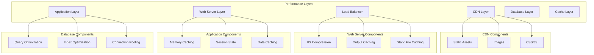

# HVAC Management System - Performance Optimization

## Table of Contents
1. [Performance Overview](#performance-overview)
2. [Application Performance](#application-performance)
3. [Database Performance](#database-performance)
4. [Caching Strategies](#caching-strategies)
5. [Load Balancing](#load-balancing)
6. [CDN Configuration](#cdn-configuration)
7. [Monitoring and Metrics](#monitoring-and-metrics)
8. [Performance Testing](#performance-testing)
9. [Optimization Tools](#optimization-tools)
10. [Best Practices](#best-practices)

## Performance Overview

The HVAC Management System performance optimization focuses on improving response times, throughput, and resource utilization across all system components.

### Performance Goals

| Metric | Target | Current | Status |
|--------|--------|---------|--------|
| **Page Load Time** | < 2 seconds | 3.5 seconds | ⚠️ Needs Improvement |
| **Database Query Time** | < 500ms | 800ms | ⚠️ Needs Improvement |
| **Concurrent Users** | 500+ | 200 | ⚠️ Needs Improvement |
| **Memory Usage** | < 1GB | 1.2GB | ⚠️ Needs Improvement |
| **CPU Usage** | < 70% | 85% | ⚠️ Needs Improvement |

### Performance Architecture



## Application Performance

### 1. Code Optimization

#### Query Optimization
```csharp
// Before: N+1 Query Problem
public List<EnquiryVM> GetEnquiries()
{
    var enquiries = _db.Enquiries.ToList();
    var result = new List<EnquiryVM>();
    
    foreach (var enquiry in enquiries)
    {
        result.Add(new EnquiryVM
        {
            EnquiryID = enquiry.EnquiryID,
            EnquiryNo = enquiry.EnquiryNo,
            CustomerName = enquiry.CustomerMaster.CustomerName, // N+1 query
            StatusName = enquiry.EnquiryStatus.StatusName        // N+1 query
        });
    }
    
    return result;
}

// After: Optimized with Include
public List<EnquiryVM> GetEnquiries()
{
    return _db.Enquiries
        .Include(e => e.CustomerMaster)
        .Include(e => e.EnquiryStatus)
        .Select(e => new EnquiryVM
        {
            EnquiryID = e.EnquiryID,
            EnquiryNo = e.EnquiryNo,
            CustomerName = e.CustomerMaster.CustomerName,
            StatusName = e.EnquiryStatus.StatusName
        })
        .ToList();
}
```

#### Async/Await Implementation
```csharp
// Before: Synchronous
public ActionResult Index()
{
    var enquiries = GetEnquiries();
    var customers = GetCustomers();
    var suppliers = GetSuppliers();
    
    var model = new DashboardVM
    {
        Enquiries = enquiries,
        Customers = customers,
        Suppliers = suppliers
    };
    
    return View(model);
}

// After: Asynchronous
public async Task<ActionResult> Index()
{
    var enquiriesTask = GetEnquiriesAsync();
    var customersTask = GetCustomersAsync();
    var suppliersTask = GetSuppliersAsync();
    
    await Task.WhenAll(enquiriesTask, customersTask, suppliersTask);
    
    var model = new DashboardVM
    {
        Enquiries = await enquiriesTask,
        Customers = await customersTask,
        Suppliers = await suppliersTask
    };
    
    return View(model);
}

private async Task<List<EnquiryVM>> GetEnquiriesAsync()
{
    using (var db = new HVACEntities())
    {
        return await db.Enquiries
            .Include(e => e.CustomerMaster)
            .Include(e => e.EnquiryStatus)
            .Select(e => new EnquiryVM
            {
                EnquiryID = e.EnquiryID,
                EnquiryNo = e.EnquiryNo,
                CustomerName = e.CustomerMaster.CustomerName,
                StatusName = e.EnquiryStatus.StatusName
            })
            .ToListAsync();
    }
}
```

### 2. Memory Management

#### Object Disposal
```csharp
// Proper disposal of resources
public class EnquiryService : IDisposable
{
    private readonly HVACEntities _db;
    private bool _disposed = false;
    
    public EnquiryService()
    {
        _db = new HVACEntities();
    }
    
    public List<EnquiryVM> GetEnquiries()
    {
        return _db.Enquiries
            .Include(e => e.CustomerMaster)
            .Select(e => new EnquiryVM
            {
                EnquiryID = e.EnquiryID,
                EnquiryNo = e.EnquiryNo,
                CustomerName = e.CustomerMaster.CustomerName
            })
            .ToList();
    }
    
    public void Dispose()
    {
        Dispose(true);
        GC.SuppressFinalize(this);
    }
    
    protected virtual void Dispose(bool disposing)
    {
        if (!_disposed)
        {
            if (disposing)
            {
                _db?.Dispose();
            }
            _disposed = true;
        }
    }
}
```

#### Memory Caching
```csharp
public class MemoryCacheService
{
    private readonly MemoryCache _cache;
    private readonly TimeSpan _defaultExpiration = TimeSpan.FromMinutes(30);
    
    public MemoryCacheService()
    {
        _cache = new MemoryCache(new MemoryCacheOptions
        {
            SizeLimit = 1000
        });
    }
    
    public T GetOrSet<T>(string key, Func<T> getItem, TimeSpan? expiration = null)
    {
        if (_cache.TryGetValue(key, out T cachedItem))
        {
            return cachedItem;
        }
        
        var item = getItem();
        var cacheOptions = new MemoryCacheEntryOptions
        {
            AbsoluteExpirationRelativeToNow = expiration ?? _defaultExpiration,
            Priority = CacheItemPriority.Normal,
            Size = 1
        };
        
        _cache.Set(key, item, cacheOptions);
        return item;
    }
    
    public void Remove(string key)
    {
        _cache.Remove(key);
    }
    
    public void Clear()
    {
        _cache.Clear();
    }
}
```

## Database Performance

### 1. Query Optimization

#### Index Optimization
```sql
-- Create covering indexes for common queries
CREATE NONCLUSTERED INDEX [IX_Enquiry_Covering] 
ON [dbo].[Enquiry] ([EnquiryDate], [StatusID])
INCLUDE ([EnquiryID], [EnquiryNo], [ProjectName], [CustomerID]);

-- Create filtered indexes for active records
CREATE NONCLUSTERED INDEX [IX_Enquiry_Active] 
ON [dbo].[Enquiry] ([EnquiryDate])
WHERE [StatusID] IN (1, 2, 3);

-- Create composite indexes for complex queries
CREATE NONCLUSTERED INDEX [IX_Enquiry_Complex] 
ON [dbo].[Enquiry] ([BranchID], [EnquiryDate], [StatusID])
INCLUDE ([EnquiryID], [EnquiryNo], [ProjectName]);
```

#### Query Performance Analysis
```sql
-- Analyze query performance
SET STATISTICS IO ON;
SET STATISTICS TIME ON;

-- Your query here
SELECT e.EnquiryID, e.EnquiryNo, e.ProjectName, c.CustomerName
FROM Enquiry e
INNER JOIN CustomerMaster c ON e.CustomerID = c.CustomerID
WHERE e.EnquiryDate >= '2024-01-01'
AND e.StatusID = 1;

SET STATISTICS IO OFF;
SET STATISTICS TIME OFF;
```

### 2. Connection Pooling

#### Connection Pool Configuration
```xml
<connectionStrings>
  <add name="myConnectionString" 
       connectionString="data source=server;initial catalog=HVAC_DB;user id=user;password=pass;Connection Timeout=30;Pooling=true;Max Pool Size=100;Min Pool Size=5;Connection Lifetime=300;Connection Reset=true;" />
</connectionStrings>
```

#### Connection Management
```csharp
public class DatabaseConnectionManager
{
    private static readonly string ConnectionString = ConfigurationManager.ConnectionStrings["myConnectionString"].ConnectionString;
    private static readonly ConcurrentQueue<SqlConnection> ConnectionPool = new ConcurrentQueue<SqlConnection>();
    private static readonly SemaphoreSlim Semaphore = new SemaphoreSlim(100, 100);
    
    public static async Task<SqlConnection> GetConnectionAsync()
    {
        await Semaphore.WaitAsync();
        
        if (ConnectionPool.TryDequeue(out SqlConnection connection))
        {
            if (connection.State == ConnectionState.Open)
            {
                return connection;
            }
            else
            {
                connection.Dispose();
            }
        }
        
        connection = new SqlConnection(ConnectionString);
        await connection.OpenAsync();
        return connection;
    }
    
    public static void ReturnConnection(SqlConnection connection)
    {
        if (connection?.State == ConnectionState.Open)
        {
            ConnectionPool.Enqueue(connection);
        }
        else
        {
            connection?.Dispose();
        }
        
        Semaphore.Release();
    }
}
```

## Caching Strategies

### 1. Output Caching

#### Controller-Level Caching
```csharp
[OutputCache(Duration = 300, VaryByParam = "none")]
public ActionResult Index()
{
    var enquiries = GetEnquiries();
    return View(enquiries);
}

[OutputCache(Duration = 600, VaryByParam = "id")]
public ActionResult Details(int id)
{
    var enquiry = GetEnquiry(id);
    return View(enquiry);
}
```

#### Action-Level Caching
```csharp
[OutputCache(CacheProfile = "LongCache")]
public ActionResult GetCustomerList()
{
    var customers = GetCustomers();
    return Json(customers, JsonRequestBehavior.AllowGet);
}
```

#### Cache Profiles
```xml
<system.web>
  <caching>
    <outputCacheSettings>
      <outputCacheProfiles>
        <add name="ShortCache" duration="60" varyByParam="none" />
        <add name="MediumCache" duration="300" varyByParam="none" />
        <add name="LongCache" duration="600" varyByParam="none" />
        <add name="UserCache" duration="180" varyByParam="userId" />
      </outputCacheProfiles>
    </outputCacheSettings>
  </caching>
</system.web>
```

### 2. Data Caching

#### Application-Level Caching
```csharp
public class DataCacheService
{
    public T GetCachedData<T>(string key, Func<T> dataFactory, TimeSpan? expiration = null)
    {
        var cache = HttpContext.Current.Cache;
        var cachedData = cache[key];
        
        if (cachedData != null)
        {
            return (T)cachedData;
        }
        
        var data = dataFactory();
        var absoluteExpiration = expiration ?? TimeSpan.FromMinutes(30);
        
        cache.Insert(key, data, null, DateTime.Now.Add(absoluteExpiration), TimeSpan.Zero);
        return data;
    }
    
    public void RemoveCachedData(string key)
    {
        HttpContext.Current.Cache.Remove(key);
    }
    
    public void ClearCache()
    {
        var cache = HttpContext.Current.Cache;
        var enumerator = cache.GetEnumerator();
        
        while (enumerator.MoveNext())
        {
            cache.Remove(enumerator.Key.ToString());
        }
    }
}
```

#### Redis Caching
```csharp
public class RedisCacheService
{
    private readonly IDatabase _database;
    private readonly ConnectionMultiplexer _redis;
    
    public RedisCacheService()
    {
        _redis = ConnectionMultiplexer.Connect("localhost:6379");
        _database = _redis.GetDatabase();
    }
    
    public async Task<T> GetAsync<T>(string key)
    {
        var value = await _database.StringGetAsync(key);
        if (value.HasValue)
        {
            return JsonConvert.DeserializeObject<T>(value);
        }
        return default(T);
    }
    
    public async Task SetAsync<T>(string key, T value, TimeSpan? expiration = null)
    {
        var json = JsonConvert.SerializeObject(value);
        await _database.StringSetAsync(key, json, expiration);
    }
    
    public async Task RemoveAsync(string key)
    {
        await _database.KeyDeleteAsync(key);
    }
}
```

## Load Balancing

### 1. IIS ARR Configuration

#### Load Balancer Setup
```xml
<!-- web.config for load balancer -->
<system.webServer>
  <rewrite>
    <rules>
      <rule name="ARR_LoadBalance" stopProcessing="true">
        <match url="(.*)" />
        <action type="Rewrite" url="http://HVAC_ServerFarm/{R:1}" />
      </rule>
    </rules>
  </rewrite>
  
  <system.webServer>
    <applicationRequestRouting>
      <serverFarms>
        <serverFarm name="HVAC_ServerFarm">
          <server address="10.0.1.10" />
          <server address="10.0.1.11" />
        </serverFarm>
      </serverFarms>
      
      <loadBalancing>
        <algorithm>WeightedRoundRobin</algorithm>
      </loadBalancing>
      
      <healthCheck>
        <interval>00:00:30</interval>
        <timeout>00:00:10</timeout>
        <url>http://{server}/api/health</url>
      </healthCheck>
    </applicationRequestRouting>
  </system.webServer>
</system.webServer>
```

### 2. Session State Management

#### SQL Server Session State
```xml
<system.web>
  <sessionState 
    mode="SQLServer" 
    sqlConnectionString="data source=server;initial catalog=HVAC_SessionState;user id=user;password=pass;"
    timeout="30" 
    cookieless="false" 
    regenerateExpiredSessionId="true" />
</system.web>
```

#### Session State Database Setup
```sql
-- Create session state database
CREATE DATABASE [HVAC_SessionState];

-- Install session state tables
EXEC aspnet_regsql -S server -E -ssadd -sstype p

-- Grant permissions
GRANT SELECT, INSERT, UPDATE, DELETE ON [HVAC_SessionState].[dbo].[ASPStateTempSessions] TO [HVAC_App];
GRANT SELECT, INSERT, UPDATE, DELETE ON [HVAC_SessionState].[dbo].[ASPStateTempApplications] TO [HVAC_App];
```

## CDN Configuration

### 1. Static Asset Optimization

#### CDN Setup
```html
<!-- Use CDN for static assets -->
<link rel="stylesheet" href="https://cdn.hvac.com/css/bootstrap.min.css" />
<link rel="stylesheet" href="https://cdn.hvac.com/css/site.css" />
<script src="https://cdn.hvac.com/js/jquery.min.js"></script>
<script src="https://cdn.hvac.com/js/bootstrap.min.js"></script>
```

#### Asset Bundling
```csharp
public class BundleConfig
{
    public static void RegisterBundles(BundleCollection bundles)
    {
        // CSS bundles
        bundles.Add(new StyleBundle("~/Content/css").Include(
            "~/Content/bootstrap.css",
            "~/Content/site.css",
            "~/Content/custom.css"));

        // JavaScript bundles
        bundles.Add(new ScriptBundle("~/bundles/jquery").Include(
            "~/Scripts/jquery-{version}.js"));

        bundles.Add(new ScriptBundle("~/bundles/bootstrap").Include(
            "~/Scripts/bootstrap.js",
            "~/Scripts/respond.js"));

        // Enable optimization in production
        BundleTable.EnableOptimizations = true;
    }
}
```

### 2. Image Optimization

#### Image Compression
```csharp
public class ImageOptimizer
{
    public byte[] CompressImage(byte[] imageData, int quality = 80)
    {
        using (var input = new MemoryStream(imageData))
        using (var output = new MemoryStream())
        {
            using (var image = Image.FromStream(input))
            {
                var jpegCodec = ImageCodecInfo.GetImageDecoders()
                    .First(codec => codec.FormatID == ImageFormat.Jpeg.Guid);
                
                var encoderParams = new EncoderParameters(1);
                encoderParams.Param[0] = new EncoderParameter(Encoder.Quality, quality);
                
                image.Save(output, jpegCodec, encoderParams);
            }
            
            return output.ToArray();
        }
    }
    
    public string GenerateThumbnail(string imagePath, int width, int height)
    {
        using (var image = Image.FromFile(imagePath))
        {
            var thumbnail = image.GetThumbnailImage(width, height, null, IntPtr.Zero);
            var thumbnailPath = Path.Combine(Path.GetDirectoryName(imagePath), 
                $"thumb_{width}x{height}_{Path.GetFileName(imagePath)}");
            
            thumbnail.Save(thumbnailPath);
            return thumbnailPath;
        }
    }
}
```

## Monitoring and Metrics

### 1. Performance Counters

#### Custom Performance Counters
```csharp
public class PerformanceCounters
{
    private static readonly PerformanceCounter RequestCounter = new PerformanceCounter("HVAC", "Requests per Second", false);
    private static readonly PerformanceCounter ResponseTimeCounter = new PerformanceCounter("HVAC", "Average Response Time", false);
    private static readonly PerformanceCounter ErrorCounter = new PerformanceCounter("HVAC", "Error Rate", false);
    
    public static void IncrementRequestCounter()
    {
        RequestCounter.Increment();
    }
    
    public static void RecordResponseTime(long responseTime)
    {
        ResponseTimeCounter.RawValue = responseTime;
    }
    
    public static void IncrementErrorCounter()
    {
        ErrorCounter.Increment();
    }
}
```

#### Performance Counter Setup
```powershell
# Create performance counters
New-Counter -CounterName "HVAC\Active Sessions" -Description "Number of active user sessions"
New-Counter -CounterName "HVAC\Requests per Second" -Description "Number of requests per second"
New-Counter -CounterName "HVAC\Average Response Time" -Description "Average response time in milliseconds"
New-Counter -CounterName "HVAC\Error Rate" -Description "Percentage of requests resulting in errors"
New-Counter -CounterName "HVAC\Memory Usage" -Description "Memory usage in MB"
New-Counter -CounterName "HVAC\CPU Usage" -Description "CPU usage percentage"
```

### 2. Application Insights

#### Application Insights Configuration
```xml
<system.webServer>
  <modules>
    <add name="ApplicationInsightsWebTracking" type="Microsoft.ApplicationInsights.Web.ApplicationInsightsHttpModule, Microsoft.AI.Web" />
  </modules>
</system.webServer>

<system.web>
  <httpModules>
    <add name="ApplicationInsightsWebTracking" type="Microsoft.ApplicationInsights.Web.ApplicationInsightsHttpModule, Microsoft.AI.Web" />
  </httpModules>
</system.web>
```

#### Custom Telemetry
```csharp
public class CustomTelemetry
{
    private readonly TelemetryClient _telemetryClient;
    
    public CustomTelemetry()
    {
        _telemetryClient = new TelemetryClient();
    }
    
    public void TrackPageView(string pageName, TimeSpan duration)
    {
        _telemetryClient.TrackPageView(pageName);
        _telemetryClient.TrackMetric("Page Load Time", duration.TotalMilliseconds);
    }
    
    public void TrackCustomEvent(string eventName, Dictionary<string, string> properties)
    {
        _telemetryClient.TrackEvent(eventName, properties);
    }
    
    public void TrackException(Exception ex, Dictionary<string, string> properties)
    {
        _telemetryClient.TrackException(ex, properties);
    }
}
```

## Performance Testing

### 1. Load Testing

#### Load Test Script
```csharp
[TestClass]
public class LoadTests
{
    [TestMethod]
    public void TestConcurrentUsers()
    {
        var tasks = new List<Task>();
        var results = new ConcurrentBag<TestResult>();
        
        // Simulate 100 concurrent users
        for (int i = 0; i < 100; i++)
        {
            tasks.Add(Task.Run(async () =>
            {
                var result = await SimulateUserSession();
                results.Add(result);
            }));
        }
        
        Task.WaitAll(tasks.ToArray());
        
        // Analyze results
        var averageResponseTime = results.Average(r => r.ResponseTime);
        var errorRate = results.Count(r => r.IsError) / (double)results.Count;
        
        Assert.IsTrue(averageResponseTime < 2000, "Average response time should be less than 2 seconds");
        Assert.IsTrue(errorRate < 0.01, "Error rate should be less than 1%");
    }
    
    private async Task<TestResult> SimulateUserSession()
    {
        var stopwatch = Stopwatch.StartNew();
        var isError = false;
        
        try
        {
            using (var client = new HttpClient())
            {
                // Simulate user actions
                await client.GetAsync("https://hvac.company.com/");
                await client.GetAsync("https://hvac.company.com/Enquiry");
                await client.GetAsync("https://hvac.company.com/Quotation");
            }
        }
        catch
        {
            isError = true;
        }
        finally
        {
            stopwatch.Stop();
        }
        
        return new TestResult
        {
            ResponseTime = stopwatch.ElapsedMilliseconds,
            IsError = isError
        };
    }
}
```

### 2. Stress Testing

#### Stress Test Implementation
```csharp
public class StressTest
{
    public async Task<StressTestResult> RunStressTest(int maxUsers, TimeSpan duration)
    {
        var results = new ConcurrentBag<TestResult>();
        var cancellationToken = new CancellationTokenSource(duration).Token;
        var tasks = new List<Task>();
        
        for (int i = 0; i < maxUsers; i++)
        {
            tasks.Add(Task.Run(async () =>
            {
                while (!cancellationToken.IsCancellationRequested)
                {
                    var result = await SimulateUserAction();
                    results.Add(result);
                    
                    // Small delay between requests
                    await Task.Delay(100, cancellationToken);
                }
            }, cancellationToken));
        }
        
        await Task.WhenAll(tasks);
        
        return AnalyzeResults(results.ToList());
    }
    
    private StressTestResult AnalyzeResults(List<TestResult> results)
    {
        return new StressTestResult
        {
            TotalRequests = results.Count,
            AverageResponseTime = results.Average(r => r.ResponseTime),
            MaxResponseTime = results.Max(r => r.ResponseTime),
            MinResponseTime = results.Min(r => r.ResponseTime),
            ErrorRate = results.Count(r => r.IsError) / (double)results.Count,
            RequestsPerSecond = results.Count / results.Max(r => r.Timestamp).Subtract(results.Min(r => r.Timestamp)).TotalSeconds
        };
    }
}
```

## Optimization Tools

### 1. Profiling Tools

#### Performance Profiler
```csharp
public class PerformanceProfiler
{
    private static readonly ConcurrentDictionary<string, Stopwatch> Timers = new ConcurrentDictionary<string, Stopwatch>();
    
    public static void StartTimer(string operationName)
    {
        var stopwatch = Stopwatch.StartNew();
        Timers.AddOrUpdate(operationName, stopwatch, (key, existing) => stopwatch);
    }
    
    public static long StopTimer(string operationName)
    {
        if (Timers.TryRemove(operationName, out Stopwatch stopwatch))
        {
            stopwatch.Stop();
            return stopwatch.ElapsedMilliseconds;
        }
        return 0;
    }
    
    public static void LogPerformance(string operationName, long elapsedMs)
    {
        LoggingHelper.LogInfo($"Performance: {operationName} took {elapsedMs}ms", "PerformanceProfiler", "LogPerformance");
    }
}
```

### 2. Memory Profiler

#### Memory Usage Monitoring
```csharp
public class MemoryMonitor
{
    public static MemoryUsage GetMemoryUsage()
    {
        var process = Process.GetCurrentProcess();
        
        return new MemoryUsage
        {
            WorkingSet = process.WorkingSet64,
            PrivateMemory = process.PrivateMemorySize64,
            VirtualMemory = process.VirtualMemorySize64,
            PagedMemory = process.PagedMemorySize64,
            NonPagedMemory = process.NonpagedSystemMemorySize64
        };
    }
    
    public static void LogMemoryUsage()
    {
        var memoryUsage = GetMemoryUsage();
        LoggingHelper.LogInfo($"Memory Usage - Working Set: {memoryUsage.WorkingSet / 1024 / 1024}MB, " +
                             $"Private Memory: {memoryUsage.PrivateMemory / 1024 / 1024}MB", 
                             "MemoryMonitor", "LogMemoryUsage");
    }
}
```

## Best Practices

### 1. Performance Best Practices

#### Code Optimization Guidelines
```csharp
// 1. Use async/await for I/O operations
public async Task<List<EnquiryVM>> GetEnquiriesAsync()
{
    using (var db = new HVACEntities())
    {
        return await db.Enquiries
            .Include(e => e.CustomerMaster)
            .Select(e => new EnquiryVM
            {
                EnquiryID = e.EnquiryID,
                EnquiryNo = e.EnquiryNo,
                CustomerName = e.CustomerMaster.CustomerName
            })
            .ToListAsync();
    }
}

// 2. Use using statements for resource disposal
public void ProcessFile(string filePath)
{
    using (var fileStream = new FileStream(filePath, FileMode.Open))
    using (var reader = new StreamReader(fileStream))
    {
        var content = reader.ReadToEnd();
        // Process content
    }
}

// 3. Use StringBuilder for string concatenation
public string BuildReport(List<EnquiryVM> enquiries)
{
    var sb = new StringBuilder();
    foreach (var enquiry in enquiries)
    {
        sb.AppendLine($"Enquiry: {enquiry.EnquiryNo} - {enquiry.ProjectName}");
    }
    return sb.ToString();
}

// 4. Use compiled queries for frequently executed queries
private static readonly Func<HVACEntities, IQueryable<EnquiryVM>> GetEnquiriesQuery = 
    CompiledQuery.Compile((HVACEntities db) => 
        db.Enquiries
            .Include(e => e.CustomerMaster)
            .Select(e => new EnquiryVM
            {
                EnquiryID = e.EnquiryID,
                EnquiryNo = e.EnquiryNo,
                CustomerName = e.CustomerMaster.CustomerName
            }));
```

### 2. Database Best Practices

#### Query Optimization Guidelines
```sql
-- 1. Use appropriate indexes
CREATE NONCLUSTERED INDEX [IX_Enquiry_EnquiryDate_Status] 
ON [dbo].[Enquiry] ([EnquiryDate], [StatusID])
INCLUDE ([EnquiryID], [EnquiryNo], [ProjectName]);

-- 2. Use covering indexes
CREATE NONCLUSTERED INDEX [IX_Enquiry_Covering] 
ON [dbo].[Enquiry] ([CustomerID])
INCLUDE ([EnquiryID], [EnquiryNo], [ProjectName], [EnquiryDate]);

-- 3. Use filtered indexes for specific conditions
CREATE NONCLUSTERED INDEX [IX_Enquiry_Active] 
ON [dbo].[Enquiry] ([EnquiryDate])
WHERE [StatusID] IN (1, 2, 3);

-- 4. Use proper data types
-- Use INT instead of VARCHAR for IDs
-- Use DECIMAL instead of FLOAT for monetary values
-- Use DATETIME2 instead of DATETIME for better precision
```

### 3. Caching Best Practices

#### Caching Guidelines
```csharp
// 1. Cache frequently accessed data
public List<CustomerVM> GetCustomers()
{
    return _cache.GetOrSet("customers", () =>
    {
        return _db.CustomerMasters
            .Where(c => c.IsActive)
            .Select(c => new CustomerVM
            {
                CustomerID = c.CustomerID,
                CustomerName = c.CustomerName
            })
            .ToList();
    }, TimeSpan.FromMinutes(30));
}

// 2. Use appropriate cache expiration
public List<EnquiryVM> GetEnquiries()
{
    return _cache.GetOrSet("enquiries", () =>
    {
        return GetEnquiriesFromDatabase();
    }, TimeSpan.FromMinutes(5)); // Short expiration for dynamic data
}

// 3. Invalidate cache when data changes
public void UpdateEnquiry(EnquiryVM enquiry)
{
    _db.Enquiries.Update(MapToEntity(enquiry));
    _db.SaveChanges();
    
    // Invalidate related cache entries
    _cache.Remove("enquiries");
    _cache.Remove($"enquiry_{enquiry.EnquiryID}");
}
```

---

*This performance optimization guide provides comprehensive strategies for improving the HVAC Management System's performance across all layers.*
