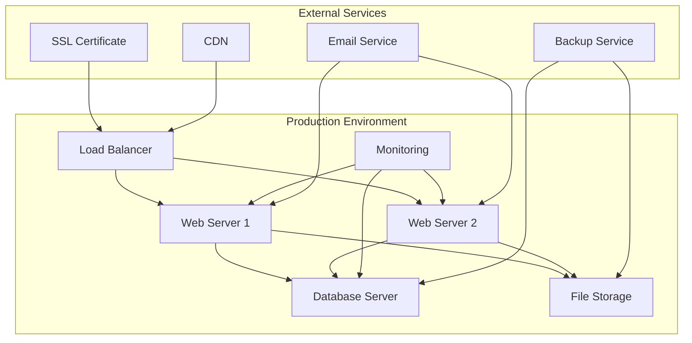

# HVAC Management System - Production Deployment

## Table of Contents
1. [Deployment Overview](#deployment-overview)
2. [Pre-Deployment Checklist](#pre-deployment-checklist)
3. [Server Configuration](#server-configuration)
4. [Database Deployment](#database-deployment)
5. [Application Deployment](#application-deployment)
6. [SSL Certificate Setup](#ssl-certificate-setup)
7. [Load Balancer Configuration](#load-balancer-configuration)
8. [Monitoring Setup](#monitoring-setup)
9. [Post-Deployment Validation](#post-deployment-validation)
10. [Rollback Procedures](#rollback-procedures)

## Deployment Overview

The HVAC Management System production deployment involves multiple components including web servers, database servers, load balancers, and monitoring systems.

### Deployment Architecture



## Pre-Deployment Checklist

### 1. Environment Preparation

#### Server Requirements
- **Web Servers**: 2x Windows Server 2019/2022
- **Database Server**: 1x Windows Server 2019/2022 with SQL Server 2019
- **Load Balancer**: 1x Windows Server 2019/2022 with IIS ARR
- **Storage**: 1TB+ for application files and database
- **Network**: 1Gbps+ connection

#### Software Prerequisites
- .NET Framework 4.8
- IIS 10.0+
- SQL Server 2019+
- Windows PowerShell 5.1+
- Visual C++ Redistributable

### 2. Security Preparation

#### Security Checklist
- [ ] SSL certificates obtained and validated
- [ ] Firewall rules configured
- [ ] Antivirus software installed and updated
- [ ] Windows updates applied
- [ ] Security policies configured
- [ ] Backup procedures tested

## Server Configuration

### 1. Web Server Setup

#### IIS Configuration
```xml
<!-- web.config production settings -->
<system.web>
  <compilation debug="false" targetFramework="4.8" />
  <httpRuntime maxRequestLength="10485760" executionTimeout="300" />
  <customErrors mode="RemoteOnly" defaultRedirect="~/Error/Index" />
  <sessionState mode="InProc" timeout="30" cookieless="false" />
</system.web>

<system.webServer>
  <defaultDocument>
    <files>
      <clear />
      <add value="index.html" />
    </files>
  </defaultDocument>
  
  <httpProtocol>
    <customHeaders>
      <add name="X-Content-Type-Options" value="nosniff" />
      <add name="X-Frame-Options" value="DENY" />
      <add name="X-XSS-Protection" value="1; mode=block" />
      <add name="Strict-Transport-Security" value="max-age=31536000; includeSubDomains" />
    </customHeaders>
  </httpProtocol>
</system.webServer>
```

#### Application Pool Configuration
```powershell
# Create application pool
New-WebAppPool -Name "HVAC_AppPool" -Force

# Configure application pool
Set-ItemProperty -Path "IIS:\AppPools\HVAC_AppPool" -Name processModel.identityType -Value ApplicationPoolIdentity
Set-ItemProperty -Path "IIS:\AppPools\HVAC_AppPool" -Name processModel.loadUserProfile -Value $true
Set-ItemProperty -Path "IIS:\AppPools\HVAC_AppPool" -Name processModel.idleTimeout -Value "00:20:00"
Set-ItemProperty -Path "IIS:\AppPools\HVAC_AppPool" -Name recycling.periodicRestart.time -Value "00:00:00"
Set-ItemProperty -Path "IIS:\AppPools\HVAC_AppPool" -Name recycling.periodicRestart.requests -Value 0
Set-ItemProperty -Path "IIS:\AppPools\HVAC_AppPool" -Name recycling.periodicRestart.memory -Value 0
Set-ItemProperty -Path "IIS:\AppPools\HVAC_AppPool" -Name recycling.periodicRestart.privateMemory -Value 0
```

### 2. Database Server Setup

#### SQL Server Configuration
```sql
-- Configure SQL Server for production
EXEC sp_configure 'show advanced options', 1;
RECONFIGURE;

-- Set max memory (adjust based on server RAM)
EXEC sp_configure 'max server memory (MB)', 8192;
RECONFIGURE;

-- Enable backup compression
EXEC sp_configure 'backup compression default', 1;
RECONFIGURE;

-- Configure database settings
ALTER DATABASE [HVAC_DB] SET RECOVERY FULL;
ALTER DATABASE [HVAC_DB] SET PAGE_VERIFY CHECKSUM;
ALTER DATABASE [HVAC_DB] SET ALLOW_SNAPSHOT_ISOLATION ON;
ALTER DATABASE [HVAC_DB] SET READ_COMMITTED_SNAPSHOT ON;
```

## Database Deployment

### 1. Database Creation

#### Database Setup Script
```sql
-- Create production database
CREATE DATABASE [HVAC_DB_Production]
ON 
( NAME = 'HVAC_DB_Production',
  FILENAME = 'C:\Program Files\Microsoft SQL Server\MSSQL15.MSSQLSERVER\MSSQL\DATA\HVAC_DB_Production.mdf',
  SIZE = 1GB,
  MAXSIZE = 100GB,
  FILEGROWTH = 1GB )
LOG ON 
( NAME = 'HVAC_DB_Production_Log',
  FILENAME = 'C:\Program Files\Microsoft SQL Server\MSSQL15.MSSQLSERVER\MSSQL\DATA\HVAC_DB_Production_Log.ldf',
  SIZE = 100MB,
  MAXSIZE = 10GB,
  FILEGROWTH = 100MB );

-- Set database options
ALTER DATABASE [HVAC_DB_Production] SET COMPATIBILITY_LEVEL = 150;
ALTER DATABASE [HVAC_DB_Production] SET RECOVERY FULL;
ALTER DATABASE [HVAC_DB_Production] SET PAGE_VERIFY CHECKSUM;
ALTER DATABASE [HVAC_DB_Production] SET ALLOW_SNAPSHOT_ISOLATION ON;
ALTER DATABASE [HVAC_DB_Production] SET READ_COMMITTED_SNAPSHOT ON;
```

### 2. Data Migration

#### Migration Script
```powershell
# Database migration script
$sourceServer = "DevelopmentServer"
$targetServer = "ProductionServer"
$sourceDatabase = "HVAC_DB_Dev"
$targetDatabase = "HVAC_DB_Production"

# Create backup
$backupPath = "C:\Backup\HVAC_DB_Dev.bak"
Invoke-Sqlcmd -ServerInstance $sourceServer -Query "BACKUP DATABASE [$sourceDatabase] TO DISK = '$backupPath' WITH FORMAT, COMPRESSION"

# Restore to production
Invoke-Sqlcmd -ServerInstance $targetServer -Query "RESTORE DATABASE [$targetDatabase] FROM DISK = '$backupPath' WITH REPLACE, RECOVERY"
```

## Application Deployment

### 1. Build and Package

#### Build Script
```powershell
# Build application
$solutionPath = "C:\HVAC_Application\HVAC.sln"
$outputPath = "C:\HVAC_Application\Build\Release"

# Clean and build
dotnet clean $solutionPath
dotnet build $solutionPath --configuration Release --output $outputPath

# Copy additional files
Copy-Item "C:\HVAC_Application\HVAC\Content" -Destination "$outputPath\Content" -Recurse
Copy-Item "C:\HVAC_Application\HVAC\Scripts" -Destination "$outputPath\Scripts" -Recurse
Copy-Item "C:\HVAC_Application\HVAC\Views" -Destination "$outputPath\Views" -Recurse
```

### 2. Deployment Process

#### Deployment Script
```powershell
# Deploy to web servers
$webServers = @("WebServer1", "WebServer2")
$appPath = "C:\inetpub\wwwroot\HVAC"
$sourcePath = "C:\HVAC_Application\Build\Release"

foreach ($server in $webServers) {
    # Stop application pool
    Invoke-Command -ComputerName $server -ScriptBlock {
        Stop-WebAppPool -Name "HVAC_AppPool"
    }
    
    # Copy files
    Copy-Item $sourcePath -Destination "\\$server\$appPath" -Recurse -Force
    
    # Start application pool
    Invoke-Command -ComputerName $server -ScriptBlock {
        Start-WebAppPool -Name "HVAC_AppPool"
    }
}
```

## SSL Certificate Setup

### 1. Certificate Installation

#### Certificate Installation Script
```powershell
# Install SSL certificate
$certPath = "C:\Certificates\HVAC_SSL.pfx"
$certPassword = "CertificatePassword123!"

# Import certificate
$cert = Import-PfxCertificate -FilePath $certPath -CertStoreLocation Cert:\LocalMachine\My -Password (ConvertTo-SecureString $certPassword -AsPlainText -Force)

# Bind certificate to website
New-WebBinding -Name "HVAC_Website" -Protocol https -Port 443 -SslFlags 1
Set-WebBinding -Name "HVAC_Website" -BindingInformation "*:443:" -CertificateThumbprint $cert.Thumbprint
```

### 2. HTTPS Configuration

#### HTTPS Redirect
```xml
<system.webServer>
  <rewrite>
    <rules>
      <rule name="Redirect to HTTPS" stopProcessing="true">
        <match url="(.*)" />
        <conditions>
          <add input="{HTTPS}" pattern="off" ignoreCase="true" />
        </conditions>
        <action type="Redirect" url="https://{HTTP_HOST}/{R:1}" redirectType="Permanent" />
      </rule>
    </rules>
  </rewrite>
</system.webServer>
```

## Load Balancer Configuration

### 1. IIS ARR Setup

#### ARR Configuration
```xml
<!-- web.config for load balancer -->
<system.webServer>
  <rewrite>
    <rules>
      <rule name="ARR_LoadBalance" stopProcessing="true">
        <match url="(.*)" />
        <action type="Rewrite" url="http://HVAC_ServerFarm/{R:1}" />
      </rule>
    </rules>
  </rewrite>
  
  <system.webServer>
    <applicationRequestRouting>
      <serverFarms>
        <serverFarm name="HVAC_ServerFarm">
          <server address="10.0.1.10" />
          <server address="10.0.1.11" />
        </serverFarm>
      </serverFarms>
    </applicationRequestRouting>
  </system.webServer>
</system.webServer>
```

### 2. Health Checks

#### Health Check Configuration
```csharp
// Health check endpoint
[Route("api/health")]
public class HealthController : Controller
{
    public ActionResult Check()
    {
        try
        {
            // Check database connection
            using (var db = new HVACEntities())
            {
                db.Database.Connection.Open();
                db.Database.Connection.Close();
            }
            
            // Check file system
            var uploadPath = Server.MapPath("~/UploadDocuments");
            if (!Directory.Exists(uploadPath))
            {
                return Json(new { status = "unhealthy", message = "Upload directory not found" });
            }
            
            return Json(new { status = "healthy", timestamp = DateTime.Now });
        }
        catch (Exception ex)
        {
            return Json(new { status = "unhealthy", message = ex.Message });
        }
    }
}
```

## Monitoring Setup

### 1. Application Monitoring

#### Performance Counters
```powershell
# Create performance counters
New-Counter -CounterName "HVAC\Active Sessions" -Description "Number of active user sessions"
New-Counter -CounterName "HVAC\Requests per Second" -Description "Number of requests per second"
New-Counter -CounterName "HVAC\Average Response Time" -Description "Average response time in milliseconds"
New-Counter -CounterName "HVAC\Error Rate" -Description "Percentage of requests resulting in errors"
```

### 2. Log Monitoring

#### Log Configuration
```xml
<system.diagnostics>
  <trace autoflush="true">
    <listeners>
      <add name="fileListener" type="System.Diagnostics.TextWriterTraceListener" initializeData="C:\Logs\HVAC_Application.log" />
      <add name="eventLogListener" type="System.Diagnostics.EventLogTraceListener" initializeData="HVAC Application" />
    </listeners>
  </trace>
</system.diagnostics>
```

## Post-Deployment Validation

### 1. Functional Testing

#### Validation Checklist
- [ ] Application loads successfully
- [ ] User authentication works
- [ ] Database connections are established
- [ ] File uploads function correctly
- [ ] Reports generate properly
- [ ] Email notifications are sent
- [ ] All user roles can access appropriate features

### 2. Performance Testing

#### Performance Validation
```csharp
// Performance test script
public class PerformanceTest
{
    public void RunPerformanceTests()
    {
        // Test response times
        var responseTime = MeasureResponseTime("https://hvac.company.com/");
        Assert.IsTrue(responseTime < 2000, "Home page should load within 2 seconds");
        
        // Test concurrent users
        var concurrentUsers = SimulateConcurrentUsers(100);
        Assert.IsTrue(concurrentUsers.All(u => u.ResponseTime < 5000), "All users should get response within 5 seconds");
        
        // Test database performance
        var dbResponseTime = MeasureDatabaseResponseTime();
        Assert.IsTrue(dbResponseTime < 1000, "Database queries should complete within 1 second");
    }
}
```

## Rollback Procedures

### 1. Application Rollback

#### Rollback Script
```powershell
# Rollback application
$rollbackVersion = "1.0.0"
$backupPath = "C:\Backup\HVAC_$rollbackVersion"

# Stop application pool
Stop-WebAppPool -Name "HVAC_AppPool"

# Restore previous version
Copy-Item $backupPath -Destination "C:\inetpub\wwwroot\HVAC" -Recurse -Force

# Start application pool
Start-WebAppPool -Name "HVAC_AppPool"
```

### 2. Database Rollback

#### Database Rollback Script
```sql
-- Rollback database
RESTORE DATABASE [HVAC_DB_Production] 
FROM DISK = 'C:\Backup\HVAC_DB_Production_Before_Deployment.bak'
WITH REPLACE, RECOVERY;
```

---

*This production deployment guide provides comprehensive instructions for deploying the HVAC Management System to a production environment.*
