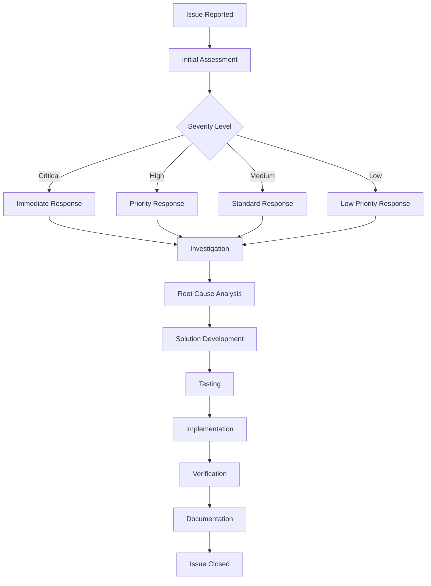

# HVAC Management System - Common Issues and Solutions

## Table of Contents
1. [Issue Categories](#issue-categories)
2. [Authentication Issues](#authentication-issues)
3. [Database Issues](#database-issues)
4. [Performance Issues](#performance-issues)
5. [File Upload Issues](#file-upload-issues)
6. [Email Issues](#email-issues)
7. [Session Issues](#session-issues)
8. [Configuration Issues](#configuration-issues)
9. [Browser Compatibility Issues](#browser-compatibility-issues)
10. [Network Issues](#network-issues)

## Issue Categories

### Issue Severity Levels

| Severity | Description | Response Time | Examples |
|----------|-------------|---------------|----------|
| **Critical** | System down, data loss | 1 hour | Database corruption, complete system failure |
| **High** | Major functionality affected | 4 hours | Login failures, data not saving |
| **Medium** | Minor functionality affected | 24 hours | Slow performance, UI issues |
| **Low** | Cosmetic issues | 72 hours | Text formatting, minor UI glitches |

### Issue Resolution Process



## Authentication Issues

### 1. Login Failures

#### Issue: Users cannot log in
**Symptoms:**
- Login page loads but authentication fails
- "Invalid username or password" error
- Users are redirected back to login page

**Possible Causes:**
1. Incorrect username/password
2. Account locked due to failed attempts
3. Database connection issues
4. Session configuration problems
5. Password hashing issues

**Troubleshooting Steps:**

```csharp
// 1. Check user account status
public bool CheckUserAccountStatus(string username)
{
    using (var db = new HVACEntities())
    {
        var user = db.UserRegistrations.FirstOrDefault(u => u.UserName == username);
        
        if (user == null)
        {
            LoggingHelper.LogWarning($"User not found: {username}");
            return false;
        }
        
        if (!user.IsActive)
        {
            LoggingHelper.LogWarning($"User account inactive: {username}");
            return false;
        }
        
        if (user.IsLocked && user.LockedUntil > DateTime.Now)
        {
            LoggingHelper.LogWarning($"User account locked: {username}");
            return false;
        }
        
        return true;
    }
}

// 2. Verify password hashing
public bool VerifyPasswordHashing(string password, string hash)
{
    try
    {
        return BCrypt.Net.BCrypt.Verify(password, hash);
    }
    catch (Exception ex)
    {
        LoggingHelper.LogError("Password verification failed", ex);
        return false;
    }
}

// 3. Check database connectivity
public bool CheckDatabaseConnection()
{
    try
    {
        using (var db = new HVACEntities())
        {
            db.Database.Connection.Open();
            var result = db.Database.SqlQuery<int>("SELECT 1").First();
            db.Database.Connection.Close();
            return true;
        }
    }
    catch (Exception ex)
    {
        LoggingHelper.LogError("Database connection failed", ex);
        return false;
    }
}
```

**Solutions:**

1. **Reset user password:**
```sql
-- Reset password for locked user
UPDATE UserRegistration 
SET Password = '$2a$12$hashedpassword', 
    FailedLoginAttempts = 0, 
    IsLocked = 0, 
    LockedUntil = NULL 
WHERE UserName = 'username';
```

2. **Unlock user account:**
```sql
-- Unlock user account
UPDATE UserRegistration 
SET IsLocked = 0, 
    FailedLoginAttempts = 0, 
    LockedUntil = NULL 
WHERE UserName = 'username';
```

3. **Check session configuration:**
```xml
<!-- Verify session configuration in web.config -->
<system.web>
  <sessionState 
    mode="InProc" 
    timeout="30" 
    cookieless="false" 
    regenerateExpiredSessionId="true" />
</system.web>
```

### 2. Session Timeout Issues

#### Issue: Users are logged out unexpectedly
**Symptoms:**
- Users are redirected to login page during work
- Session expires too quickly
- "Session expired" messages

**Troubleshooting Steps:**

```csharp
// Check session timeout configuration
public void CheckSessionConfiguration()
{
    var sessionTimeout = HttpContext.Current.Session.Timeout;
    LoggingHelper.LogInfo($"Session timeout: {sessionTimeout} minutes");
    
    // Check if session is being extended properly
    var lastActivity = HttpContext.Current.Session["LastActivity"];
    if (lastActivity != null)
    {
        var timeSinceLastActivity = DateTime.Now - (DateTime)lastActivity;
        LoggingHelper.LogInfo($"Time since last activity: {timeSinceLastActivity.TotalMinutes} minutes");
    }
}

// Extend session on activity
public void ExtendSession()
{
    HttpContext.Current.Session["LastActivity"] = DateTime.Now;
}
```

**Solutions:**

1. **Increase session timeout:**
```xml
<system.web>
  <sessionState timeout="60" />
</system.web>
```

2. **Implement session extension:**
```javascript
// JavaScript to extend session on user activity
$(document).ready(function() {
    setInterval(function() {
        $.ajax({
            url: '/Home/ExtendSession',
            type: 'POST',
            success: function() {
                console.log('Session extended');
            }
        });
    }, 15 * 60 * 1000); // Every 15 minutes
});
```

## Database Issues

### 1. Connection Timeout

#### Issue: Database connection timeouts
**Symptoms:**
- "Connection timeout" errors
- Slow database operations
- Application becomes unresponsive

**Troubleshooting Steps:**

```csharp
// Check connection pool status
public ConnectionPoolStatus CheckConnectionPool()
{
    var connectionString = ConfigurationManager.ConnectionStrings["myConnectionString"].ConnectionString;
    var builder = new SqlConnectionStringBuilder(connectionString);
    
    return new ConnectionPoolStatus
    {
        MaxPoolSize = builder.MaxPoolSize,
        MinPoolSize = builder.MinPoolSize,
        ConnectionTimeout = builder.ConnectTimeout,
        CurrentConnections = GetCurrentConnectionCount()
    };
}

// Monitor connection usage
public void MonitorConnections()
{
    var query = @"
        SELECT 
            session_id,
            login_time,
            last_request_start_time,
            status,
            program_name
        FROM sys.dm_exec_sessions 
        WHERE is_user_process = 1";
    
    using (var db = new HVACEntities())
    {
        var connections = db.Database.SqlQuery<ConnectionInfo>(query).ToList();
        LoggingHelper.LogInfo($"Active connections: {connections.Count}");
    }
}
```

**Solutions:**

1. **Increase connection timeout:**
```xml
<connectionStrings>
  <add name="myConnectionString" 
       connectionString="...;Connection Timeout=60;Command Timeout=300;" />
</connectionStrings>
```

2. **Optimize connection pooling:**
```xml
<connectionStrings>
  <add name="myConnectionString" 
       connectionString="...;Pooling=true;Max Pool Size=100;Min Pool Size=5;Connection Lifetime=300;" />
</connectionStrings>
```

3. **Implement connection retry logic:**
```csharp
public async Task<T> ExecuteWithRetry<T>(Func<Task<T>> operation, int maxRetries = 3)
{
    for (int i = 0; i < maxRetries; i++)
    {
        try
        {
            return await operation();
        }
        catch (SqlException ex) when (ex.Number == -2 && i < maxRetries - 1)
        {
            await Task.Delay(1000 * (i + 1)); // Exponential backoff
        }
    }
    throw new Exception("Max retries exceeded");
}
```

### 2. Query Performance Issues

#### Issue: Slow database queries
**Symptoms:**
- Long page load times
- Database queries taking > 5 seconds
- High CPU usage on database server

**Troubleshooting Steps:**

```sql
-- 1. Identify slow queries
SELECT 
    query_hash,
    total_elapsed_time,
    execution_count,
    total_elapsed_time / execution_count as avg_elapsed_time,
    total_logical_reads,
    total_logical_writes,
    last_execution_time
FROM sys.dm_exec_query_stats
ORDER BY total_elapsed_time DESC;

-- 2. Check missing indexes
SELECT 
    migs.avg_total_user_cost * (migs.avg_user_impact / 100.0) * (migs.user_seeks + migs.user_scans) AS improvement_measure,
    'CREATE INDEX [IX_' + OBJECT_NAME(migs.object_id) + '_' + ISNULL(mid.equality_columns, '') + '] ON ' + mid.statement + ' (' + ISNULL(mid.equality_columns, '') + ')' AS create_index_statement
FROM sys.dm_db_missing_index_groups mig
INNER JOIN sys.dm_db_missing_index_group_stats migs ON migs.group_handle = mig.index_group_handle
INNER JOIN sys.dm_db_missing_index_details mid ON mig.index_handle = mid.index_handle
WHERE migs.avg_total_user_cost * (migs.avg_user_impact / 100.0) * (migs.user_seeks + migs.user_scans) > 10
ORDER BY improvement_measure DESC;

-- 3. Check index usage
SELECT 
    i.name AS IndexName,
    s.user_seeks,
    s.user_scans,
    s.user_lookups,
    s.user_updates
FROM sys.indexes i
LEFT JOIN sys.dm_db_index_usage_stats s ON i.object_id = s.object_id AND i.index_id = s.index_id
WHERE i.name IS NOT NULL
ORDER BY s.user_seeks + s.user_scans + s.user_lookups DESC;
```

**Solutions:**

1. **Add missing indexes:**
```sql
-- Create index for frequently queried columns
CREATE NONCLUSTERED INDEX [IX_Enquiry_EnquiryDate_Status] 
ON [dbo].[Enquiry] ([EnquiryDate], [StatusID])
INCLUDE ([EnquiryID], [EnquiryNo], [ProjectName]);
```

2. **Optimize existing queries:**
```csharp
// Before: Inefficient query
var enquiries = db.Enquiries.ToList()
    .Where(e => e.EnquiryDate >= fromDate && e.EnquiryDate <= toDate)
    .Where(e => e.StatusID == statusId);

// After: Optimized query
var enquiries = db.Enquiries
    .Where(e => e.EnquiryDate >= fromDate && e.EnquiryDate <= toDate)
    .Where(e => e.StatusID == statusId)
    .ToList();
```

3. **Use stored procedures for complex queries:**
```sql
CREATE PROCEDURE [dbo].[SP_GetEnquiryList]
    @FromDate DATETIME,
    @ToDate DATETIME,
    @StatusID INT = NULL
AS
BEGIN
    SET NOCOUNT ON;
    
    SELECT 
        e.EnquiryID,
        e.EnquiryNo,
        e.EnquiryDate,
        e.ProjectName,
        c.CustomerName,
        s.StatusName
    FROM Enquiry e
    INNER JOIN CustomerMaster c ON e.CustomerID = c.CustomerID
    LEFT JOIN EnquiryStatus s ON e.StatusID = s.StatusID
    WHERE e.EnquiryDate BETWEEN @FromDate AND @ToDate
    AND (@StatusID IS NULL OR e.StatusID = @StatusID)
    ORDER BY e.EnquiryDate DESC;
END
```

## Performance Issues

### 1. Slow Page Load Times

#### Issue: Pages take too long to load
**Symptoms:**
- Page load times > 5 seconds
- Users complain about slow performance
- High server resource usage

**Troubleshooting Steps:**

```csharp
// Monitor page load times
public class PerformanceMonitor
{
    public void LogPageLoadTime(string pageName, long loadTime)
    {
        LoggingHelper.LogInfo($"Page load time: {pageName} - {loadTime}ms");
        
        if (loadTime > 5000) // 5 seconds
        {
            LoggingHelper.LogWarning($"Slow page load: {pageName} - {loadTime}ms");
        }
    }
    
    public void MonitorDatabaseQueries()
    {
        var slowQueries = GetSlowQueries();
        foreach (var query in slowQueries)
        {
            LoggingHelper.LogWarning($"Slow query detected: {query.SqlText} - {query.Duration}ms");
        }
    }
}
```

**Solutions:**

1. **Implement output caching:**
```csharp
[OutputCache(Duration = 300, VaryByParam = "none")]
public ActionResult Index()
{
    var enquiries = GetEnquiries();
    return View(enquiries);
}
```

2. **Optimize database queries:**
```csharp
// Use async/await for database operations
public async Task<List<EnquiryVM>> GetEnquiriesAsync()
{
    using (var db = new HVACEntities())
    {
        return await db.Enquiries
            .Include(e => e.CustomerMaster)
            .Include(e => e.EnquiryStatus)
            .Select(e => new EnquiryVM
            {
                EnquiryID = e.EnquiryID,
                EnquiryNo = e.EnquiryNo,
                CustomerName = e.CustomerMaster.CustomerName,
                StatusName = e.EnquiryStatus.StatusName
            })
            .ToListAsync();
    }
}
```

3. **Implement data caching:**
```csharp
public List<CustomerVM> GetCustomers()
{
    var cacheKey = "customers";
    var customers = HttpContext.Cache[cacheKey] as List<CustomerVM>;
    
    if (customers == null)
    {
        customers = _db.CustomerMasters
            .Where(c => c.IsActive)
            .Select(c => new CustomerVM
            {
                CustomerID = c.CustomerID,
                CustomerName = c.CustomerName
            })
            .ToList();
        
        HttpContext.Cache.Insert(cacheKey, customers, null, 
            DateTime.Now.AddMinutes(30), TimeSpan.Zero);
    }
    
    return customers;
}
```

### 2. Memory Issues

#### Issue: High memory usage
**Symptoms:**
- Application pool recycling frequently
- Out of memory errors
- Slow performance due to garbage collection

**Troubleshooting Steps:**

```csharp
// Monitor memory usage
public class MemoryMonitor
{
    public MemoryUsage GetMemoryUsage()
    {
        var process = Process.GetCurrentProcess();
        
        return new MemoryUsage
        {
            WorkingSet = process.WorkingSet64,
            PrivateMemory = process.PrivateMemorySize64,
            VirtualMemory = process.VirtualMemorySize64,
            PagedMemory = process.PagedMemorySize64
        };
    }
    
    public void LogMemoryUsage()
    {
        var memoryUsage = GetMemoryUsage();
        LoggingHelper.LogInfo($"Memory Usage - Working Set: {memoryUsage.WorkingSet / 1024 / 1024}MB");
        
        if (memoryUsage.WorkingSet > 1024 * 1024 * 1024) // 1GB
        {
            LoggingHelper.LogWarning("High memory usage detected");
        }
    }
}
```

**Solutions:**

1. **Implement proper disposal:**
```csharp
public class EnquiryService : IDisposable
{
    private readonly HVACEntities _db;
    private bool _disposed = false;
    
    public EnquiryService()
    {
        _db = new HVACEntities();
    }
    
    public void Dispose()
    {
        Dispose(true);
        GC.SuppressFinalize(this);
    }
    
    protected virtual void Dispose(bool disposing)
    {
        if (!_disposed)
        {
            if (disposing)
            {
                _db?.Dispose();
            }
            _disposed = true;
        }
    }
}
```

2. **Optimize data loading:**
```csharp
// Use pagination for large datasets
public PagedResult<EnquiryVM> GetEnquiries(int pageNumber, int pageSize)
{
    var query = _db.Enquiries
        .Include(e => e.CustomerMaster)
        .Include(e => e.EnquiryStatus);
    
    var totalCount = query.Count();
    var enquiries = query
        .OrderByDescending(e => e.EnquiryDate)
        .Skip((pageNumber - 1) * pageSize)
        .Take(pageSize)
        .Select(e => new EnquiryVM
        {
            EnquiryID = e.EnquiryID,
            EnquiryNo = e.EnquiryNo,
            CustomerName = e.CustomerMaster.CustomerName,
            StatusName = e.EnquiryStatus.StatusName
        })
        .ToList();
    
    return new PagedResult<EnquiryVM>
    {
        Data = enquiries,
        TotalCount = totalCount,
        PageNumber = pageNumber,
        PageSize = pageSize
    };
}
```

## File Upload Issues

### 1. Upload Failures

#### Issue: File uploads fail
**Symptoms:**
- "File upload failed" errors
- Files not appearing in the system
- Upload progress stops

**Troubleshooting Steps:**

```csharp
// Check file upload configuration
public void CheckFileUploadConfiguration()
{
    var maxFileSize = ConfigurationManager.AppSettings["MaxFileSize"];
    var allowedExtensions = ConfigurationManager.AppSettings["AllowedFileExtensions"];
    var uploadPath = ConfigurationManager.AppSettings["UploadPath"];
    
    LoggingHelper.LogInfo($"Max file size: {maxFileSize}");
    LoggingHelper.LogInfo($"Allowed extensions: {allowedExtensions}");
    LoggingHelper.LogInfo($"Upload path: {uploadPath}");
    
    // Check if upload directory exists and is writable
    var fullPath = HttpContext.Current.Server.MapPath(uploadPath);
    if (!Directory.Exists(fullPath))
    {
        LoggingHelper.LogError($"Upload directory does not exist: {fullPath}");
    }
    else
    {
        try
        {
            var testFile = Path.Combine(fullPath, "test.txt");
            File.WriteAllText(testFile, "test");
            File.Delete(testFile);
            LoggingHelper.LogInfo("Upload directory is writable");
        }
        catch (Exception ex)
        {
            LoggingHelper.LogError($"Upload directory is not writable: {ex.Message}");
        }
    }
}
```

**Solutions:**

1. **Increase file size limits:**
```xml
<system.web>
  <httpRuntime maxRequestLength="10485760" executionTimeout="300" />
</system.web>

<system.webServer>
  <security>
    <requestFiltering>
      <requestLimits maxAllowedContentLength="10485760" />
    </requestFiltering>
  </security>
</system.webServer>
```

2. **Implement proper file validation:**
```csharp
public ValidationResult ValidateFile(HttpPostedFileBase file)
{
    var result = new ValidationResult();
    
    // Check file size
    if (file.ContentLength > 10 * 1024 * 1024) // 10MB
    {
        result.AddError("File", "File size cannot exceed 10MB");
        return result;
    }
    
    // Check file extension
    var allowedExtensions = new[] { ".pdf", ".doc", ".docx", ".xls", ".xlsx", ".jpg", ".jpeg", ".png" };
    var extension = Path.GetExtension(file.FileName).ToLower();
    
    if (!allowedExtensions.Contains(extension))
    {
        result.AddError("File", "File type not allowed");
        return result;
    }
    
    // Check MIME type
    var allowedMimeTypes = new[] { "application/pdf", "application/msword", "image/jpeg", "image/png" };
    if (!allowedMimeTypes.Contains(file.ContentType))
    {
        result.AddError("File", "Invalid file type");
        return result;
    }
    
    return result;
}
```

3. **Implement chunked upload for large files:**
```javascript
// JavaScript for chunked upload
function uploadFileInChunks(file, chunkSize = 1024 * 1024) {
    var chunks = Math.ceil(file.size / chunkSize);
    var currentChunk = 0;
    
    function uploadChunk() {
        var start = currentChunk * chunkSize;
        var end = Math.min(start + chunkSize, file.size);
        var chunk = file.slice(start, end);
        
        var formData = new FormData();
        formData.append('chunk', chunk);
        formData.append('chunkIndex', currentChunk);
        formData.append('totalChunks', chunks);
        formData.append('fileName', file.name);
        
        $.ajax({
            url: '/File/UploadChunk',
            type: 'POST',
            data: formData,
            processData: false,
            contentType: false,
            success: function(response) {
                currentChunk++;
                if (currentChunk < chunks) {
                    uploadChunk();
                } else {
                    // All chunks uploaded, merge them
                    mergeChunks(file.name, chunks);
                }
            }
        });
    }
    
    uploadChunk();
}
```

## Email Issues

### 1. Email Not Sending

#### Issue: Emails are not being sent
**Symptoms:**
- No email notifications received
- Email sending errors in logs
- SMTP connection failures

**Troubleshooting Steps:**

```csharp
// Test SMTP configuration
public bool TestSmtpConfiguration()
{
    try
    {
        var smtpServer = ConfigurationManager.AppSettings["MailServer"];
        var smtpPort = int.Parse(ConfigurationManager.AppSettings["EmailPort"]);
        var username = ConfigurationManager.AppSettings["SMTPAdminEmail"];
        var password = ConfigurationManager.AppSettings["SMTPPassword"];
        
        using (var client = new SmtpClient(smtpServer, smtpPort))
        {
            client.Credentials = new NetworkCredential(username, password);
            client.EnableSsl = true;
            
            var message = new MailMessage
            {
                From = new MailAddress(username),
                Subject = "Test Email",
                Body = "This is a test email"
            };
            message.To.Add(username);
            
            client.Send(message);
            return true;
        }
    }
    catch (Exception ex)
    {
        LoggingHelper.LogError("SMTP test failed", ex);
        return false;
    }
}
```

**Solutions:**

1. **Verify SMTP settings:**
```xml
<appSettings>
  <add key="MailServer" value="smtp.company.com" />
  <add key="EmailPort" value="587" />
  <add key="SMTPAdminEmail" value="noreply@company.com" />
  <add key="SMTPPassword" value="password" />
  <add key="SMTPEnableSSL" value="true" />
</appSettings>
```

2. **Implement email retry logic:**
```csharp
public async Task<bool> SendEmailWithRetry(MailMessage message, int maxRetries = 3)
{
    for (int i = 0; i < maxRetries; i++)
    {
        try
        {
            using (var client = new SmtpClient())
            {
                await client.SendMailAsync(message);
                return true;
            }
        }
        catch (Exception ex) when (i < maxRetries - 1)
        {
            LoggingHelper.LogWarning($"Email send attempt {i + 1} failed, retrying...", ex);
            await Task.Delay(1000 * (i + 1)); // Exponential backoff
        }
    }
    return false;
}
```

3. **Implement email queue for reliability:**
```csharp
public class EmailQueue
{
    private readonly Queue<EmailMessage> _emailQueue = new Queue<EmailMessage>();
    private readonly object _lockObject = new object();
    
    public void QueueEmail(EmailMessage message)
    {
        lock (_lockObject)
        {
            _emailQueue.Enqueue(message);
        }
    }
    
    public async Task ProcessEmailQueue()
    {
        while (true)
        {
            EmailMessage message = null;
            
            lock (_lockObject)
            {
                if (_emailQueue.Count > 0)
                {
                    message = _emailQueue.Dequeue();
                }
            }
            
            if (message != null)
            {
                await SendEmail(message);
            }
            else
            {
                await Task.Delay(1000); // Wait 1 second before checking again
            }
        }
    }
}
```

## Session Issues

### 1. Session Data Loss

#### Issue: Session data is lost
**Symptoms:**
- User data disappears between page loads
- Forms lose their state
- Shopping cart contents are lost

**Troubleshooting Steps:**

```csharp
// Check session configuration
public void CheckSessionConfiguration()
{
    var sessionMode = HttpContext.Current.Session.Mode;
    var sessionTimeout = HttpContext.Current.Session.Timeout;
    var sessionID = HttpContext.Current.Session.SessionID;
    
    LoggingHelper.LogInfo($"Session mode: {sessionMode}");
    LoggingHelper.LogInfo($"Session timeout: {sessionTimeout} minutes");
    LoggingHelper.LogInfo($"Session ID: {sessionID}");
    
    // Check if session is working
    HttpContext.Current.Session["TestKey"] = "TestValue";
    var testValue = HttpContext.Current.Session["TestKey"];
    
    if (testValue == null)
    {
        LoggingHelper.LogError("Session is not working properly");
    }
}
```

**Solutions:**

1. **Use SQL Server session state:**
```xml
<system.web>
  <sessionState 
    mode="SQLServer" 
    sqlConnectionString="data source=server;initial catalog=HVAC_SessionState;user id=user;password=pass;"
    timeout="30" 
    cookieless="false" 
    regenerateExpiredSessionId="true" />
</system.web>
```

2. **Implement session state backup:**
```csharp
public class SessionStateManager
{
    public void BackupSessionData()
    {
        var sessionData = new Dictionary<string, object>();
        
        foreach (string key in HttpContext.Current.Session.Keys)
        {
            sessionData[key] = HttpContext.Current.Session[key];
        }
        
        // Store in database or cache
        StoreSessionData(HttpContext.Current.Session.SessionID, sessionData);
    }
    
    public void RestoreSessionData()
    {
        var sessionData = GetSessionData(HttpContext.Current.Session.SessionID);
        
        if (sessionData != null)
        {
            foreach (var item in sessionData)
            {
                HttpContext.Current.Session[item.Key] = item.Value;
            }
        }
    }
}
```

## Configuration Issues

### 1. Web.config Errors

#### Issue: Web.config configuration errors
**Symptoms:**
- Application fails to start
- Configuration errors in logs
- Features not working as expected

**Troubleshooting Steps:**

```csharp
// Validate web.config
public void ValidateWebConfig()
{
    try
    {
        var config = ConfigurationManager.OpenExeConfiguration(ConfigurationUserLevel.None);
        LoggingHelper.LogInfo("Web.config is valid");
    }
    catch (ConfigurationErrorsException ex)
    {
        LoggingHelper.LogError("Web.config validation failed", ex);
    }
}

// Check connection strings
public void ValidateConnectionStrings()
{
    var connectionStrings = ConfigurationManager.ConnectionStrings;
    
    foreach (ConnectionStringSettings connectionString in connectionStrings)
    {
        try
        {
            using (var connection = new SqlConnection(connectionString.ConnectionString))
            {
                connection.Open();
                connection.Close();
                LoggingHelper.LogInfo($"Connection string '{connectionString.Name}' is valid");
            }
        }
        catch (Exception ex)
        {
            LoggingHelper.LogError($"Connection string '{connectionString.Name}' is invalid", ex);
        }
    }
}
```

**Solutions:**

1. **Fix XML syntax errors:**
```xml
<!-- Ensure proper XML formatting -->
<configuration>
  <connectionStrings>
    <add name="myConnectionString" 
         connectionString="data source=server;initial catalog=HVAC_DB;user id=user;password=pass;" />
  </connectionStrings>
  
  <system.web>
    <compilation debug="false" targetFramework="4.8" />
    <httpRuntime maxRequestLength="10485760" executionTimeout="300" />
  </system.web>
</configuration>
```

2. **Validate configuration values:**
```csharp
public class ConfigurationValidator
{
    public ValidationResult ValidateConfiguration()
    {
        var result = new ValidationResult();
        
        // Check required app settings
        var requiredSettings = new[] { "MailServer", "EmailPort", "SMTPAdminEmail" };
        
        foreach (var setting in requiredSettings)
        {
            if (string.IsNullOrEmpty(ConfigurationManager.AppSettings[setting]))
            {
                result.AddError(setting, $"Required app setting '{setting}' is missing");
            }
        }
        
        // Check connection strings
        if (ConfigurationManager.ConnectionStrings["myConnectionString"] == null)
        {
            result.AddError("ConnectionString", "Required connection string 'myConnectionString' is missing");
        }
        
        return result;
    }
}
```

---

*This common issues guide provides comprehensive troubleshooting steps for the most frequently encountered problems in the HVAC Management System.*
