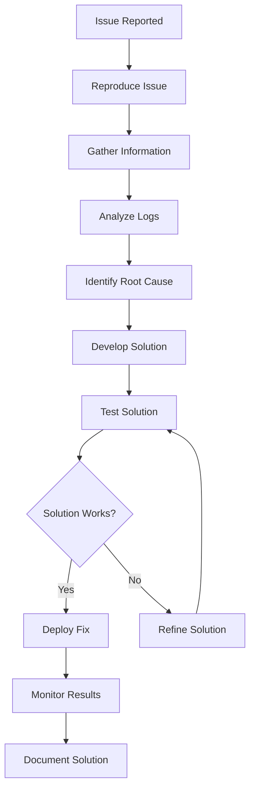

# HVAC Management System - Debugging Guide

## Table of Contents
1. [Debugging Overview](#debugging-overview)
2. [Debugging Environment Setup](#debugging-environment-setup)
3. [Application Debugging](#application-debugging)
4. [Database Debugging](#database-debugging)
5. [Performance Debugging](#performance-debugging)
6. [Security Debugging](#security-debugging)
7. [Network Debugging](#network-debugging)
8. [Browser Debugging](#browser-debugging)
9. [Production Debugging](#production-debugging)
10. [Debugging Tools and Techniques](#debugging-tools-and-techniques)

## Debugging Overview

### Debugging Methodology

The HVAC Management System debugging follows a systematic approach to identify, isolate, and resolve issues:



### Debugging Levels

| Level | Scope | Tools | Time Required |
|-------|-------|-------|---------------|
| **Level 1** | Application logs, basic errors | Log files, error messages | 15-30 minutes |
| **Level 2** | Code analysis, database queries | Debugger, profiler, SQL tools | 1-2 hours |
| **Level 3** | Performance, memory, network | Performance tools, memory profiler | 2-4 hours |
| **Level 4** | Complex system issues | Full debugging suite, team collaboration | 4+ hours |

## Debugging Environment Setup

### 1. Development Environment

#### Visual Studio Configuration
```xml
<!-- web.config for debugging -->
<system.web>
  <compilation debug="true" targetFramework="4.8" />
  <customErrors mode="Off" />
  <httpRuntime maxRequestLength="10485760" executionTimeout="300" />
</system.web>

<system.webServer>
  <httpErrors errorMode="Detailed" />
  <modules>
    <remove name="FormsAuthentication" />
  </modules>
</system.webServer>
```

#### Debug Settings
```csharp
// Enable detailed error information
#if DEBUG
    public static class DebugSettings
    {
        public static bool EnableDetailedErrors = true;
        public static bool EnablePerformanceLogging = true;
        public static bool EnableQueryLogging = true;
        public static bool EnableMemoryLogging = true;
    }
#endif
```

### 2. Logging Configuration

#### Debug Logging Setup
```csharp
public class DebugLogging
{
    private static readonly ILogger _logger = new LoggerFactory()
        .AddConsole()
        .AddDebug()
        .AddFile("logs/debug-{Date}.log")
        .CreateLogger("HVAC_Debug");

    public static void LogDebug(string message, string category = "Debug")
    {
        _logger.LogDebug($"[{category}] {message}");
    }

    public static void LogInfo(string message, string category = "Info")
    {
        _logger.LogInformation($"[{category}] {message}");
    }

    public static void LogWarning(string message, string category = "Warning")
    {
        _logger.LogWarning($"[{category}] {message}");
    }

    public static void LogError(string message, Exception ex = null, string category = "Error")
    {
        _logger.LogError(ex, $"[{category}] {message}");
    }
}
```

## Application Debugging

### 1. Controller Debugging

#### Debug Attributes
```csharp
[DebuggerStepThrough]
public class EnquiryController : Controller
{
    private readonly HVACEntities _db;
    
    public EnquiryController()
    {
        _db = new HVACEntities();
    }
    
    [HttpGet]
    public ActionResult Index()
    {
        try
        {
            DebugLogging.LogDebug("EnquiryController.Index - Start");
            
            var enquiries = GetEnquiries();
            
            DebugLogging.LogDebug($"EnquiryController.Index - Found {enquiries.Count} enquiries");
            
            return View(enquiries);
        }
        catch (Exception ex)
        {
            DebugLogging.LogError("EnquiryController.Index - Error", ex);
            throw;
        }
    }
    
    [HttpPost]
    public ActionResult Create(EnquiryVM model)
    {
        try
        {
            DebugLogging.LogDebug("EnquiryController.Create - Start");
            DebugLogging.LogDebug($"EnquiryController.Create - Model: {JsonConvert.SerializeObject(model)}");
            
            if (!ModelState.IsValid)
            {
                DebugLogging.LogWarning("EnquiryController.Create - Model validation failed");
                return View(model);
            }
            
            var enquiry = MapToEntity(model);
            _db.Enquiries.Add(enquiry);
            _db.SaveChanges();
            
            DebugLogging.LogInfo("EnquiryController.Create - Enquiry created successfully");
            
            return RedirectToAction("Index");
        }
        catch (Exception ex)
        {
            DebugLogging.LogError("EnquiryController.Create - Error", ex);
            throw;
        }
    }
}
```

#### Model Validation Debugging
```csharp
public class ModelValidationDebugger
{
    public static void LogModelState(ModelStateDictionary modelState)
    {
        if (HttpContext.Current.IsDebuggingEnabled)
        {
            foreach (var key in modelState.Keys)
            {
                var state = modelState[key];
                if (!state.IsValid)
                {
                    var errors = string.Join(", ", state.Errors.Select(e => e.ErrorMessage));
                    DebugLogging.LogWarning($"Model validation error for '{key}': {errors}");
                }
            }
        }
    }
    
    public static void LogModelData(object model)
    {
        if (HttpContext.Current.IsDebuggingEnabled)
        {
            var json = JsonConvert.SerializeObject(model, Formatting.Indented);
            DebugLogging.LogDebug($"Model data: {json}");
        }
    }
}
```

### 2. Service Layer Debugging

#### Service Debugging
```csharp
public class EnquiryService : IDisposable
{
    private readonly HVACEntities _db;
    private readonly ILogger _logger;
    
    public EnquiryService()
    {
        _db = new HVACEntities();
        _logger = new LoggerFactory().CreateLogger("EnquiryService");
    }
    
    public List<EnquiryVM> GetEnquiries(DateTime fromDate, DateTime toDate)
    {
        using (var activity = new ActivityScope("GetEnquiries"))
        {
            try
            {
                _logger.LogDebug($"Getting enquiries from {fromDate} to {toDate}");
                
                var enquiries = _db.Enquiries
                    .Where(e => e.EnquiryDate >= fromDate && e.EnquiryDate <= toDate)
                    .Include(e => e.CustomerMaster)
                    .Include(e => e.EnquiryStatus)
                    .Select(e => new EnquiryVM
                    {
                        EnquiryID = e.EnquiryID,
                        EnquiryNo = e.EnquiryNo,
                        CustomerName = e.CustomerMaster.CustomerName,
                        StatusName = e.EnquiryStatus.StatusName
                    })
                    .ToList();
                
                _logger.LogDebug($"Found {enquiries.Count} enquiries");
                return enquiries;
            }
            catch (Exception ex)
            {
                _logger.LogError(ex, "Error getting enquiries");
                throw;
            }
        }
    }
    
    public void Dispose()
    {
        _db?.Dispose();
    }
}

public class ActivityScope : IDisposable
{
    private readonly string _activityName;
    private readonly Stopwatch _stopwatch;
    
    public ActivityScope(string activityName)
    {
        _activityName = activityName;
        _stopwatch = Stopwatch.StartNew();
        DebugLogging.LogDebug($"Starting activity: {_activityName}");
    }
    
    public void Dispose()
    {
        _stopwatch.Stop();
        DebugLogging.LogDebug($"Completed activity: {_activityName} in {_stopwatch.ElapsedMilliseconds}ms");
    }
}
```

## Database Debugging

### 1. Query Debugging

#### SQL Query Logging
```csharp
public class DatabaseDebugger
{
    public static void LogQuery(string sql, object parameters = null, TimeSpan? duration = null)
    {
        if (HttpContext.Current.IsDebuggingEnabled)
        {
            var logMessage = $"SQL Query: {sql}";
            
            if (parameters != null)
            {
                logMessage += $"\nParameters: {JsonConvert.SerializeObject(parameters)}";
            }
            
            if (duration.HasValue)
            {
                logMessage += $"\nDuration: {duration.Value.TotalMilliseconds}ms";
            }
            
            DebugLogging.LogDebug(logMessage, "Database");
        }
    }
    
    public static void LogSlowQuery(string sql, TimeSpan duration)
    {
        if (duration.TotalMilliseconds > 1000) // 1 second
        {
            DebugLogging.LogWarning($"Slow query detected: {sql} - {duration.TotalMilliseconds}ms", "Database");
        }
    }
}

// Custom DbContext for debugging
public class HVACEntitiesDebug : HVACEntities
{
    public HVACEntitiesDebug()
    {
        Database.Log = sql => DebugLogging.LogDebug(sql, "Database");
    }
    
    public override int SaveChanges()
    {
        var stopwatch = Stopwatch.StartNew();
        var result = base.SaveChanges();
        stopwatch.Stop();
        
        DebugLogging.LogDebug($"SaveChanges completed in {stopwatch.ElapsedMilliseconds}ms", "Database");
        return result;
    }
}
```

#### Query Performance Analysis
```csharp
public class QueryPerformanceAnalyzer
{
    public static void AnalyzeQuery(string sql, TimeSpan duration)
    {
        if (HttpContext.Current.IsDebuggingEnabled)
        {
            var analysis = new QueryAnalysis
            {
                Sql = sql,
                Duration = duration,
                Timestamp = DateTime.Now
            };
            
            // Log query analysis
            DebugLogging.LogDebug($"Query Analysis: {JsonConvert.SerializeObject(analysis)}", "Database");
            
            // Check for common performance issues
            CheckForPerformanceIssues(analysis);
        }
    }
    
    private static void CheckForPerformanceIssues(QueryAnalysis analysis)
    {
        var issues = new List<string>();
        
        // Check for missing WHERE clause
        if (!analysis.Sql.ToUpper().Contains("WHERE") && analysis.Sql.ToUpper().Contains("SELECT"))
        {
            issues.Add("Query may be missing WHERE clause");
        }
        
        // Check for SELECT *
        if (analysis.Sql.ToUpper().Contains("SELECT *"))
        {
            issues.Add("Query uses SELECT * - consider specifying columns");
        }
        
        // Check for long duration
        if (analysis.Duration.TotalMilliseconds > 1000)
        {
            issues.Add("Query duration exceeds 1 second");
        }
        
        if (issues.Any())
        {
            DebugLogging.LogWarning($"Query performance issues detected: {string.Join(", ", issues)}", "Database");
        }
    }
}
```

### 2. Connection Debugging

#### Connection Pool Monitoring
```csharp
public class ConnectionPoolMonitor
{
    public static void LogConnectionPoolStatus()
    {
        if (HttpContext.Current.IsDebuggingEnabled)
        {
            var connectionString = ConfigurationManager.ConnectionStrings["myConnectionString"].ConnectionString;
            var builder = new SqlConnectionStringBuilder(connectionString);
            
            var status = new
            {
                MaxPoolSize = builder.MaxPoolSize,
                MinPoolSize = builder.MinPoolSize,
                ConnectionTimeout = builder.ConnectTimeout,
                CurrentConnections = GetCurrentConnectionCount()
            };
            
            DebugLogging.LogDebug($"Connection Pool Status: {JsonConvert.SerializeObject(status)}", "Database");
        }
    }
    
    private static int GetCurrentConnectionCount()
    {
        try
        {
            using (var connection = new SqlConnection(ConfigurationManager.ConnectionStrings["myConnectionString"].ConnectionString))
            {
                connection.Open();
                var command = new SqlCommand("SELECT COUNT(*) FROM sys.dm_exec_sessions WHERE is_user_process = 1", connection);
                return (int)command.ExecuteScalar();
            }
        }
        catch
        {
            return -1;
        }
    }
}
```

## Performance Debugging

### 1. Performance Profiling

#### Performance Counter
```csharp
public class PerformanceProfiler
{
    private static readonly Dictionary<string, Stopwatch> Timers = new Dictionary<string, Stopwatch>();
    private static readonly object LockObject = new object();
    
    public static void StartTimer(string operationName)
    {
        if (HttpContext.Current.IsDebuggingEnabled)
        {
            lock (LockObject)
            {
                Timers[operationName] = Stopwatch.StartNew();
            }
            DebugLogging.LogDebug($"Started timer: {operationName}", "Performance");
        }
    }
    
    public static void StopTimer(string operationName)
    {
        if (HttpContext.Current.IsDebuggingEnabled)
        {
            lock (LockObject)
            {
                if (Timers.ContainsKey(operationName))
                {
                    Timers[operationName].Stop();
                    var duration = Timers[operationName].ElapsedMilliseconds;
                    DebugLogging.LogDebug($"Stopped timer: {operationName} - {duration}ms", "Performance");
                    Timers.Remove(operationName);
                }
            }
        }
    }
    
    public static void LogMemoryUsage()
    {
        if (HttpContext.Current.IsDebuggingEnabled)
        {
            var process = Process.GetCurrentProcess();
            var memoryUsage = new
            {
                WorkingSet = process.WorkingSet64 / 1024 / 1024, // MB
                PrivateMemory = process.PrivateMemorySize64 / 1024 / 1024, // MB
                VirtualMemory = process.VirtualMemorySize64 / 1024 / 1024, // MB
                PagedMemory = process.PagedMemorySize64 / 1024 / 1024 // MB
            };
            
            DebugLogging.LogDebug($"Memory Usage: {JsonConvert.SerializeObject(memoryUsage)}", "Performance");
        }
    }
}
```

#### Memory Leak Detection
```csharp
public class MemoryLeakDetector
{
    private static readonly List<MemorySnapshot> Snapshots = new List<MemorySnapshot>();
    
    public static void TakeSnapshot(string description)
    {
        if (HttpContext.Current.IsDebuggingEnabled)
        {
            var snapshot = new MemorySnapshot
            {
                Description = description,
                Timestamp = DateTime.Now,
                WorkingSet = GC.GetTotalMemory(false),
                Gen0Collections = GC.CollectionCount(0),
                Gen1Collections = GC.CollectionCount(1),
                Gen2Collections = GC.CollectionCount(2)
            };
            
            Snapshots.Add(snapshot);
            DebugLogging.LogDebug($"Memory snapshot taken: {description} - {snapshot.WorkingSet / 1024 / 1024}MB", "Performance");
        }
    }
    
    public static void AnalyzeMemoryTrend()
    {
        if (HttpContext.Current.IsDebuggingEnabled && Snapshots.Count > 1)
        {
            var trend = new MemoryTrendAnalysis
            {
                StartSnapshot = Snapshots.First(),
                EndSnapshot = Snapshots.Last(),
                MemoryGrowth = Snapshots.Last().WorkingSet - Snapshots.First().WorkingSet,
                CollectionGrowth = Snapshots.Last().Gen2Collections - Snapshots.First().Gen2Collections
            };
            
            DebugLogging.LogDebug($"Memory trend analysis: {JsonConvert.SerializeObject(trend)}", "Performance");
            
            if (trend.MemoryGrowth > 50 * 1024 * 1024) // 50MB
            {
                DebugLogging.LogWarning("Potential memory leak detected - significant memory growth", "Performance");
            }
        }
    }
}
```

### 2. Request/Response Debugging

#### Request Debugging
```csharp
public class RequestDebugger
{
    public static void LogRequest(HttpRequest request)
    {
        if (HttpContext.Current.IsDebuggingEnabled)
        {
            var requestInfo = new
            {
                Url = request.Url.ToString(),
                Method = request.HttpMethod,
                UserAgent = request.UserAgent,
                ContentType = request.ContentType,
                ContentLength = request.ContentLength,
                Headers = request.Headers.AllKeys.ToDictionary(k => k, k => request.Headers[k]),
                QueryString = request.QueryString.AllKeys.ToDictionary(k => k, k => request.QueryString[k]),
                Form = request.Form.AllKeys.ToDictionary(k => k, k => request.Form[k])
            };
            
            DebugLogging.LogDebug($"Request Info: {JsonConvert.SerializeObject(requestInfo, Formatting.Indented)}", "Request");
        }
    }
    
    public static void LogResponse(HttpResponse response)
    {
        if (HttpContext.Current.IsDebuggingEnabled)
        {
            var responseInfo = new
            {
                StatusCode = response.StatusCode,
                ContentType = response.ContentType,
                Headers = response.Headers.AllKeys.ToDictionary(k => k, k => response.Headers[k])
            };
            
            DebugLogging.LogDebug($"Response Info: {JsonConvert.SerializeObject(responseInfo, Formatting.Indented)}", "Response");
        }
    }
}
```

## Security Debugging

### 1. Authentication Debugging

#### Authentication Flow Debugging
```csharp
public class AuthenticationDebugger
{
    public static void LogAuthenticationAttempt(string username, bool success, string reason = null)
    {
        if (HttpContext.Current.IsDebuggingEnabled)
        {
            var attempt = new
            {
                Username = username,
                Success = success,
                Reason = reason,
                Timestamp = DateTime.Now,
                IPAddress = GetClientIPAddress(),
                UserAgent = HttpContext.Current.Request.UserAgent
            };
            
            DebugLogging.LogDebug($"Authentication attempt: {JsonConvert.SerializeObject(attempt)}", "Security");
        }
    }
    
    public static void LogSessionActivity(string activity, string sessionId)
    {
        if (HttpContext.Current.IsDebuggingEnabled)
        {
            var sessionInfo = new
            {
                Activity = activity,
                SessionId = sessionId,
                Timestamp = DateTime.Now,
                IPAddress = GetClientIPAddress()
            };
            
            DebugLogging.LogDebug($"Session activity: {JsonConvert.SerializeObject(sessionInfo)}", "Security");
        }
    }
    
    private static string GetClientIPAddress()
    {
        var request = HttpContext.Current.Request;
        var ipAddress = request.Headers["X-Forwarded-For"] ??
                       request.Headers["X-Real-IP"] ??
                       request.UserHostAddress;
        return ipAddress;
    }
}
```

### 2. Authorization Debugging

#### Permission Debugging
```csharp
public class AuthorizationDebugger
{
    public static void LogPermissionCheck(string resource, string action, bool granted, int userId)
    {
        if (HttpContext.Current.IsDebuggingEnabled)
        {
            var permissionInfo = new
            {
                Resource = resource,
                Action = action,
                Granted = granted,
                UserId = userId,
                Timestamp = DateTime.Now
            };
            
            DebugLogging.LogDebug($"Permission check: {JsonConvert.SerializeObject(permissionInfo)}", "Security");
        }
    }
    
    public static void LogAccessAttempt(string resource, bool allowed, string reason = null)
    {
        if (HttpContext.Current.IsDebuggingEnabled)
        {
            var accessInfo = new
            {
                Resource = resource,
                Allowed = allowed,
                Reason = reason,
                Timestamp = DateTime.Now,
                IPAddress = GetClientIPAddress()
            };
            
            DebugLogging.LogDebug($"Access attempt: {JsonConvert.SerializeObject(accessInfo)}", "Security");
        }
    }
}
```

## Network Debugging

### 1. HTTP Request Debugging

#### HTTP Client Debugging
```csharp
public class HttpClientDebugger
{
    public static async Task<HttpResponseMessage> SendRequestWithDebugging(HttpRequestMessage request)
    {
        if (HttpContext.Current.IsDebuggingEnabled)
        {
            DebugLogging.LogDebug($"HTTP Request: {request.Method} {request.RequestUri}", "Network");
            DebugLogging.LogDebug($"Request Headers: {JsonConvert.SerializeObject(request.Headers)}", "Network");
            
            if (request.Content != null)
            {
                var content = await request.Content.ReadAsStringAsync();
                DebugLogging.LogDebug($"Request Content: {content}", "Network");
            }
        }
        
        var stopwatch = Stopwatch.StartNew();
        var response = await new HttpClient().SendAsync(request);
        stopwatch.Stop();
        
        if (HttpContext.Current.IsDebuggingEnabled)
        {
            DebugLogging.LogDebug($"HTTP Response: {response.StatusCode} in {stopwatch.ElapsedMilliseconds}ms", "Network");
            DebugLogging.LogDebug($"Response Headers: {JsonConvert.SerializeObject(response.Headers)}", "Network");
        }
        
        return response;
    }
}
```

### 2. Database Connection Debugging

#### Connection Debugging
```csharp
public class DatabaseConnectionDebugger
{
    public static void LogConnectionAttempt(string connectionString)
    {
        if (HttpContext.Current.IsDebuggingEnabled)
        {
            var builder = new SqlConnectionStringBuilder(connectionString);
            var connectionInfo = new
            {
                Server = builder.DataSource,
                Database = builder.InitialCatalog,
                Timeout = builder.ConnectTimeout,
                Pooling = builder.Pooling,
                MaxPoolSize = builder.MaxPoolSize
            };
            
            DebugLogging.LogDebug($"Database connection attempt: {JsonConvert.SerializeObject(connectionInfo)}", "Database");
        }
    }
    
    public static void LogConnectionResult(bool success, TimeSpan duration, Exception ex = null)
    {
        if (HttpContext.Current.IsDebuggingEnabled)
        {
            var result = new
            {
                Success = success,
                Duration = duration.TotalMilliseconds,
                Error = ex?.Message
            };
            
            DebugLogging.LogDebug($"Database connection result: {JsonConvert.SerializeObject(result)}", "Database");
        }
    }
}
```

## Browser Debugging

### 1. Client-Side Debugging

#### JavaScript Debugging
```javascript
// Client-side debugging utilities
var HVACDebug = {
    log: function(message, category) {
        if (console && console.log) {
            console.log('[HVAC Debug] [' + (category || 'General') + '] ' + message);
        }
    },
    
    logError: function(error, context) {
        if (console && console.error) {
            console.error('[HVAC Debug] [Error] ' + (context || '') + ': ' + error.message);
            console.error(error.stack);
        }
    },
    
    logAjax: function(url, method, data, response) {
        this.log('AJAX Request: ' + method + ' ' + url, 'Network');
        if (data) {
            this.log('Request Data: ' + JSON.stringify(data), 'Network');
        }
        if (response) {
            this.log('Response: ' + JSON.stringify(response), 'Network');
        }
    },
    
    logPerformance: function(operation, duration) {
        this.log('Performance: ' + operation + ' took ' + duration + 'ms', 'Performance');
    }
};

// Override jQuery AJAX for debugging
$(document).ready(function() {
    var originalAjax = $.ajax;
    $.ajax = function(options) {
        var startTime = new Date().getTime();
        
        var success = options.success;
        options.success = function(data, textStatus, jqXHR) {
            var duration = new Date().getTime() - startTime;
            HVACDebug.logAjax(options.url, options.type, options.data, data);
            HVACDebug.logPerformance('AJAX Request', duration);
            
            if (success) {
                success(data, textStatus, jqXHR);
            }
        };
        
        var error = options.error;
        options.error = function(jqXHR, textStatus, errorThrown) {
            HVACDebug.logError(errorThrown, 'AJAX Error');
            
            if (error) {
                error(jqXHR, textStatus, errorThrown);
            }
        };
        
        return originalAjax.call(this, options);
    };
});
```

### 2. Console Debugging

#### Browser Console Integration
```csharp
// Server-side method to send debug info to browser
public ActionResult GetDebugInfo()
{
    if (HttpContext.Current.IsDebuggingEnabled)
    {
        var debugInfo = new
        {
            ServerTime = DateTime.Now,
            SessionId = HttpContext.Current.Session.SessionID,
            UserAgent = HttpContext.Current.Request.UserAgent,
            IPAddress = HttpContext.Current.Request.UserHostAddress,
            MemoryUsage = GC.GetTotalMemory(false) / 1024 / 1024, // MB
            RequestCount = GetRequestCount()
        };
        
        return Json(debugInfo, JsonRequestBehavior.AllowGet);
    }
    
    return Json(new { error = "Debug mode not enabled" }, JsonRequestBehavior.AllowGet);
}
```

## Production Debugging

### 1. Remote Debugging

#### Production Debug Setup
```csharp
public class ProductionDebugger
{
    public static void LogProductionIssue(string issue, Exception ex = null)
    {
        var issueInfo = new
        {
            Issue = issue,
            Timestamp = DateTime.Now,
            Server = Environment.MachineName,
            User = Environment.UserName,
            Exception = ex?.ToString(),
            StackTrace = ex?.StackTrace
        };
        
        // Log to file for production debugging
        LogToFile(issueInfo);
        
        // Send to monitoring system
        SendToMonitoring(issueInfo);
    }
    
    private static void LogToFile(object data)
    {
        var logPath = Path.Combine(AppDomain.CurrentDomain.BaseDirectory, "Logs", "ProductionDebug.log");
        var logEntry = $"[{DateTime.Now}] {JsonConvert.SerializeObject(data)}\n";
        
        File.AppendAllText(logPath, logEntry);
    }
}
```

### 2. Health Check Debugging

#### Health Check Endpoint
```csharp
[Route("api/debug/health")]
public class DebugHealthController : Controller
{
    public ActionResult Check()
    {
        if (!HttpContext.Current.IsDebuggingEnabled)
        {
            return Json(new { error = "Debug mode not enabled" }, JsonRequestBehavior.AllowGet);
        }
        
        var health = new
        {
            Database = CheckDatabaseHealth(),
            Memory = CheckMemoryHealth(),
            Disk = CheckDiskHealth(),
            Network = CheckNetworkHealth(),
            Services = CheckServicesHealth()
        };
        
        return Json(health, JsonRequestBehavior.AllowGet);
    }
    
    private bool CheckDatabaseHealth()
    {
        try
        {
            using (var db = new HVACEntities())
            {
                db.Database.Connection.Open();
                return true;
            }
        }
        catch
        {
            return false;
        }
    }
    
    private object CheckMemoryHealth()
    {
        var process = Process.GetCurrentProcess();
        return new
        {
            WorkingSet = process.WorkingSet64 / 1024 / 1024, // MB
            PrivateMemory = process.PrivateMemorySize64 / 1024 / 1024, // MB
            AvailableMemory = GC.GetTotalMemory(false) / 1024 / 1024 // MB
        };
    }
}
```

## Debugging Tools and Techniques

### 1. Debugging Tools

#### Custom Debugging Tools
```csharp
public class DebuggingTools
{
    public static void DumpObject(object obj, string name = "Object")
    {
        if (HttpContext.Current.IsDebuggingEnabled)
        {
            var json = JsonConvert.SerializeObject(obj, Formatting.Indented);
            DebugLogging.LogDebug($"{name}: {json}", "Debug");
        }
    }
    
    public static void DumpCollection<T>(IEnumerable<T> collection, string name = "Collection")
    {
        if (HttpContext.Current.IsDebuggingEnabled)
        {
            var count = collection.Count();
            DebugLogging.LogDebug($"{name} Count: {count}", "Debug");
            
            foreach (var item in collection.Take(10)) // Limit to first 10 items
            {
                DumpObject(item, $"{name} Item");
            }
        }
    }
    
    public static void DumpSession()
    {
        if (HttpContext.Current.IsDebuggingEnabled)
        {
            var sessionData = new Dictionary<string, object>();
            
            foreach (string key in HttpContext.Current.Session.Keys)
            {
                sessionData[key] = HttpContext.Current.Session[key];
            }
            
            DumpObject(sessionData, "Session Data");
        }
    }
}
```

### 2. Debugging Techniques

#### Conditional Debugging
```csharp
public class ConditionalDebugger
{
    public static void DebugIf(bool condition, string message, string category = "Debug")
    {
        if (condition && HttpContext.Current.IsDebuggingEnabled)
        {
            DebugLogging.LogDebug(message, category);
        }
    }
    
    public static void DebugIfNotNull(object obj, string message, string category = "Debug")
    {
        if (obj != null && HttpContext.Current.IsDebuggingEnabled)
        {
            DebugLogging.LogDebug(message, category);
        }
    }
    
    public static void DebugIfEmpty<T>(IEnumerable<T> collection, string message, string category = "Debug")
    {
        if (!collection.Any() && HttpContext.Current.IsDebuggingEnabled)
        {
            DebugLogging.LogDebug(message, category);
        }
    }
}
```

---

*This debugging guide provides comprehensive techniques and tools for debugging the HVAC Management System across all layers and environments.*
